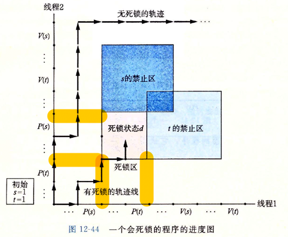

# 第十二章 - 并发编程

>并发的几种模式

1. `进程` 通过进程实现的并发必须显示的通过 **IPC(进程间通信)** 来实现；
2. `I/O 多路复用` ： 在这种编程模型中，应用程序在一个进程的上下文中显式的去调度它自己的逻辑流。逻辑流被模型化为状态机。 **数据达到描述符之后，主程序显示的从一个状态转换到另外一个状态**
3. `线程`：线程是运行在一个单一进程上下文中的逻辑流，由内核进行调度。它像进程一样被内核调度，想I/O多路复用一样共享一个虚拟地址空间

## 12.1 基于进程的并发编程

1. 基于进程的并发编程就是：在服务端 listenfd，并且每接收到一个连接都创建一个新的进程，在新的进程中处理连接。
2. 基于进程存在一个重要问题：主进程必须 Close(connfd)，子进程必须 Close(listenfd) 。特别是 Close(connfd)。如果我们不在子进程中调用 Close(connfd) 的话，会有内存泄漏。因为子进程会在死亡的时候 Close(connfd)，然后这只是简单的将文件表的 refcnt - 1 而不会真正的回收 connfd。

### 12.1.1 基于进程的并发服务器

```c
#include "stdio.h"
#include "../csapp.hpp"

void echo(int connfd);

void chld_sighandler(int sig)
{
    printf("chld_sighandler\n");
    int status;
    // 再回忆一下为什么要使用 while 循环
    //
    while((waitpid(-1, &status, WNOHANG)) > 0)
        ;

    printf("end chld_sighandler\n");
}

int main(int argc, char **argv)
{
    int listenfd, connfd;
    struct sockaddr_storage addr;
    socklen_t socklen;
    
    if (argc != 2) {
        fprintf(stderr, "usage: %s <port>\n", argv[0]);
        exit(0);
    }

    Signal(SIGCHLD, chld_sighandler);
    listenfd = Open_listenfd(argv[1]);
    while (1)
    {
        connfd = Accept(listenfd, (SA *) &addr, &socklen);
        if (Fork() == 0)
        {
            Close(listenfd);
            echo(connfd);
            Close(connfd);
            printf("child close connfd\n");
            exit(0);
        }

        Close(connfd);
    }
}

void echo(int connfd)
{
    char buf[MAXLINE];
    rio_t rio;
    Rio_readinitb(&rio, connfd);
    printf("begin read\n");
    ssize_t n;
    while ((n = Rio_readlineb(&rio, buf, RIO_BUFSIZE)) != 0) {
        if (strstr(buf, "quit!")) {
            printf("quit!\n");
            exit(0);
        }
        printf("read message : [%s], cnt = [%lu]\n", buf, n);
        Rio_writen(connfd, buf, n);
    }
}
```

### 12.1.2 进程的优劣

1. 优点：有独立的地址空间，编程模型更简单
2. 缺点：IPC 效率很低

## 12.2 基于 I/O 多路复用的并发编程

1. `fd_set` 最多可监听的文件描述符取决于 `sizeof(fd_set)` 的值 
2. 根据前面的说法，I/O 多路复用其实就是一个 `状态机`。我们的状态机的节点为 `select`，当我们发现有连接可读，则进入读取状态。读取完数据之后回到 `select` 状态继续检查状态。
3. 在下面的例子中， `ready_set = read_set` 这一步是很重要的。因为我们的 select 会检查所有参数中给定的集合 **并修改**；

```c
#include <sys/select.h>

// int select(int n, fd_set *fdset, NULL, NULL, NULL);
int select(int maxfd,fd_set *rdset,fd_set *wrset,fd_set *exset,struct timeval *timeout);

FD_ZERO(fd_set *fdset);										// clear all bits in fdset
FD_CLR(int fd, fd_set *fdset);								// clear bit fd in fdset
FD_SET(int fd, fd_set *fdset);								// turn on bit fd in fdset
FD_ISSET(int fd, fd_set *fdset);							// Is bit fd in fdset on?
```

```c
#define __DARWIN_howmany(x, y)  ((((x) % (y)) == 0) ? ((x) / (y)) : (((x) / (y)) + 1)) /* # y's == x bits? */

typedef struct fd_set {
	__int32_t       fds_bits[__DARWIN_howmany(__DARWIN_FD_SETSIZE, __DARWIN_NFDBITS)];
} fd_set;
```

```c
#include "stdio.h"
#include "../csapp.hpp"

void command(void);
void echo(int connfd);

int main(int argc, char **argv)
{
    int    listenfd, connfd;
    fd_set read_set, ready_set;
    struct sockaddr_storage sock;
    socklen_t socklen;

    if (argc != 2) {
        fprintf(stderr, "usage: %s <port>\n", argv[0]);
        exit(0);
    }

    listenfd = Open_listenfd(argv[1]);

    FD_ZERO(&read_set);
    FD_SET(STDIN_FILENO, &read_set);
    FD_SET(listenfd, &read_set);

    while(1)
    {
        ready_set = read_set;
        Select(listenfd + 1, &ready_set, NULL, NULL, 0);
        if (FD_ISSET(STDIN_FILENO, &ready_set)) {
            printf("read from stdin\n");
            command();
        }
        if (FD_ISSET(listenfd, &ready_set)) {
            socklen = sizeof(sock);
            connfd = Accept(listenfd, (SA *) &sock, &socklen);
            echo(connfd);
            Close(connfd);
        }
    }
}

void echo(int connfd)
{
    char buf[MAXLINE];
    rio_t rio;
    Rio_readinitb(&rio, connfd);
    printf("begin read\n");
    ssize_t n;
    while ((n = Rio_readlineb(&rio, buf, RIO_BUFSIZE)) != 0) {
        if (strstr(buf, "quit!")) {
            printf("quit!\n");
            exit(0);
        }
        printf("read message : [%s], cnt = [%lu]\n", buf, n);
        Rio_writen(connfd, buf, n);
    }
}

void command(void)
{
    char buf[MAXLINE];
    if (!Fgets(buf, MAXLINE, stdin)) {
        exit(0);
    }
    printf("%s", buf);
}
```

### 12.2.1 基于 I/O 多路复用的并发事件驱动服务器

1. `事件驱动` 中，某些事件会导致流向向前推进。一般的思路是 **将逻辑流模型化为状态机**。不严格的说，`状态机` 就是一组 `状态`，`输入时间`，`转移`。
2. 对于 `I/O 多路复用` 来讲， `select`, `read`, `write`, `connect` 都是状态。select 为初始状态，当我们有一个客户端请求连接的同时，应用是 `select -> connect -> select` 这样的 `自循环`

```c
#include "stdio.h"
#include "../csapp.cpp"

typedef struct
{
    int    maxfd;
    fd_set ready_set;
    fd_set read_set;
    int    nready;
    int    maxi;
    int    clientfd[FD_SETSIZE];
    rio_t  clientrio[FD_SETSIZE];
} pool;

int byte_cnt = 0;

void init_pool(int listenfd, pool *p);

void add_client(int connfd, pool *p);

void check_clients(pool *p);

int main(int argc, char **argv)
{
    int                     listenfd, connfd;
    struct sockaddr_storage addr;
    socklen_t               clientlen;
    static pool             p;

    if (argc != 2)
    {
        fprintf(stderr, "usage: %s <port>\n", argv[0]);
        exit(0);
    }

    listenfd = Open_listenfd(argv[1]);
    init_pool(listenfd, &p);

    while (1)
    {
        p.ready_set = p.read_set;
        // 监听连接
        p.nready    = Select(p.maxfd + 1, &p.ready_set, NULL, NULL, NULL);
        if (FD_ISSET(listenfd, &p.ready_set))
        {
            clientlen = sizeof(addr);
            connfd    = Accept(listenfd, (SA *) &addr, &clientlen);
            add_client(connfd, &p);
        }
        check_clients(&p);
    }
}


void check_clients(pool *p)
{
    int   i, connfd, n;
    char  buf[MAXLINE];
    rio_t rio;

    for (i = 0; (i <= p->maxi && p->nready > 0); ++i)
    {
        connfd = p->clientfd[i];
        rio    = p->clientrio[i];

        if (connfd > 0 && FD_ISSET(connfd, &p->ready_set))
        {
            if ((n = Rio_readlineb(&rio, buf, MAXLINE)) != 0)
            {
                byte_cnt += n;
                printf("read [%d] message [%s]\n", n, buf);
                Rio_writen(connfd, buf, n);
            }
            else
            {
                Close(connfd);
                FD_CLR(connfd, &p->read_set);
                p->clientfd[i] = -1;
            }
        }
    }
}

void add_client(int connfd, pool *p)
{
    int i;
    p->nready--;
    for (i = 0; i < FD_SETSIZE; i++)
    {
        if (p->clientfd[i] < 0)
        {
            p->clientfd[i] = connfd;
            Rio_readinitb(&p->clientrio[i], connfd);

            FD_SET(connfd, &p->read_set);
            if (connfd > p->maxfd)
                p->maxfd = connfd;
            // 更新 maxi，这样 check_client 就不需要更新整个数组了
            if (i > p->maxi)
                p->maxi  = i;

            break;
        }
    }
    if (i == FD_SETSIZE)
        app_error("add_client error: Too many clients");
}

void init_pool(int listenfd, pool *p)
{
    p->maxi    = -1;
    for (int i = 0; i < FD_SETSIZE; i++)
    {
        p->clientfd[i] = -1;
    }

    p->maxfd = listenfd;
    FD_SET(listenfd, &p->read_set);
    FD_ZERO(&p->ready_set);
    p->nready = 0;
}
```

### 12.2.2 I/O 多路复用技术的优劣

#### 优点

1. 相对于进程，多路复用给了我们更多的行为的控制。例如我们可以只选择接受 readable 的连接
2. 在单一进程中，共享数据更简单；

#### 缺点

1. 编码复杂

## 12.3 基于线程的并发编程

1. 线程是运行在 **进程上下文** 中的逻辑流
2. 每个线程都有自己的 **线程上下文**，包括线程ID，栈，栈指针，程序计数器等

### 12.3.1 线程执行模型


### 12.3.2 Posix 线程

#### 创建一个线程

1. 线程的代码和本地数据被封装在一个 `线程例程` 中，在我们的例子中就是 `thread` 函数
2. 线程例程以 `void *`  作为输入， `void *` 作为返回值。如果希望给线程传递多个返回值那么我们需要将参数放在一个 struct 中并给线程传递 struct 的指针

```c
void Pthread_create(pthread_t *tidp, pthread_attr_t *attrp,
                    void * (*routine)(void *), void *argp)
```

```c
#include "stdio.h"
#include "../csapp.hpp"

void *thread(void *vargp);

int main()
{
    pthread_t tid;
    Pthread_create(&tid, NULL, thread, NULL);
    Pthread_join(tid, NULL);

    exit(0);
}

void *thread(void *vargp)
{
    printf("Hello world\n");
    return NULL;
}
```

### 12.3.4 终止线程

1. 当 `void * (*routine)(void *) ` 退出时线程退出；
2. 调用 `pthread_exit` 会终止当前线程，如果是在主线程中调用，那么它会等子线程结束
3. 进程终结时，进程内的线程也会结束
4. 调用 `pthread_cancel(pthread_t tid)` 终止指定线程

>注意，当主线程结束的时候，主线程创建的子线程是不会结束的

```c
#include "stdio.h"
#include "../csapp.hpp"

void *thread(void *vargp);
void *thread2(void *vargp);

int main()
{
    pthread_t tid;
    Pthread_create(&tid, NULL, thread, NULL);
    sleep(5);
}

void *thread(void *vargp)
{
    // 这个将不会打印，因为主线程退出了
    printf("thread run\n");

    pthread_t tid;
    Pthread_create(&tid, NULL, thread2, NULL);

    printf("thread end\n");
    return NULL;
}


void *thread2(void *vargp)
{
    sleep(3);
    printf("thread2 run!\n");
    return NULL;
}
```

### 12.3.5 回收已终止线程的资源

1. 返回值指向线程的返回值
2. **pthread_join 函数会阻塞，并且等待 tid 终止。然后回收线程所占用的所有内存资源**

```c
#include <pthread.h>

int pthread_join(pthread_t tid, void **thread_return);
```

```c
#include "stdio.h"
#include "../csapp.hpp"

void *thread(void *var)
{
    int *num = (int *) var;
    printf("num = [%d]\n", *num);
    *num = 200;

    return var;
}

int main()
{
    pthread_t tid;
    int num = 100;
    pthread_create(&tid, NULL, thread, (void *) &num);

    int thread_return, *p_thread_return = &thread_return;
    printf("p_thread_return = [%p]\n", p_thread_return);
    pthread_join(tid, (void **)&p_thread_return);
    printf("p_thread_return = [%p]\n", p_thread_return);
    printf("thread return = [%d]\n", *((int *)p_thread_return));
    //p_thread_return = [0x7ffee16690d0]
    //num = [100]
    //p_thread_return = [0x7ffee16690d4]
    //thread return = [200]
}
```

### 12.3.6 分离线程

1. 线程是 `可结合(joinable)` 和 `分离的(detached)`
2. 可结合的线程能够被其他的线程收回或杀死，在被其他线程回收之前，它的资源是不释放的。而 **分离的线程不能被其他的线程回收或者杀死，它的资源在终止时由系统自动释放**
3. 线程默认是可结合的， **所以我们要么通过 pthread_join 来显式的回收资源，要么通过 pthread_detach 来让系统自动的回收资源**

```c
#include <pthread.h>

int pthread_detach(pthread_t tid);
```

### 12.3.7 初始化线程

```c
#include <pthread.h>

pthread_once_t once_control = PTHREAD_ONCE_INIT;

int pthread_once(pthread_once_t *once_control, void (*init_routine)(void));
```

### 12.3.8 基于线程的并发服务器

```c
#include "stdio.h"
#include "../csapp.cpp"

void echo(int connfd);

void *thread(void *args);

int main(int argc, char **argv)
{
    // 注意，我们这里分配的是一个 int * 指向了 connfd。
    // 如果不这么做的话将会有并发问题，因为所有的线程共享了一个 connfd
    int                     listenfd, *connfd;
    struct sockaddr_storage addr;
    socklen_t               socklen;
    pthread_t tid;

    if (argc != 2)
    {
        fprintf(stderr, "usage: %s <port>\n", argv[0]);
        exit(0);
    }

    listenfd = Open_listenfd(argv[1]);
    while (1)
    {
        socklen = sizeof(addr);
        connfd = (int *)Malloc(sizeof(int));
        *connfd = Accept(listenfd, (SA *) &addr, &socklen);
        pthread_create(&tid, NULL, thread, connfd);
    }
}

void *thread(void *args)
{
    int connfd = *((int *) args);
    Pthread_detach(Pthread_self());
    echo(connfd);
    Close(connfd);
    Free(args);
    return NULL;
}

void echo(int connfd)
{
    char  buf[MAXLINE];
    rio_t rio;
    Rio_readinitb(&rio, connfd);
    printf("begin read\n");
    ssize_t n;
    while ((n = Rio_readlineb(&rio, buf, RIO_BUFSIZE)) != 0)
    {
        if (strstr(buf, "quit!"))
        {
            printf("quit!\n");
            exit(0);
        }
        printf("read message : [%s], cnt = [%lu]\n", buf, n);
        Rio_writen(connfd, buf, n);
    }
}

```

## 12.4 多线程程序中的共享变量

1. 线程的内存模型是什么？
2. 根据这个模型，变量实例如何映射到内存？
3. 有多少个线程引用了这些实例？

### 12.4.1 线程内存模型

1. 线程之间独占栈，栈指针等内容，与其他的线程共享进程上下文的剩余部分，包括用户虚拟地址空间。
2. 寄存器从不共享，而虚拟内存总是共享的。
3. 各个独立线程之间的栈被保存在虚拟地址空间的栈区域中。一般来讲他们是独立的，但是如果我们通过某些手段获取到了一个指向其他栈的指针的，那么我们是可以修改其他线程上的内容的。

```c
#include "stdio.h"
#include "../csapp.hpp"

#define N 2

void *thread(void *arg);

char **ptr;

int main(int argc, char **argv)
{
    long i;
    pthread_t tid;
    char *msgs[N] = {
            "Hello from foo",
            "Hello from bar"
    };

    ptr = msgs;
    for (i = 0; i < N; i++)
    {
        Pthread_create(&tid, NULL, thread, (void *)i);
        Pthread_exit(NULL);
    }
}

void *thread(void *arg)
{
    long myid = (long) arg;
    static int cnt = 0;
	// 这里通过全局指针访问主线程的内容
    printf("[%ld]: %s (cnt = %d)\n", myid, ptr[myid], ++cnt);
    return NULL;
}
```

### 12.4.2 将变量映射到内存

1. `全局变量`：声明在函数之外的变量，所有的线程共享
2. `本地自动变量`：声明在函数内的无 static 变量，所有的线程都有自己的副本
3. `本地静态变量`：声明在函数内的 static 变量，所有线程共享

## 12.5 用信号量同步线程

```c
#include "stdio.h"
#include "../csapp.hpp"

#define voidp2type(type, voidp) (*((type*) voidp))

volatile long cnt = 0;

void *thread(void *);

int main(int argc, char **argv)
{
    // 最早由于使用了 int 类型，导致数据传递到 thread 后异常
    // int niters;
    long niters;
    pthread_t tid1, tid2;
    if (argc != 2)
    {
        printf("usage: %s <niters>\n", argv[0]);
        exit(1);
    }
    niters = atoi(argv[1]);
    pthread_create(&tid1, NULL, thread, &niters);
    pthread_create(&tid2, NULL, thread, &niters);
    Pthread_join(tid1, NULL);
    Pthread_join(tid2, NULL);

    printf("cnt = [%ld], cnt = 2 * %ld ? [%d]", cnt, niters, (cnt == 2 * niters));
}

void *thread(void *args)
{
    long n = voidp2type(long, args);
    for (long i = 0; i < n; ++i)
    {
        ++cnt;
    }
    return NULL;
}
```

### 12.5.2 信号量

1. 信号量 `s` 是一个非负的全局变量，有两种的特殊操作
	1.1 P(s) ：如果 s 大于 0， `原子的将 s - 1`，如果 s 小于 0，那么将任务挂起
	1.2 V(s) ：`原子的将 s + 1`，这将激活 **一个在 s == 0 上等待的任务**。该任务会调用 P(s)，也就是说他可以向下执行，而其他在 s == 0 上等待的任务又继续进入了等待状态

```c
#include < semaphore.h>

int sme_init(sem_t *sem, unsigned int value);
int sem_wait(sem_t *s);
int sem_post(sem_t *s);
```

### 12.5.3 使用信号量来实现互斥

1. 只有 0 和 1 两个值的信号量称之为 **二元信号量**，也称之为 `互斥锁`
2. 有 0，1，2，3，... 多个值的信号量被称之为 `计数信号量`
3. 每次要进入临界区的时候，我们调用 `互斥锁` 执行 P 操作来对临界区加锁

```c
#include "stdio.h"
#include "../csapp.hpp"

#define voidp2type(type, voidp) (*((type*) voidp))

volatile long cnt = 0;
sem_t *mutex;


void *thread(void *);


int main(int argc, char **argv)
{
    // 最早由于使用了 int 类型，导致数据传递到 thread 后异常
    // int niters;
    long niters;
    mutex = sem_open("/mysem", O_CREAT, S_IRUSR | S_IWUSR, 1);
    pthread_t tid1, tid2;
    if (argc != 2)
    {
        printf("usage: %s <niters>\n", argv[0]);
        exit(1);
    }
    niters = atoi(argv[1]);
    pthread_create(&tid1, NULL, thread, &niters);
    pthread_create(&tid2, NULL, thread, &niters);
    Pthread_join(tid1, NULL);
    Pthread_join(tid2, NULL);

    printf("cnt = [%ld], cnt = 2 * %ld ? [%d]", cnt, niters, (cnt == 2 * niters));

    sem_close(mutex);
    sem_unlink("/mysem");
}

void *thread(void *args)
{
    long      n = voidp2type(long, args);
    for (long i = 0; i < n; ++i)
    {
        sem_wait(mutex);
        ++cnt;
        sem_post(mutex);
    }
    return NULL;
}
```

### 12.5.4 利用信号量来调度共享资源

1. 生产者消费者模型，

```c
// sbuf.h
#include <semaphore.h>

typedef struct
{
    int   *buf;                     // Buffer array
    int   n;                        // Maximum number of slots
    int   front;                    // buf[(front+1) % n] is first item
    int   rear;                     // buf[rear % n] is last item
    sem_t mutex;                    // Protects accesses to buf
    sem_t slots;                    // Counts available slots
    sem_t items;                    // Counts available items
} sbuf_t;
```

```c
// sbuf.c
#include "../csapp.hpp"
#include "sbuf.h"

void sbuf_init(sbuf_t *sp, int n)
{
    sp->buf = Calloc(n, sizeof(int));
    sp->n   = n;
    sp->n   = sp->rear = 0;
    sp->mutex = *sem_open("/mutex", O_CREAT, S_IRUSR | S_IWUSR, 1);
    sp->slots = *sem_open("/slots", O_CREAT, S_IRUSR | S_IWUSR, n);
    sp->items = *sem_open("/items", O_CREAT, S_IRUSR | S_IWUSR, 0);
}

void sbuf_deinit(sbuf_t *sp)
{
    Free(sp->buf);
}

void sbuf_insert(sbuf_t *sp, int item)
{
    P(&sp->slots);
    P(&sp->mutex);
    sp->buf[(++sp->rear) % (sp->n)] = item;
    V(&sp->mutex);
    V(&sp->items);
}

int sbuf_remove(sbuf_t *sp)
{
    int item;
    P(&sp->items);
    P(&sp->mutex);
    item = sp->buf[(++sp->front) % (sp->n)];
    P(&sp->mutex);
    P(&sp->slots);

    return item;
}
```

#### 2. 读者-写者问题

1. 读者可以并发，写者必须独占
2. 在我们下面的例子中，我们有两个不同的临界区：
	1.1 对 readcnt 修改的临界区，这个临界区的竞争者是 reader
	1.2 对 w 修改的临界区，这个临界区的竞争者是 writer
3. 对于读者优先的情况，当我们试图增加一个读者时，我们需要保护两个临界区：因为我们此时 **面临和 其他reader，writer 的竞争**。所以我们首先对 mutex 加锁。随后修改 readcnt 的数量。并且在第一个读者进入时加锁。在最后一个读者离开之时解锁。
4. 这样可能会导致部分线程 **饥饿**；

```c
#include "stdio.h"
#include "../csapp.hpp"

// 读者优先

int   readcnt;
sem_t mutex, w;

void init()
{
    mutex = *sem_open("mutex", O_CREAT, S_IRUSR, 1);
    w     = *sem_open("w", O_CREAT, S_IRUSR, 1);
}

void reader(void)
{
    while(1)
    {
        // 互斥锁，我们在互斥锁中判断是否为第一个读者，如果是第一个读者，那么读者也上锁
        // 如果之后进来的也是读者，那么它将不会调用 P(&w)
        P(&mutex);
        readcnt++;
        if (readcnt == 1)
            P(&w);
        V(&mutex);

        printf("read cnt = [%d]\n", readcnt);

        P(&mutex);
        readcnt--;
        if (readcnt == 0)
            V(&w);
        V(&mutex);
    }
}

void writer(void)
{
    P(&w);
    printf("write\n");
    V(&w);
}
```

### 12.5.5 综合：基于预线程化的并发服务器

1. 需要用到 `sbuf.c` 实现的阻塞队列；
2. 服务端需要一个主线程，N 个工作线程。主线程监听端口并将建立的连接 connfd 添加到 `sbuf.c` 实现的阻塞队列中。其余所有的工作者线程轮询这个阻塞队列，并对客户端进行服务；

## 12.6 使用线程提高并行性

```c
#include "stdio.h"
#include "../csapp.hpp"

#define MAX_THREADS 32

void *sum_mutex(void *args);
void *sum_array(void *args);

long  gsum = 0;
long  nelems_per_thread;
long nelemns;
sem_t mutex;

int main(int argc, char **argv)
{
    long      i, log_nelemns, nthreads, myid[MAX_THREADS];
    pthread_t tid[MAX_THREADS];

    if (argc != 3)
    {
        printf("usage: %s <nthreads> <log_nelemns>\n", argv[0]);
        exit(0);
    }

    nthreads = atoi(argv[1]);
    if (nthreads > MAX_THREADS)
    {
        printf("max thread cnt = [%d]\n", MAX_THREADS);
    }
    log_nelemns       = atoi(argv[2]);
    nelemns           = (1u << log_nelemns);
    nelems_per_thread = nelemns / nthreads + 1;

    sem_init(&mutex, 0, 1);
    for (i = 0; i < nthreads; ++i)
    {
        myid[i] = i;
        Pthread_create(&tid[i], NULL, sum_array, &myid[i]);
    }
    for (i = 0; i < nthreads; ++i)
    {
        Pthread_join(tid[i], NULL);
    }
    long expected = (nelemns * (nelemns - 1)) / 2;
    if (gsum != expected)
    {
        printf("error : result = %ld, expected = %ld\n", gsum, expected);
    }
    return 0;
}

void *sum_mutex(void *args)
{
    long myid  = voidp2type(int, args);
    long start = nelems_per_thread * myid;
    long end   = start + nelems_per_thread;
    if (end > nelemns)
        end = nelemns;
    for (; start < end; ++start)
    {
        P(&mutex);
        gsum += start;
        V(&mutex);
    }
    return NULL;
}

void *sum_array(void *args)
{
    long myid  = voidp2type(int, args);
    long start = nelems_per_thread * myid;
    long end   = start + nelems_per_thread;
    if (end > nelemns)
        end = nelemns;
    long sum = 0;
    for (; start < end; ++start)
    {
        sum += start;
    }
    P(&mutex);
    gsum += sum;
    V(&mutex);
    return NULL;
}
```

## 12.7 其他并发问题

### 12.7.1 线程安全

>以下是几类线程不安全的函数类

1. 不保护共享变量的函数
2. 保持跨越多个调用的状态的函数，如下面的函数, `rand` 每次调用的结果依赖于上次执行的结果。并且有 rand 和 srand 两个函数可能会修改 next_sead 变量。我们无法通过加锁来保证 next_sead 的线程安全性。
3. 返回指向静态变量的指针的函数，因为一个正在被线程使用的结果会被另外一个线程悄悄的覆盖
4. 调用线程不安全的函数。如果 f 调用了 g，g 是一个线程不安全的函数。
	4.1 如果 g 是 <2>，那么只能重写 g 了
	4.2 如果 g 是 <1> 或者 <3> 那么可以通过加锁来保证 f 的线程安全。

```c
unsigned next_sead = 1;

unsigned rand(void)
{
	next_sead = next_sead * 11111 + 12345;
	return (unsigned) (next_sead >> 16) % 54321;
}

unsigned srand(unsigned new_seed)
{
	next_sead = new_sead;
}
```

### 12.7.2 可重入性

1. **当被多个线程调用时，不会引用任何共享数据** 的叫做可重入性(reentrant)
2. 可重入是线程安全的子集

### 12.7.4 竞争

1. 当一个程序的正确性依赖于 **一个线程要在另外一个线程到达 y 之前到达控制流中的 x 时就会发生竞争**
2. 和访问共享数据不一样，竞争有的时候没有那么方便的通过锁来保证，而是：
	2.1 通过直接传递本地变量的副本来实现
	2.2 通过使用 malloc 和 free 来传递独立的变量来实现
3. 在下面的例子中，通过锁来实现保证竞争的正确性是比较麻烦的。因为我们要保证的不仅仅是线程 A 和 B 对公共变量的访问的排它性，**还要保证他们的顺序**。

```c
#include "../csapp.hpp"

#define N 4

void *thread(void *);

int main(int argc, char **argv)
{
    pthread_t tid[N];
    int i;

    for (i = 0; i < N; ++i)
    {
        Pthread_create(&tid[i], NULL, thread, &i);
    }

    for (i = 0; i < N; ++i)
    {
        Pthread_join(tid[i], NULL);
    }

    exit(0);
}
void *thread(void *args)
{
    int myid = voidp2type(int, args);
    printf("Hello from thread %d\n,", myid);
    return NULL;
}
```

### 12.7.5 死锁



1. 当走到死锁状态 d 的时候，表示 P(s) 和 P(t) 都已经调用，并且流程图最终会走到下一个 P(s) 或者 P(t) 的调用；

---

1. 对于二元信号量：给定所有的互斥操作一个全序，如果每个线程都以一种顺序获得互斥锁并且以相反的顺序释放，那么这个程序就是无死锁的。(互斥锁加锁顺序规则)
