# 初出茅庐 -- 初级篇

## 2.1 最基础的 “穷竭搜索”

1. 穷竭搜索是将所有的可能性全部罗列出来，包括 `深度优先` 和 `广度优先`

### 2.1.4 深度优先

从某个状态开始，不断的转移状态直至状态无法转移，然后退回到上一步的状态，继续转移其他的状态。如此不断重复直至找到解。

### 2.1.5 广度优先

1. 与 `深度优先` 类似，从某个状态触发搜索所有的状态，与深度优先不同的是，宽度优先总是先搜索 **距离初始状态最近的状态。**
2. `初始状态` -> `只需要一次转移就可以达到的所有状态` -> `只需要两次转移就可以达到的所有状态`
3. **深度优先（隐式的）利用了栈，而广度优先则（隐式的）利用的队列**
4. 搜索时首先将初始状态添加到队列，然后从队列的前端取出状态， **把从该状态中可以转移到的状态中尚未访问的状态添加到队列**，直到队列为空或者找到解。
5. 想象一下， `深度优先遍历二叉树` 和 `广度优先遍历二叉树`：
	- 深度优先：首先 push 根节点到 stack；push 根节点的左子节点到 stack；直到最后 push 最左叶子节点（这个时候已经到达了前面提到的 `没有可以变换的状态`）；开始遍历右子节点；
	- 广度优先：使用双端队列；push 根节点到 queue；弹出 queue；push 根节点的左子节点和右子节点到 queue；弹出队列中的左子节点和右子节点并重复上述动作；

### 2.1.6 特殊状态的枚举

1. 在 `for(int i = pos; i < MAX_N; ++i)` 中，第一次循环交换了 perm[i] 和 perm[pos], 第二次循环交换了 perm[i+1] 和 perm[pos]，依次类推
2. 在每次 for 循环中，我们以 `perm[pos]` 为第一个字符，和 perm 数组中的 `permutation([pos+1, ..., MAX_N - 1])` 中所有的字符拼接得到以 `perm[pox]` 为首字符的所有字符


```c
// 生成 {0, 1, 2, ..., n-1} 的 n! 种排列
#include "iostream"

#define MAX_N 3

int  perm[MAX_N];

static void init()
{
	for (int i = 0; i < MAX_N; ++i)
	{
		perm[i] = i;
	}
}

static void permutation(int pos)
{
	if (pos == MAX_N)
	{
		for (const int i : perm)
		{
			std::cout << i;
		}
		std::cout << std::endl;
	}

	for (int i = pos; i < MAX_N; ++i)
	{
		std::swap(perm[i], perm[pos]);
		permutation(pos + 1);
		std::swap(perm[i], perm[pos]);
	}
}


int main(int argc, char **argv)
{
	init();
	permutation(0);
}
```

### 2.1.7 剪枝

1. 深度优先搜索时，如果 n 个元素排列组合有 n! 种，那么时间复杂度会非常高。
2. 深度优先搜索时，如果知道 **从当前状态下，无论如何转移都不会有解。那么我们可以不继续搜索，而直接跳过。** 这种方式称之为剪枝。
3. 简单来说，假设我们在一个 **只包含正整数的数组中**，求自序列串和等于 k 的，那么只要我们得到了某一个序列串大于 k，那么我们就可以放弃这个子序列串的后续状态搜索。

## 2.2 贪心算法

### 硬币找零

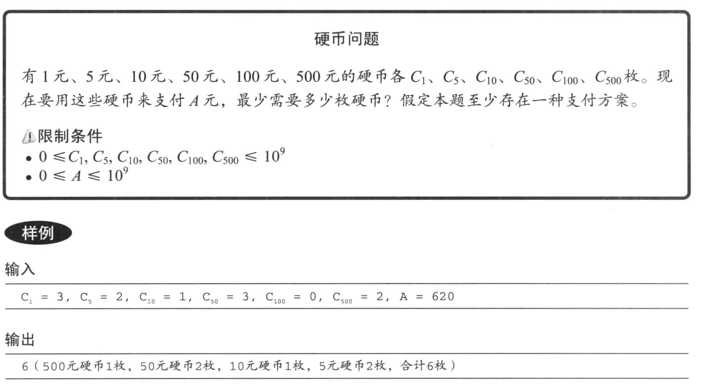

1. 遵循某种规律，不断的选择 **最优选择**

```cpp
// 有 1，5，10，50，100，500 六种面额的硬币
// 各 c1, c5, c10, c50, c100, c500 张
// 需要支付 A 元，最少需要多少枚硬币。

// 这题有一个贪心算法：因为任何一个较大的数字都可以被分解为较小的数字的和
// 也就是说：有大面额的尽量用大面额的，因为需要的硬币数较少
// 并且不存在，使用了大面额之后用小面额无法找零成功的情况。
// 如果不满足我们前面提到的条件则无法使用贪心算法。
#include "iostream"

const char *format = "C1 = %d, C5 = %d, C10 = %d, C50 = %d, C100 = %d, C500 = %d, A = %d";
const int coins[6] = {1, 5, 10, 50, 100, 500};

int C[6];

int A;

void solve()
{
	std::string line;
	std::getline(std::cin, line);
	int c1,c5,c10,c50,c100,c500,sum;
	sscanf(line.c_str(), format, &c1, &c5, &c10, &c50, &c100, &c500, &sum);
	C[0] = c1;
	C[1] = c5;
	C[2] = c10;
	C[3] = c50;
	C[4] = c100;
	C[5] = c500;
	int cnt = 0;
	for (int i = 5; i >= 0; --i)
	{
		while (sum != 0 && C[i] > 0 && sum >= coins[i])
		{
			sum -= coins[i];
			C[i]--;
			++cnt;
		}
	}
	std::cout << cnt << std::endl;
}

int main(int argc, char **argv)
{
	solve();
}
```

然而，上面的解法还可以更加简化；

```cpp
void solve2()
{
	int ans = 0;
	for (int i = 5; i >= 0; i--)
	{
		// 计算可以使用的 coins[i] 的数量
		int t = std::min(A / coins[i], C[i]);
		A -= t * coins[i];
		ans += t;
	}
}
```

### 区间问题

>我们每次选择可选工作中最早结束的那项

```c
// 区间调度问题
// start 表示工作开始时间， stop 表示工作结束时间
// 要选择所做的工作保证 `参加工作的数量（不是持续时间）最多`

#include "vector"

int MaxWorkCnt(std::vector<int> start,
				std::vector<int> stop)
{
	size_t workCnt = 0;
	int stopTime = 0;
	for (size_t i = 0; i != start.size(); i++)
	{
		if (start[i] > stopTime)
		{
			stopTime = stop[i];
			workCnt++;
		}
	}
	return workCnt;
}

int main(int argc, char **argv)
{
	std::vector<int> start{1, 2, 4, 6, 8},
					 stop{3, 5, 7, 9, 10};

	assert(MaxWorkCnt(start, stop) == 3);
}

```

#### 贪心算法(区间问题)的证明

1. 直观上来看，选择越早结束的工作，之后的工作选择就越多；
2. 归纳法：与其他选择方案相比，该算法的选择在选取了相同数量的更早开始的工作同时，其最终结束时间不会比其他的方案更晚；

### POJ 3617

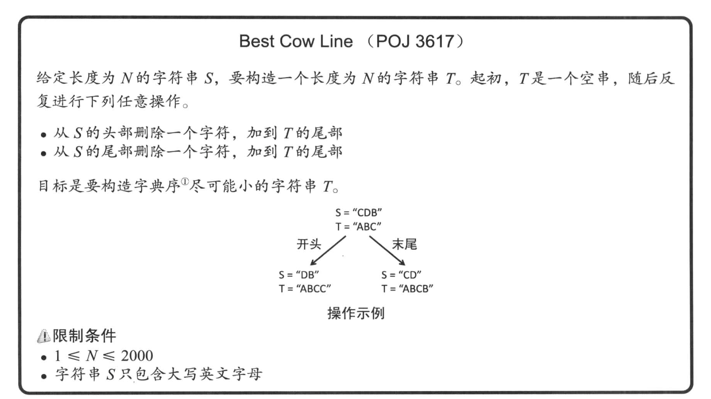

1. 这个题的思路非常简单，找到首尾两个字符字典序中较小的那个字符，并输出
2. 如果两个字符相同，那么随便输出一个即可：
	- 之前考虑的是会出现 `X0X1[X2]x[X3]X1X0` 这种形式的，其实我们只需要随意输出任意一个 A1，随后在循环中进行下一轮比较即可。如果 `X3 < X2`，那么最后的形式一定是 X3 在 X2 的前面。所以我们优先减少右边去靠近 X3

```c
#include "iostream"
#include "string"

void solve2()
{
	char        ch;
	int         num;
	std::string word, ret;

	std::cin >> num;
	while (num-- > 0)
	{
		std::cin >> ch;
		word.push_back(ch);
	}

	int head = 0, tail = word.size() - 1;
	while (head <= tail)
	{
		if (head == tail)
		{
			ret.push_back(word[head]);
			break;
		}
		else if (word[head] > word[tail])
		{
			ret.push_back(word[tail--]);
		}
		else if (word[head] < word[tail])
		{
			ret.push_back(word[head++]);
		}
		else
		{
			bool left = false;

			for (int i = 0; head + i < tail - i; i++)
			{
				if (word[head + i] < word[tail - i])
				{
					left = true;
					break;
				}
				else if (word[head + i] > word[tail - i])
				{
					left = false;
					break;
				}
			}

			if (left)
				ret.push_back(word[head++]);
			else
				ret.push_back(word[tail--]);
		}
	}

	for (int i = 0; i < ret.size(); ++i)
	{
		std::cout << ret[i];
		if (i != 0 && (i+1) % 80 == 0)
		{
			std::cout << std::endl;
		}
	}
}

int main(int argc, char **argv)
{
	solve2();
}
```

### POJ 3069

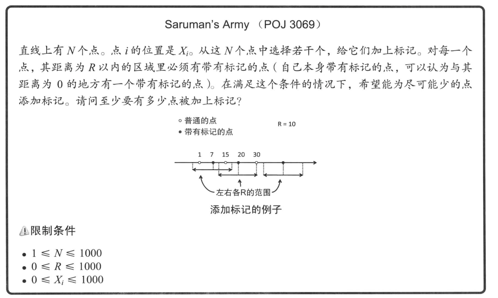

```C
#include "iostream"
#include "vector"
#include "algorithm"

void solve(std::vector<int> &arr, const int r)
{
	std::sort(arr.begin(), arr.end());
	int i = 0, ans = 0, N = arr.size();

	/**
	 * 每次循环中：
	 * 1. 找到第一个和起始点间距超过 r 的点，这个点的前一个点就是我们要找的中间节点
	 * 2. 从中间节点向后遍历，找到第一个和中间节点间距超过 r 的节点，这个节点就是下一次循环的起点
	 */
	while (i < N)
	{
		/**
		 * 不需要考虑 arr[0] > r
		 * 只需要考虑，arr[1] - arr[0] > r
		 * 如果成立，那么我们需要标记 arr[0]
		 */
		int s = arr[i++];
		while (i < N && arr[i] <= s + r)
			i++;
		/*
		 * 设置中间的 point，这个 point 到 arr[0] <= r
		 */
		int p = arr[i - 1];

		/**
		 * 找到第一个 arr[i] - p > r 的，这个点就是新的起始位置
		 */
		while (i < N && arr[i] <= p + r)
			i++;

		ans++;
	}

	if (ans != 0)
	{
		std::cout << ans << std::endl;
	}
}

int main(int argc, char **argv)
{
	int              r = 0, n = 0, cnt = 0, point;
	std::vector<int> arr;
	while (r != -1 || n != -1)
	{
		std::cin >> r >> n;
		// 为了方便计算
		while (cnt++ < n)
		{
			std::cin >> point;
			arr.push_back(point);
		}

		solve(arr, r);

		cnt = 0;
		arr.clear();
	}
}
```

### POJ 3253

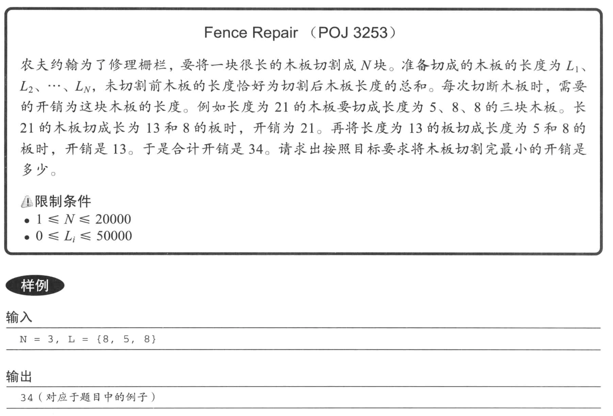

1. 每个节点的开销等于 `木板的最终长度 x 模板的深度`
2. 最短的板应该是 **深度最大的子节点之一**。所以这个叶子节点的同一深度的兄弟节点一定存在，并且由于同样是最深的叶子节点，所以应该对应于次短的板
3. 这种切法可以和我之前自己的切法（错误的）对比一下：我是每次切掉最大的那块，那么最终的结果是形成了一个队列（也可以说是左子节点为空的二叉树）。
4. 假设最后切割成的队列按从小到大的顺序是 `L1, L2, ..., Ln`
	- L1 和 L2 是兄弟节点，那么我们可以得到一个新的队列 `(L1 + L2), L3, ..., Ln`
	- 对这个新的队列递归的去调用木板的长度

>该方法时间复杂度是 O(n2) 所以 OJ 会超时

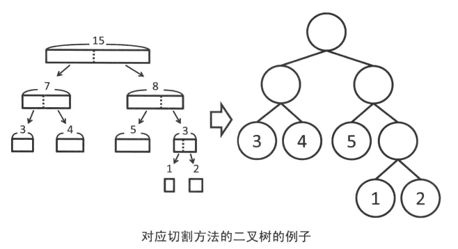

```c
// POJ 3253
#include <vector>
#include "iostream"
#include "algorithm"

int arr[20010];

int huffman(int *v, int num)
{
	std::sort(v, v + num);
	if (num == 0)
		return 0;
	else if (num == 1)
		return *v;
	else if (num == 2)
		return *v + *(v + 1);

	int sum = *v + *(v + 1);
	v = v + 1;
	*v = sum;

	return sum + huffman(v, num - 1);
}

int main(int argc, char **argv)
{
	int N, num, len = 0, i = 0;


	std::cin >> N;
	int tmp = N;
	while (tmp-- > 0)
	{
		std::cin >> num;
		len += num;
		arr[i++] = num;
	}

	std::cout << huffman(arr, N) << std::endl;
}

```

## 2.3 记录结果再利用的 “动态规划”

### 2.3.1 记忆化搜索与动态规划

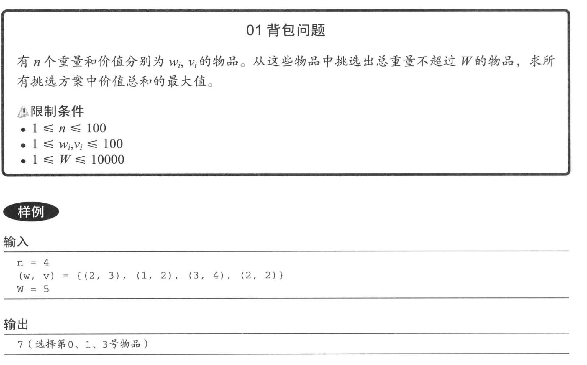

```c
// 01 背包问题

#include "iostream"

int n, W;
int items[100][2];

void init()
{
	std::cin >> n;
	int w0, v0, tmp = 0;
	while (tmp++ < n)
	{
		std::cin >> w0 >> v0;
		items[tmp][0] = w0;
		items[tmp][1] = v0;
	}
	std::cin >> W;
}

int exhaustion(int i, int weight)
{
	if (i == n)
	{
		return 0;
	}
	else if (weight < items[i][0])
	{
		return exhaustion(++i, weight);
	}
	else
	{
		// 选择和不选择物品都尝试，并取得最大值
		return std::max(exhaustion(i + 1, weight),
						exhaustion(i + 1, weight - items[i][0]) + items[i][1]);
	}
}

int main(int argc, char **argv)
{
	init();
	std::cout << exhaustion(0, W) << std::endl;
}

```

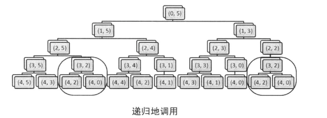

1. 可以看到，这里我们使用了所谓的 `记忆化搜索`，使用一个额外的数组保存了计算的结果。并在已经计算之后直接查表

```c
int dp_res(int i, int weight)
{
	if (dp[i][weight] >= 0)
		return dp[i][weight];

	int res;
	if (i == n)
	{
		res = 0;
	}
	else if (weight < items[i][0])
	{
		res = dp_res(i + 1, weight);
	}
	else
	{
		res = std::max(dp_res(i + 1, weight),
					   dp_res(i + 1, weight - items[i][0]) + items[i][1]);
	}

	return res;
}

```

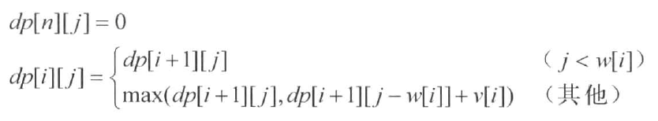

>推出来表格

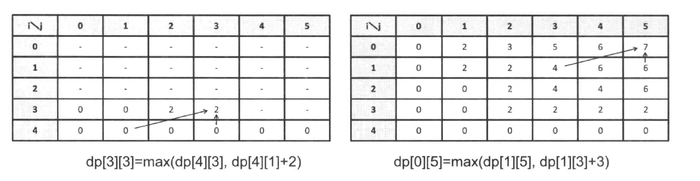

```c
/**
 * 数组的元素 dp[x][y] 表示：
 *
 * 从第 x 个元素开始选择，当前负重为 y 的最大价值
 */
int dp_func(int index, int weight)
{
	for (int i = 0; i <= 10001; ++i)
	{
		dp[100][i] = 0;
	}

	for (int i = n - 1; i >= 0; --i)
	{
		for (int j = 0; j <= W; j++)
		{
			// j 小于 items[i][0]，说明 dp[i][j] 无法选择 items[i] 元素
			// 所以它可以简单的等于它的上面一层
			if (j < items[i][0])
			{
				dp[i][j] = dp[i + 1][j];
			}
			else
			{
				// j 大于 items[i][0]，表示它可以选择 items[i] 元素，
				// 所以它需要做一个比较，选择两个值中的较大值
				// 1. 不选择 items[i]
				// 2. 选择 items[i]，当选择 items[i] 时，它的最大值等于 dp[i+1][j-items[i][0]] + items[i][1]
				dp[i][j] = std::max(dp[i + 1][j],
									dp[i + 1][j - items[i][0]] + items[i][1]);
			}
		}
	}

	return dp[index][weight];
}
```

#### 01背包问题的各种 DP

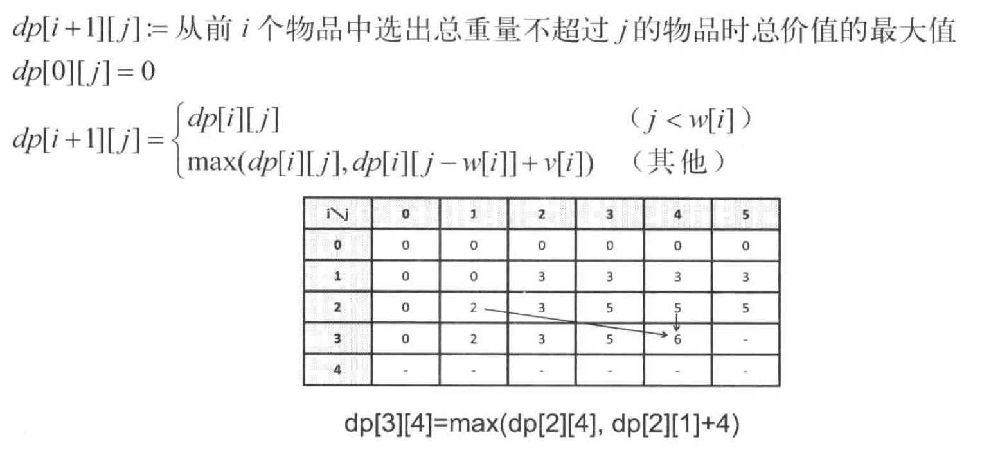

```c
/**
 * 表示从 [0, num] 的区间取，取出的最多不超过重量 weight 的物品
 */
int dp_func2(int num, int weight)
{
	for (size_t i = 0; i < W; ++i)
	{
		dp[0][i] = 0;
	}

	for (size_t i = 1; i <= n; ++i)
	{
		for (size_t j = 0; j <= W; ++j)
		{
			if (j < items[i - 1][0])
			{
				dp[i][j] = dp[i - 1][j];
			}
			else
			{
				dp[i][j] = std::max(dp[i - 1][j],
									dp[i - 1][j - items[i - 1][0]] + items[i - 1][1]);
			}
		}
	}

	return dp[num][weight];
}

```

#### 最长公共子序列

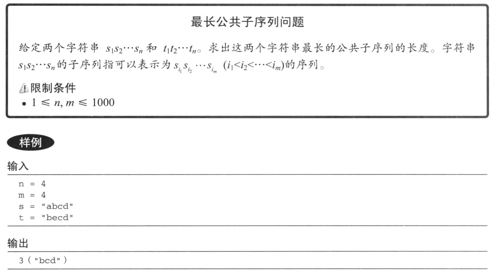

1. 假设存在一个二维数 dp[i][j]， 表示的是 `[s1[0], s1[i]]` 和 `[s2[0], s2[j]]` 的最长公共子字符串。那么 dp[i+1][j+1] 的最长公共子字符串一定是以下三种情况之一
	- 位于 `[s1[0], s1[i]]` 和 `[s2[0], s2[j+1]]` 之间
	- 位于 `[s1[0], s1[i+1]]` 和 `[s2[0], s2[j]]` 之间
	- 位于 `[s1[0], s1[i+1]]` 和 `[s2[0], s2[j+1]]` 之间
		- 如果 `s1[i+1] == s2[j+1]`，那么在原来的最长公共子字符串上加上 `s1[i+1]` 和 `s2[j+1]`
		- 如果 `s1[i+1] != s2[j+1]`，那么最长的公共子字符串肯定在前面的两种情况中
2. **那么我们的最大值就可以转换为求以上三种情况的最大值了**

---

>那么我们可以推到出他们的转换公式

- `s1[i+1] != s2[j+1]`: dp[i+1][j+1] = max(dp[i+1)[j], dp[i][j+1])
- `s1[i+1] == s2[j+1]`: dp[i+1][j+1] = max(dp[i+1)[j], dp[i][j+1], dp[i][j] + 1)

**可以看到，我们两个公式中都有可能会将 `i+1`, `j+1` 减少**

```c
void solve()
{
	int dp[len1 + 1][len2 + 1];
	for (size_t i = 0; i <= len2; ++i)
	{
		dp[0][i] = 0;
	}

	for (size_t j = 0; j <= len1; ++j)
	{
		dp[j][0] = 0;
	}

	for (size_t i = 1; i <= len1; ++i)
	{
		for (size_t j = 1; j <= len2; ++j)
		{
			if (word1[i] == word2[j])
			{
				dp[i][j] = dp[i-1][j-1] + 1;
			}
			else
			{
				dp[i][j] = std::max(dp[i][j - 1], dp[i - 1][j]);
			}
		}
	}

	std::cout << dp[len1][len2] << std::endl;
}

```

### 2.3.2 进一步探讨递归问题

#### 完全背包问题

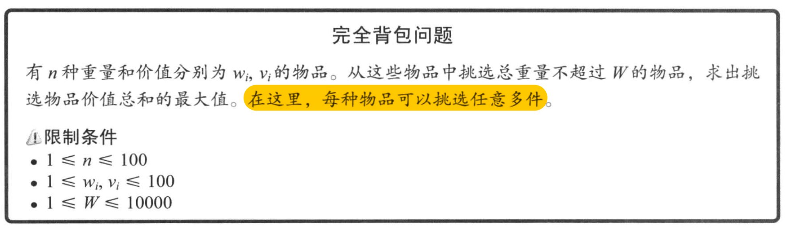

>和完全背包问题不一样的是，我们的每个物品可以选择 `多次`。还是和前面一样，我们假设 dp[i][j] 表示从前面 i 件物品里选择重量不超过 j 的最大价值

1. 想要达到 `dp[i+1][j]` 的状态可能由以下几种状态转换而来：
	- 不选择物品 `i+1`，那么这个时候的最大值显然是 `dp[i][j]`（在重量都等于 `j` 的情况下，必然是可以选择的物品 `i` 越多，我们所得到的值越大）
	- 选择物品 `i+1`，这个时候它和之前的01背包问题的区别来了，选择物品 `i+1` 可能是多次，所以它应该等于
		- dp[i][j - w[i]] + v[i]
		- dp[i][j - 2 * w[i]] + 2 * v[i]
		- ...

```c
/**
 * 从 [0, x - 1] 项元素里面，选择重量不超过 y 的物品。价值越高越好
 */
int solve(int x, int y)
{
	// 初始化 dp 数组
	int dp[x + 1][y + 1];
	for (size_t i = 0; i != x + 1; ++i)
		dp[i][0] = 0;
	for (size_t j = 0; j != y + 1; ++j)
		dp[0][j] = 0;

	for (size_t i = 1; i <= x; ++i)
	{
		for (size_t j = 1; j <= y; ++j)
		{
			int max = 0;
			for (size_t k = 0; k * w[i-1] <= j; ++k)
			{
				int tmp = dp[i - 1][j - k * w[i-1]] + static_cast<int>(k) * v[i-1];
				if (max < tmp)
				{
					max = tmp;
				}
			}
			dp[i][j] = max;
		}
	}
	
	return dp[x][y];
}

```

>对于输入 `[{3, 4}, {4, 5}, {2, 3}]`, `n == 3`, `w == 7`
><br/>
>int tmp = dp[i - 1][j - k * w[i-1]] + static_cast<int>(k) * v[i-1];


- f(3, 7)
	- ...
	- f(3, 3)
		- dp[2][3]
		- dp[2][1] + 1 * v[2]
	- f(3, 4)
		- dp[2][4]
		- dp[2][2] + 1 * v[2]
		- dp[2][0] + 2 * v[2]
	- f(3, 5)
		- dp[2][5]
		- dp[2][3] + 1 * v[2]
		- dp[2][1] + 2 * v[2]
	- f(3, 6)
		- dp[2][6]
		- dp[2][4] + 1 * v[2]
		- dp[2][2] + 2 * v[2]
		- dp[2][2] + 3 * v[2]
	- f(3, 7)
		- dp[2][7]
		- dp[2][5] + 1 * v[2]
		- dp[2][3] + 2 * v[2]
		- dp[2][1] + 3 * v[2]
	- ...

>经过观察，我们发现（观察个x，书上说的，这谁他妈的观察得到啊？？？）
><br/>
>f(3, 7) 的三个可选项正好对应了 f(2, 5) 的几个可选项 + v[2]
><br/>
>`dp[2][5] + 1 * v[2]`, `dp[2][3] + 2 * v[2]`, `dp[2][1] + 3 * v[2]`
><br/>
>`dp[2][5]`, `dp[2][3] + 1 * v[2]`, `dp[2][1] + 2 * v[2]`
><br/>
>所以 max({dp[i][j-k\*w[i]]+k\*v[i] | 0 <= k})
><br/>
>所以 f(3, 7) == max(dp[2][7], dp[3][5])
><br/>
>**dp[i+1][j] == max(dp[i][j], dp[i + 1][j - w[i]] + w[i])**

```c
int solve2(int x, int y)
{
	// 初始化 dp 数组
	int dp[x + 1][y + 1];
	for (size_t i = 0; i != x + 1; ++i)
		dp[i][0] = 0;
	for (size_t j = 0; j != y + 1; ++j)
		dp[0][j] = 0;

	for (size_t i = 1; i <= x; ++i)
	{
		for (size_t j = 1; j <= y; ++j)
		{
			// 这里我犯了两个错误
			// 1. 第一次我没有判断 j >= w[j - 1] 就开始计算实际的值，导致数据会访问到 0 以后的索引
			// 2. 第二次判断了 j >= w[j - 1]，但是在不符合条件的时候没有赋值
			// dp[i][j] = dp[i - 1][j];
			// 这导致了部分数据未赋值
			if (j >= w[i - 1])
			{
				dp[i][j] = std::max(dp[i - 1][j], dp[i][j - w[i - 1]] + v[i - 1]);
			}
			else
			{
				dp[i][j] = dp[i - 1][j];
			}
		}
	}

	return dp[x][y];
}

```

#### 对完全/不完全背包问题的优化

>对于输入 `[{3, 4}, {4, 5}, {2, 3}]`, `n == 3`, `w == 7`

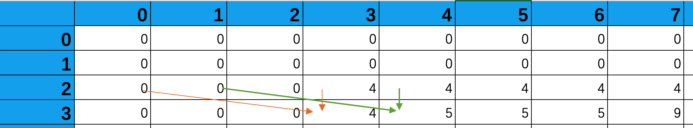

>对比一下完全背包问题的状态转换

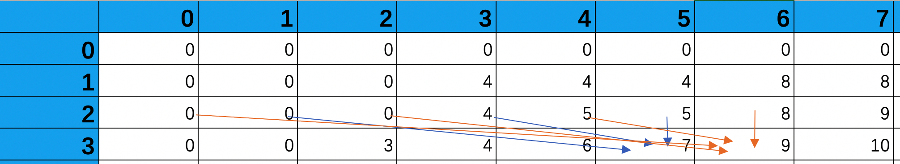

针对不完全背包问题的优化：我们可以观察到一个结论，在二维数组中的 dp[i][j]， **在计算完 dp[i+1][j] 之后就不会再使用**，那么如果我们从右往左更新这个数组，那么就可以得到一个这样的一维数组：
1. **对于 `index >= j` 的 dp[j], dp[j+1]...，它们等同于原来的二维数组的 dp[i][j], dp[i][j+1]**
2. 对于 `index < j` 的 dp[j-1], dp[j-2]...，它们等同于原来的二维数组的 dp[i-1][j-1], dp[i-1][j-2]

```c
/*
 * 对 dp 数组进行优化，只需要一维数组就可以。
 * dp[i][j] 代表从前面 i 个元素开始，选择不大于重量 weight 的物品
 */
int dp_func3(int num, int weight)
{
	// 这里我出了一个 BUG，我没有初始化数组中所有的值。
	int dp0[weight + 1];
	memset(dp0, 0, sizeof(dp0));

	for (size_t i = 1; i <= num; ++i)
	{
		for (size_t j = weight; j > 0; --j)
		{
			if (j >= items[i - 1][0])
			{
				dp0[j] = std::max(dp0[j],
								  dp0[j - items[i - 1][0]] + items[i - 1][1]);
			}
			else
			{
				dp0[j] = dp0[j];
			}
		}
	}

	return dp0[weight];
}
```

>对于完全背包问题的错误优化

```c
/*
 * 注意，这个是完全背包问题的错误解法，我实现的时候包含了两个错误
 */
int solve3(int x, int y)
{
	// 初始化 dp 数组
	int dp[y + 1];
	for (size_t j = 0; j != y + 1; ++j)
		dp[j] = 0;

	for (size_t i = 1; i <= x; ++i)
	{
		// 错误1：这里我最开始使用的是 ++j
		for (size_t j = y; j != 0; --j)
		{
			if (j >= w[i - 1])
			{
				/*
				 * 错误2：
				 * 注意到完全背包问题和不完全背包问题的状态变换公式是不一样的。
				 * 完全背包问题的状态变换公式是：
				 * dp[i+1][j] = std::max(dp[i][j],
				 * 						 dp[i + 1][j - w[i]] + v[i])
				 *
				 * 注意，这里有个问题是：std::max() 的第二个参数是 dp[i+1] 而不是 dp[i]。
				 * 按照我们之前的说法，这个以为数组小于 j 的部分，代表的其实是 dp[i] 的那一行。
				 * 所以，我们这个解法退化成了不完全背包问题。
				 */
				dp[j] = std::max(dp[j],
								 dp[j - w[i - 1]] + v[i - 1]);
			}
			else
			{
				dp[j] = dp[j];
			}
		}
	}

	return dp[y];
}
```

>完全背包问题的正确解法

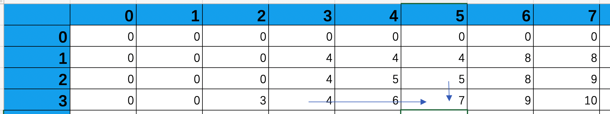

1. 只需要将内层循环的代码修改为 `for (size_t j = w[i-1]; j <= weight; ++j)` 即可。
2. 和前面的不完全背包问题一样， `dp[i+1][j]` 计算完之后就不会再继续使用，但是有一个新的问题， **在计算 `dp[i+1][j]` 的时候，需要使用到 dp[i+1][j-w[i]] 的数据**，所以我们刚才的从后往前的这种更新逻辑是不适用的。
3. 我们根据新的公式，重新观察一下这个图，我们会发现一个重要的性质：dp[i+1][j] 在计算完之后 **得到的结果** 可能会被后续的计算使用
4. 那么，根据 3 我们可以发现，如果我们从左到右去计算，那么就可以完成空间复杂度的优化。

---

#### 对比完全/不完全背包问题的优化

1. 思考一下，我们将二维数组转换为一维数组，更新 dp[i] 代表了什么？
	- **在我们的优化中， dp[j] 更新前表示 dp[i][j]，更新后表示 dp[i+1][j]**
2. 完全背包问题的转换关系 dp[i+1][j] 依赖于两个位置：dp[i][j] 和 dp[i+1][j-w[i]] + v[i]
3. 不完全背包问题的转换关系 dp[i+1][j] 依赖于两个位置：dp[i][j] 和 dp[i][j-w[i]] + v[i]
4. 他们的共同点是：他们都依赖于 `dp[i][j]`，也就是更新前的数据。
5. 他们的不同点是：一个依赖于 `dp[i+1][j-w[i]] + v[i]`， 一个依赖于 `dp[i][j-w[i]] + v[i]`。他们一个依赖于更新后的数据，一个依赖于更新前的数据。
6. 所以，在我们循环更新数组的时候需要考虑如何才能保证那些满足各自对应的依赖：
	- 对于完全/不完全背包，当我们更新 dp[j] 的时候，就已经可以当前的 dp[j] 是更新前的数据
	- 对于完全背包，我们从数组 `0->W` 的方向更新，可以保证 dp[j] 更新时，它依赖的那个数据 **已经被更新**
	- 对于不完全背包来说，我们从数组 `W->0` 的方向更新，可以保证 dp[j] 更新时，它依赖的那个数据 **尚未被更新**
	
>所以，针对任意的问题。我们都可以推断出一个结论：当我们更新数组时需要 **保证它依赖的数据的状态是它所需要的**
><br />
>而当我们从数组的低位往高位更新，当我们更新到 dp[j] 的时候数组的形式如下：
><br />
>[ dp[`i+1`][0], dp[`i+1`][1], ..., dp[i][j], ..., dp[i][MAX_J] ]
><br />
>而当我们从数组的高位往地位更新，当我们更新到 dp[j] 的时候数组的形式如下：
><br />
>[ dp[i][0], dp[i][1], ..., dp[i][j], ..., dp[`i+1`][MAX_J-1], dp[`i+1`][MAX_J] ]

#### 01背包问题[威力加强版]

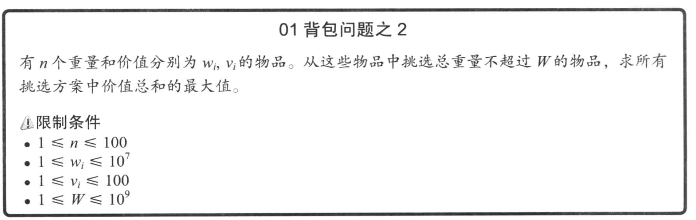

>相对于普通的01背包，唯一修改的是每个物品的重量修改到了 (0, 10<sup>7</sup>] 和总重量修改为了 10<sup>9</sup>

1. 由于使用 `前面 i 个物品 - 当前重量 j` 表示当前状态的最大价值的空间复杂度太高，所以我们可以转变一下动态规划的思路：使用 `前面 i 个物品 - 当前的总价值 j` 表示达到这个状态所需的最少重量

```c
/*
 * 定义 dp[i+1][j] 表示从前面 i 个物品中挑选出总价值为 j 的最小重量，不能满足则等于 INF，否则 >=0
 */
int solve(int max_num, int max_weight)
{
	// 100 表示每个物品的最大单价
	int dp[max_num + 1][max_num * 5 + 1];
	dp[0][0] = 0;
	for (int i = 1; i < max_num + 1; ++i)
		dp[i][0] = 0;
	for (int j = 1; j < max_num * 5 + 1; ++j)
		// 最早我的实现这里使用的是 -1 表示不可达到，但是在动态规划中我们需要选择 std::min
		// 所以 -1 需要额外的步骤去判断是重量小于，还是不论怎么选，都达不到这个价值
		dp[0][j] = 0xffff;

	for (int i = 1; i < max_num + 1; i++)
	{
		for (int j = 1; j < max_num * 5 + 1; ++j)
		{
			// 同样的错误：没有判断 j >= v[i - 1] 又犯了一次
			// 另外，没有对不满足条件时的 dp[i][j] 赋值又犯了一次
			if (j >= v[i - 1])
			{
				// 最开始我还是在使用 std::max
				dp[i][j] = std::min(dp[i - 1][j],
									dp[i - 1][j - v[i - 1]] + w[i - 1]);
			}
			else
			{
				dp[i][j] = dp[i - 1][j];
			}
		}
	}

	// 最开始我返回了 dp[max_num][i] 而不是索引，这其实是错误的
	for (int i = max_num * 5; i >= 0; --i)
	{
		if (dp[max_num][i] <= max_weight)
		{
			return i;
		}
	}

	return 0;
}
```

#### 多重部分和问题

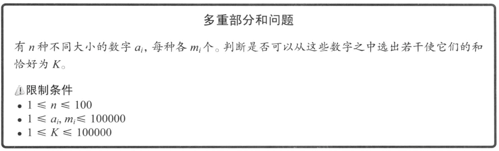

1. 假设 n 种不同的大小的数字最终达到了和为 K 的状态，那么我们可以肯定的是，他是从 `K - x` 的状态加上了一个数字 `x`。因为加法存在交换性，所以我们可以我们累加的这个数字 `x` 就是第 n 个数字。那么问题就被我们分解成了子问题： **前面 `n-1` 个数字是否可以得到累加和 {K, K - 1 * a[n], K - 2 * a[n] ...}**
2. 那么我们可以定义： **dp[i+1][j] 表示用前面 i 种数字能否累加成 j**
3. 那么得到了状态转换公式：
	- dp[i+1][j] = dp[i][j] | dp[i][j - a[i]] | dp[i][j - 2 *a[i]]...

```c
/**
 * 假设从前面 n 个元素中取元素累加，如果可以达到 k，那么就设置 dp[n][k] = true
 */
bool solve1()
{
	bool dp[n + 1][sum + 1];
	for (int i = 0; i < n + 1; ++i)
		dp[i][0] = true;
	for (int j = 1; j < sum + 1; ++j)
		dp[0][j] = false;

	for (int i = 1; i < n + 1; ++i)
	{
		for (int j = 1; j < sum + 1; ++j)
		{
			dp[i][j] = false;
			// BUG：没有比较 j >= k * a[i - 1] 导致访问越界
			for (int k = 0; k <= m[i - 1] && j >= k * a[i - 1]; ++k)
			{
				dp[i][j] |= dp[i - 1][j - k * a[i - 1]];
			}
		}
	}

	return dp[n][sum];
}
```

>可以看到，上面的空间复杂度是 O(n * sum)；而时间复杂度最差情况是 `O(n * sum * sum)`

#### 多重部分和问题的优化

观察前面的队列，我们可以看到在循环中，我们的 `for (int k = 0; k <= m[i - 1] && j >= k * a[i - 1]; ++k)` 循环中使用了很多次的 `m[i-1]`，如果我们可以将这个过程省略掉的话可以减少相当多的复杂度；

那么，我们将 dp[i + 1][j] 定义为 **前面 i 个数字计算得到 j 时，还剩余 a[i] 的数量**，不能加到的时候为 -1

那么可以得到状态转换方程：

- dp[i + 1][j]
	- m[i]						(dp[i][j] > 0)
	- -1						(dp[i + 1][j - a[i]] <= 0 || a[i] > j)
	- dp[i + 1][j - a[i]] - 1	(其他)


```c
/*
 * dp[i][j] 表示从前面 i 个元素中累加得到 j 之后，剩余的 a[i-1] 数量，-1 表示不能累加得到 j
 */
bool solve2()
{
	int dp[n + 1][sum + 1];
	for (int j = 0; j < sum + 1; ++j)
		dp[0][j] = -1;
	for (int i = 1; i < n + 1; ++i)
		dp[i][0] = m[i - 1];

	for (int i = 1; i < n + 1; ++i)
	{
		for (int j = 1; j < sum + 1; ++j)
		{
			// BUG：这里我开始只判断了 > 0 没有判断 == 0
			if (dp[i - 1][j] >= 0)
			{
				// 前面 i - 1 个数字已经可以求和了，所以这里我们不用累加 a[i - 1]
				dp[i][j] = m[i - 1];
			}
			else if (j < a[i - 1] || dp[i][j - a[i - 1]] <= 0)
			{
				// i 个数字没办法通过求和得到 K - a[i - 1]，自然也没办法通过求和得到 K
				dp[i][j] = -1;
			}
			else
			{
				dp[i][j] = dp[i][j - a[i - 1]] - 1;
			}
		}
	}

	return dp[n][sum] > 0;
}
```

>假设输入为 n = 3, sum = 7，数组为 [[4, 3], [2, 2], [2, 3]]

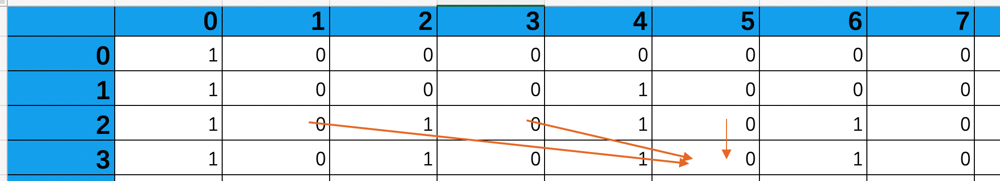

观察上面的图，我们会发现一个结论：

1. dp[3][5] = dp[2][1] | dp[2][3] | dp[2][5]
2. dp[3][3] = dp[1][1] | dp[2][3]

那么，自然我们推断得出一个结论：

- dp[i+1][j] = dp[i][j] | dp[i+1][j - a[i]]			(j >= a[i])
- dp[i+1][j] = dp[i][j]

于是我们做了如下优化：

```c
bool solve3()
{
	bool dp[n + 1][sum + 1];
	for (int i = 0; i < n + 1; ++i)
		dp[i][0] = true;
	for (int j = 1; j < sum + 1; ++j)
		dp[0][j] = false;

	for (int i = 1; i < n + 1; ++i)
	{
		for (int j = 1; j < sum + 1; ++j)
		{
			if (j >= a[i - 1])
			{
				dp[i][j] = dp[i - 1][j] | dp[i][j - a[i - 1]];
			}
			else
			{
				dp[i][j] = dp[i - 1][j];
			}
		}
	}

	return dp[n][sum];
}
```

然而，这个结论是错误的。当我们输入为：

>3
><br/>
>7 3
><br/>
>5 2
><br/>
>2 3
><br/>
>10

时，dp[3][9] 应该是不可达的，但是实际上我们算出来确实可达的。 **这是因为我们通过 dp[3][3], dp[3][5], dp[3][7] 分别可以得到和 2，4，6。然而，当我们尝试通过 `6+2` 得到 8 时却不行，因为 2 只有 3 个。所以我们修改了如上的解决方案，存储了所剩 a[i] 的数量**

#### 最长上升子序列问题

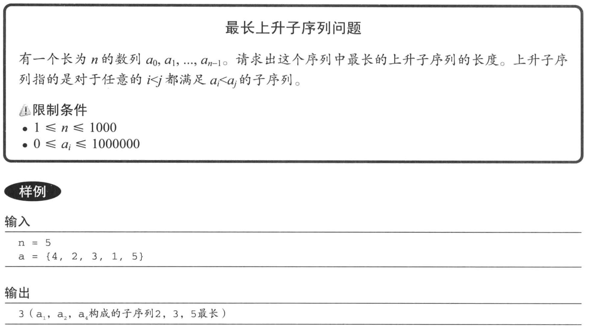

1. 当新增一个数字 a[i] 的时候，现在的最长子序列可能是一下几种情况
	- a[i] 大于当前最长子序列中的最大值，那么在当前最长上升子序列上加一
	- a[i] 小于当前最长子序列中的最大值，但是大于当前的 **某一个上升子序列的最大值**，那么这个上升子序列的长度加一，并且最大值为 a[i]
	- a[i] 不大于任何一个上升子序列的最大值，a[i] 成为一个新的长度为一的上升子序列的最大值
2. 我们可以定义 `dp[i]` 表示以 a[i] 结尾的字符的最长上升子序列的个数，所以得到状态转换方程：
	- dp[i] = 0						(i == 0)
	- dp[i] = max{ 1, dp[j] + 1 | j < i && a[i] > a[j] }

```c
int solve()
{
	int dp[n];
	dp[0] = 1;

	for (int i = 1; i < n; ++i)
	{
		int max = 1;
		// 4 2 3 1 5
		for (int j = 0; j < i; ++j)
		{
			if (arr[i] > arr[j] && dp[j] >= max)
			{
				max = dp[j] + 1;
			}
		}
		dp[i] = max;
	}

	// BUG：我之前直接返回了 dp[n - 1]
	int max = 0;
	for (int i = 0; i < n; ++i)
	{
		if (dp[i] > max)
			max = dp[i];
	}
	return max;
}

```

>上面的解法时间复杂度为 O(n<sup>2</sup>)；考虑到一个特点，对于长度为 n 的子上升序列，长度较小的那个数字更有优势 -- 对于 len(a[i]) == len(a[j]) && a[i] < a[j]，后续任意的数字只要满足 a[j] < a[q] 就一定满足 a[i] < a[j]

1. 所以我们可以定义 dp[i] 代表的是序列长度为 i+1 的序列的最小数，如果不存在对应序列长度的话则定义为 INF
2. 简单来讲，对于一个数字 a[i]，我们就用它去更新当前的 dp 序列中的某一个位置使得 **len(a[i]) == j && a[i] < dp[j]**，而这个位置就是 `j = lower_bound(a, a + n, a[i])`
	- j == 0，则当前数组中最小的数字更新为 a[i]
	- j > 0，则有 `dp[j] >= a[i]` && `dp[j-1] > a[i]`，也就是说
		- a[i] 比长度为 `j-1` 的序列的最小值要大。那么 a[i] + 这个序列就构成了一个长度为 j 的新的序列，满足了条件 `len(a[i]) == j`
		- a[i] `<` dp[j]，那么我们将 dp[j] = a[i] 即可
3. **注意，我们在开始之前一定要将数组全部初始化为 INF，因为我们是从左到右更新 dp 数组，如果不将数组全部初始化为 INF 的话会导致二分查找错误**

### 2.3.3 有关计数问题的 DP

#### 划分数


对应于牛客网的 [放苹果](https://www.nowcoder.com/questionTerminal/a2a1d0266629404fba582d416d84b6a0)

>假设 dp[i][j] 是 j 的 i 划分

1. 一种错误的思路是：我们首先从 j 中拿出 k 个，然后将剩下的 j-k 个分成 i-1 份，于是我们得到了 `dp[i][j] = sum(dp[i-1][j-1], ...)`。这是因为不同的划分中会有重复。
2. 那么我们现在需要做的就是去想办法，避免计算这些重复的数据：我们使用新的划分方法：
	- 在所有的盘子中都放上一个苹果，随后再将剩下的苹果放在盘子上，就是 dp[i][j - i]
	- 空出第一个盘子，将苹果放在剩余的 i - 1 个盘子中，就是 dp[i - 1][j]
	- 空出第二个盘子...
3. 然而，`2` 仍然是错误的，因为 **空出第二个盘子，空出第三个盘子会在空出第一个盘子中的递归被计算，我们相当于重复计算了**

>从我们下面的例子可以看到，`dp[2][4]` 表示空出一个盘子，然而在它的递归调用中可以看到 `dp[1][4]` 这个调用

- dp[3][4]
	- dp[2][4]
		- dp[1][4] == 1 （对应于 4 的分法）
		- dp[2][2]
			- dp[1][2] == 1（对应于 1 3 的分法）
			- dp[2][0] == 1（对应于 2 2 的分法）
	- dp[3][1] == 1 （对应于 1 1 2 的分法）

>递归的实现

```c
int solve0(int i, int j)
{
	if (i == 1 || j == 0)
	{
		// 只剩一个盘子了，或者没有苹果了
		return 1;
	}
	else if (i > j)
	{
		// 盘子比苹果多
		return solve0(j, j);
	}
	else
	{
		// 1. 在每个盘子中都放一个苹果，然后将剩下的苹果放到盘子中
		// 2. 空出一个盘子不放苹果，将所有的苹果放到其他的盘子中
		// 空出两个或两个以上的盘子会在 2 中被递归出来
		return solve0(i, j - i) + solve0(i - 1, j);
	}
}

```

```c
/*
 * dp[n][m] 表示 m 的 n 划分
 *
 * m == 盘子数量
 * n == 苹果数量
 */
int solve2()
{
	int dp[n + 1][m + 1];
	// 苹果为0
	for (int i = 0; i < n + 1; ++i)
		dp[i][0] = 1;
	// 盘子为1
	for (int j = 0; j < m + 1; ++j)
		dp[1][j] = 1;

	for (int i = 2; i < n + 1; ++i)
	{
		for (int j = 1; j < m + 1; ++j)
		{
			if (j >= i)
				dp[i][j] = dp[i][j - i] + dp[i - 1][j];
			else
				dp[i][j] = dp[j][j];
		}
	}

	return dp[n][m];
}

```

#### 多重集组合数

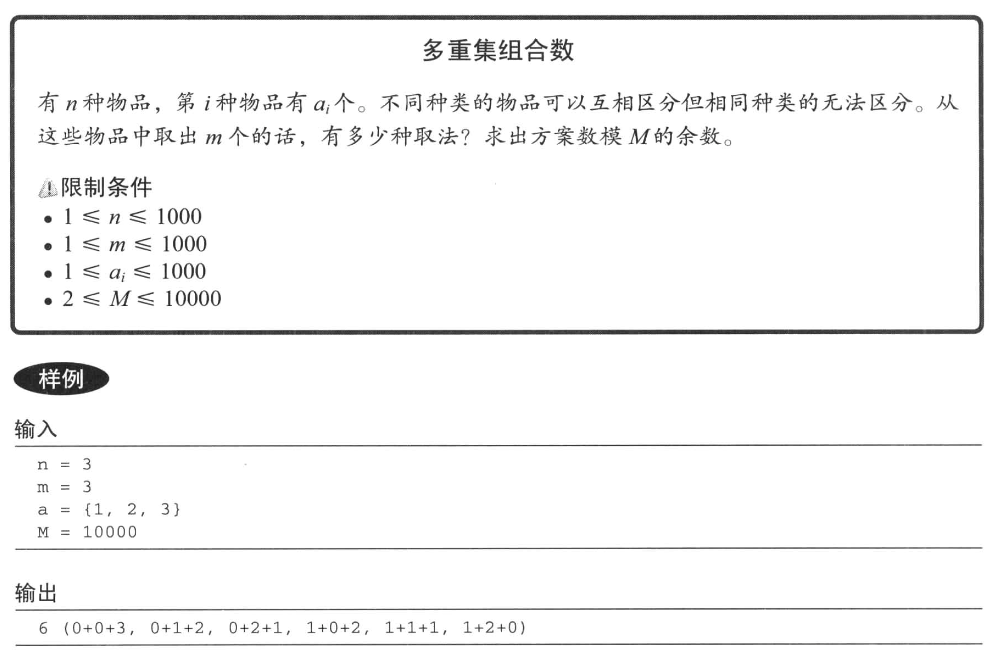


