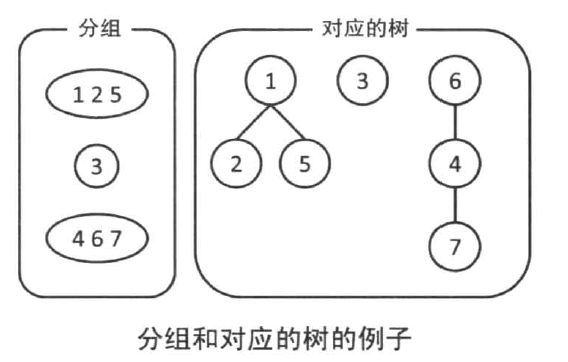

# 加工并存储数据的数据结构

## 2.4.1 树和二叉树


### 2.4.2 优先队列和堆

#### 优先队列

1. 可以插入一个数值
2. 可以取出最小的数值

**能高效的在二叉树上实现上述两个功能的，叫做 `二叉堆`**

#### 堆的数据结构


1. **堆最重要的性质就是：父节点的值一定小于等于子节点的值**
2. 除此之外，树的节点是按照 **从上到下、从左到右的顺序紧凑排列的**


>二叉树插入数值时，首先在末尾插入该数值，然后不断的向上提升直到没有大小颠倒为止


1. 从堆中删除最小值
2. 将堆的最后一个节点的数值复制到根节点上，并且删除最后一个节点
3. 不断的向下颠倒直到没有大小颠倒为止，当两个儿子都大小颠倒的时候，选择较小的那个来交换。

#### 堆的操作的复杂度

插入节点和删除最小节点的复杂度都是 O(log n)

#### 堆的实现


1. **我们使用 `数组` 来存储二叉堆**

```c
class BinaryHeap
{
public:
	explicit BinaryHeap()
			: nums(std::vector<int>()), current(0)
	{}

	void push(const int num)
	{
		nums.push_back(num);

		size_t c = current;
		while (c != 0)
		{
			size_t parent = (c - 1) / 2;
			if (nums[parent] < nums[c])
			{
				break;
			}
			// BUG1：这里我直接使用了 current 而不是 parent_index
			std::swap(nums[c], nums[parent]);
			c = parent;
		}

		current++;
	}

	int pop()
	{
		assert(current > 0);
		int ret = nums[0];
		--current;
		std::swap(nums[0], nums[current]);
		size_t i = 0;
		while (i * 2 + 1 < current)
		{
			size_t left = i * 2 + 1, right = i * 2 + 2;
			// 选择两个节点中较小的那个节点交换
			if (right < current && nums[right] < nums[left])
				left = right;

			if (nums[left] >= nums[i])
				break;

			std::swap(nums[left], nums[i]);
			i = left;
		}

		nums.erase(nums.end() - 1);

		return ret;
	}

	size_t           current;
	std::vector<int> nums;
};

int main(int argc, char **argv)
{
	BinaryHeap heap;

	size_t      cnt = 1000;
	for (size_t i   = cnt; i != 0; --i)
		heap.push(i);

	int current = -1, prev = -1;
	for (size_t i = cnt; i != 0; --i)
	{
		prev = current;
		current = heap.pop();
		assert(current > prev);
	}
}
```

>我们发现，在二叉堆的实现中，我们用到了很多的 `std::swap`，而这里其实有一个办法优化。下面的代码演示了如何优化。

```c
#include <vector>
#include "iostream"

class BinaryHeap
{
public:
	explicit BinaryHeap()
			: nums(std::vector<int>()), current(0)
	{}

	void push(const int num)
	{
		nums.push_back(num);

		size_t c = current;
		while (c != 0)
		{
			size_t parent = (c - 1) / 2;
			// BUG：之前这里我直接比较 nums[parent] < nums[c]
			if (nums[parent] < num)
			{
				break;
			}

			// 这里没有使用 std::swap，而是简单的赋值
			nums[c] = nums[parent];
			c = parent;
		}

		// 在最后才对 nums[c] 赋值
		nums[c] = num;

		current++;
	}

	int pop()
	{
		assert(current > 0);
		--current;
		int ret = nums[0], last = nums[current];
		std::swap(nums[0], nums[current]);
		nums.erase(nums.end() - 1);
		size_t i = 0;
		while (i * 2 + 1 < current)
		{
			size_t left = i * 2 + 1, right = i * 2 + 2;
			// 选择两个节点中较小的那个节点交换
			if (right < current && nums[right] < nums[left])
				left = right;

			if (nums[left] >= last)
				break;

			nums[i] = nums[left];
			i = left;
		}

		nums[i] = last;

		return ret;
	}

	size_t           current;
	std::vector<int> nums;
};

int main(int argc, char **argv)
{
	BinaryHeap heap;

	size_t      cnt = 1000;
	for (size_t i   = cnt; i != 0; --i)
		heap.push(i);

	int current = -1, prev = -1;
	for (size_t i = cnt; i != 0; --i)
	{
		prev = current;
		current = heap.pop();
		assert(current > prev);
	}
}
```

#### 需要运用优先队列的题目 - expedition


1. 思路就是，我们每次经过一个加油站，我们就获得任意时刻在这个加油站的权利。我们只需要，每经过一个加油站，就将这个加油站加入到优先队列中。当我们的油不够时选择加油量最多的那个加油站即可。
2. **有一个非常重要的优化，将终点当做最后一个加油站，可以优化我们的代码**

```c
#include "iostream"
#include "queue"

int n, l, p;
int a[1000], b[10000];

void init()
{
	std::cin >> n >> l >> p;
	for (size_t i = 0; i < n; ++i)
	{
		std::cin >> a[i] >> b[i];
	}

	std::cout << "n = " << n << std::endl;
	std::cout << "l = " << l << std::endl;
	std::cout << "p = " << p << std::endl;
}

/*
 * BUG1：题目理解错误， a[i] 不是距离 a[i-1] 的距离，而是距离起点的距离
 */
int solve()
{
	std::priority_queue<int> q;

	// pos 当前位置
	// cnt 加油次数
	// dis 距离下一个加油站的距离
	int pos = p, cnt = 0, dis = 0;
	// 注意，这里是一个非常经典的优化。我们将终点看做一个加油站，这使得我们可以不用去处理边界条件
	// 这种优化叫做哨兵
	a[n] = l;
	/*
	 * 经过每一个加油站，我们都把加油站放到优先队列中。
	 * 当油不够的时候，我们可以从已经经过的加油站中找出加油最多的那个加油站
	 */
	for (int i = 0; i < n; ++i)
	{
		while (a[i] > pos && !q.empty())
		{
			cnt++;
			pos += q.top();
			q.pop();
		}
		if (a[i] > pos)
		{
			return -1;
		}

		// 经过了一个加油站
		q.push(b[i]);
	}

	return cnt;
}
```

#### Fence Repair

>参考 `2.2` 的 Fence Repair 题目描述

```c
int solve()
{
	int ret = 0, min, sec_min;
	std::priority_queue<int, std::vector<int>, std::greater<int> > q;
	for (int i = 0; i < num; ++i)
		q.push(arr[i]);
	while (true)
	{
		min = q.top();
		q.pop();
		sec_min = q.top();
		q.pop();
		ret += min + sec_min;
		if (q.empty())
		{
			break;
		}
		q.push(min + sec_min);
	}
	return ret;
}

```

### 2.4.3 二叉搜索树

#### 二叉搜索树的结构

1. 支持插入一个数值
2. 查询是否包含某个数值
3. 删除某个数值


>二叉搜索树满足，左子节点都比父亲节点小，右子节点都比父亲节点大

#### 二叉搜索树的删除

1. 如果没有左子节点，那就用右子节点顶替删除的节点
2. 如果没有右子节点，那就用左子节点顶替删除的节点
3. 如果两个节点都有，那么就需要从左子节点和右子节点中选择一个节点顶替删除的节点：
	- 左子节点中最大的节点
	- 右子节点中最小的节点

```c
#include "iostream"

class node
{
public:
	int  val;
	node *left;
	node *right;

	explicit node(int val) : val(val), left(nullptr), right(nullptr)
	{}

	virtual ~node()
	{
		// 不需要手动的删除 val
		// delete &val;
		delete left;
		left = nullptr;

		delete right;
		right = nullptr;
	}

	node *insert(node *p, int x);

	node *remove(node *p, int x);

	node *find(node *p, int);

private:

	/**
	 * 返回 p 内一个指向 x 的节点的参数
	 */
	node **find_node_in_parent(node *p, int x);
};


node *insert2(node *p, int x)
{
	if (p == nullptr)
	{
		p = new node(x);
		return p;
	}
	else
	{
		// 这里其实可以用递归
		node *n = new node(x);
		// parent_p 指向它的左子节点或者右子节点
		node **parent_p = &p, *cur = p;
		while (cur != nullptr && cur->val != n->val)
		{
			parent_p = &cur;
			if (cur->val > x)
			{
				cur = cur->left;
				parent_p = &cur->left;
			}
			else if (cur->val < x)
			{
				cur = cur->right;
				parent_p = &cur->right;
			}
			else
			{
				return p;
			}
		}

		if (*parent_p == nullptr)
		{
			*parent_p = n;
		}

		return p;
	}
}

node *node::insert(node *p, int x)
{
	if (p == nullptr)
	{
		p = new node(x);
		return p;
	}
	else
	{
		// 这里其实可以用递归
		node *n = new node(x);
		// parent_p 指向我们要插入的位置的父节点中的指针
		// 可能是 left 或者 right
		// 这样我们就可以通过修改 parent_p 来修改父节点中的指针指向当前位置了
		node **parent_p = find_node_in_parent(p, x);
		if (*parent_p == nullptr)
		{
			*parent_p = n;
		}

		return p;
	}
}

node* node::find(node *p, int x)
{
	if (!p)
	{
		return nullptr;
	}

	while (p != nullptr)
	{
		if (p->val > x)
		{
			p = p->left;
		}
		else if (p->val < x)
		{
			p = p->right;
		}
		else
		{
			return p;
		}
	}

	return nullptr;
}

node *node::remove(node *p, int x)
{
	if (p == nullptr)
		return nullptr;

	node **parent_p = find_node_in_parent(p, x);
	if (*parent_p == nullptr)
	{
		// 没有找到对应的节点
		return nullptr;
	}

	node *r = *parent_p;
	if (r->left == nullptr)
	{
		*parent_p = r->right;
	}
	else if (r->right == nullptr)
	{
		*parent_p = r->left;
	}
	else
	{
		// 找到指向左子节点中最大的那个节点的指针
		node *max_in_left = r;
		node **max_left_p = &r;
		while (max_in_left->right != nullptr)
		{
			max_left_p = &max_in_left;
			max_in_left = max_in_left->right;
		}
		// max_in_left 指向要删除的节点中的左子节点的最大节点
		// *max_left_p 指向 max_in_left 的父节点中的 right
		// r 指向需要删除的那个节点
		max_in_left->left = r->left;
		max_in_left->right = r->right;
		*parent_p = max_in_left;

		*max_left_p = nullptr;
		r->left = nullptr;
		r->right = nullptr;
		delete r;
	}
	return p;
}

node **node::find_node_in_parent(node *p, int x)
{
	node **parent_p = &p, *cur = p;
	while (cur != nullptr && cur->val != x)
	{
		if (cur->val > x)
		{
			parent_p = &cur->left;
			cur = cur->left;
		}
		else if (cur->val < x)
		{
			parent_p = &cur->right;
			cur = cur->right;
		}

	}

	return parent_p;
}

int main(int argc, char **argv)
{
	node *p = nullptr;

	for (int i = 50; i != 0; --i)
	{
		p = p->insert(p, i);
	}
	for (int i = 50; i != 0; --i)
	{
		p = p->insert(p, i);
	}

	for (int i = 100; i != 50; --i)
	{
		p = p->insert(p, i);
	}
	for (int i = 100; i != 50; --i)
	{
		p = p->insert(p, i);
	}

	for (int i = 100; i != 0; --i)
	{
		assert(p->find(p, i)->val == i);
	}

	for (int i = 200; i != 100; --i)
	{
		assert(p->find(p, i) == nullptr);
	}

	for (int i = 100; i != 50; --i)
	{
		p = p->remove(p, i);
	}

	for (int i = 100; i != 50; --i)
	{
		assert(p->find(p, i) == nullptr);
	}

	for (int i = 50; i != 0; --i)
	{
		assert(p->find(p, i)->val == i);
	}
}
```

### 2.4.4 并查集

#### 并查集是什么

1. 查询元素 a 和元素 b 是否同组
2. 合并元素 a 和元素 b 所在的组


#### 并查集的结构



- 每个元素对应一个节点
- 每个组对应一棵树


>并查集的和并，从一个组的根向另一个组的根连边，这样两个可树就变成了一颗树


>为了查询两个元素是否在一个集合中，只需要沿着树往上走，走到树根。如果两个元素的树根相同，那么他们就在一个并查集中


#### 并查集实现中的注意点

>在实现并查集的时候，我们需要保证它不退化为一个链表

1. 对于每颗树，记录它的高度（rank）
2. 在合并的时候，如果两棵树的高度不同，那么从 rank 小的树向 rank 大的树连


还可以使用路径压缩，将所有的节点都连接到它的根节点上


```c
#include "iostream"

// 并查集的实现

#define N 100

int par[N];
int rank[N];

static int find(int x);

void init()
{
	for (int i = 0; i < N; ++i)
	{
		par[i]  = i;
		rank[i] = 0;
	}
}

bool same(int m, int n)
{
	return find(m) == find(n);
}

void unite(int m, int n)
{
	m = find(m);
	n = find(n);
	if (m == n)
	{
		return;
	}
	if (rank[m] > rank[n])
	{
		par[n] = par[m];
	}
	else
	{
		par[m] = par[n];
		if (rank[m] == rank[n])
		{
			rank[m]++;
		}
	}
}

static int find(int x)
{
	if (par[x] == x)
	{
		return x;
	}
	return find(par[x]);
}

int main(int argc, char **argv)
{
	init();
	for (int i = 0; i < N - 1; ++i)
	{
		assert(!same(i, i + 1));
	}

	for (int i = 0; i < N; ++i)
	{
		if (i % 2 == 0)
		{
			unite(i, i + 1);
		}
		else
		{
			assert(same(i, i - 1));
		}
	}
}
```

#### 食物链-POJ1182


>并查集是维护 `属于同一组` 的数据结构

在本题中，需要维护的关系有两种：

1. x 和 y 是否为同一族群
2. x 和 y 是不是食物链关系

但是我们面临一个问题，假设有 m，n，j，k 四种生物。那么假设我们现在收到两条信息：

1. m、n 是同一物种
2. j、k 是同一物种

那么我们现在应该记录 m、n、j、k 是哪一个物种呢？

所以，对于每个动物我们需要创建 `i_A`, `i_B`, `i_C` 三个元素的并查集

1. `i_A` 表示 `i 属于物种 A`
2. 并查集里的每一个组表示 **组内所有的元素代表的情况同时发生或者不发生**

例如，如果 `i_A` 和 `j_B` 在同一个组，那么就表示当 i 是物种 A 时，j 一定是物种 B

所以，对于每一条信息我们需要如下操作：

1. 对于 x == y，我们 unite(xa, ya), unite(xb, yb), unite(xc, yc)
2. 对于 x 吃 y，我们 unite(xa, yb), unite(xb, yc), unite(xc, ya)

>**因为我们不知道每一种情形，所以我们存储了每一种情况。假设 x 是族群 A，B，C 并计算在假设成立的情况下的所有情况**
