# 2.5 它们其实都是 “图”

## 2.5.1 图是什么

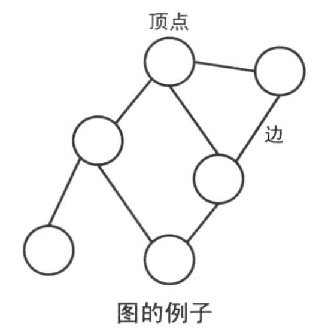

1. 图由顶点（vertex node）和 边（edge）组成；
2. 顶点的集合是 `V`，边的集合是 `E` 的图记为 `G = (V, E)`
3. 连接两点 u 和 v 的边用 `e = (u, v)` 表示

### 图的种类

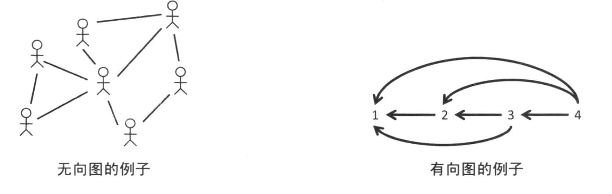

1. 微信的好友关系是 `无向图`，微博的关注是 `有向图`

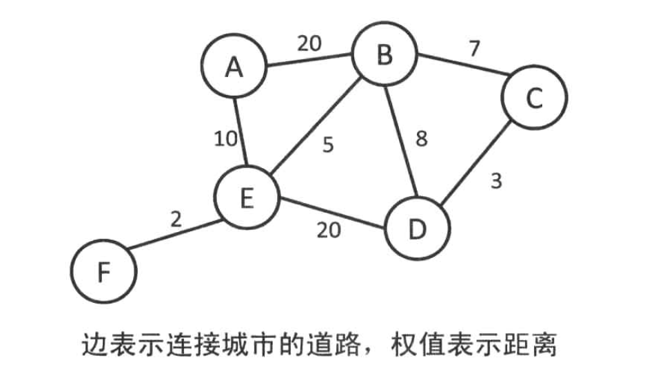

1. 我们可以给边赋予各种各样的属性。比较具有代表性的有权值（cost），称之为带权图。在不同的问题中，权值可以代表距离、时间、价格等不同的属性。

### 无向图的术语

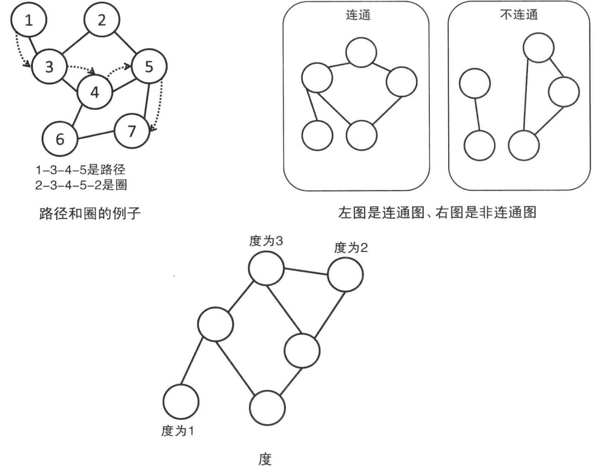

1. 两个顶点之间如果有边连接，那么就视为两个顶点相邻
2. 相邻顶点之间的序列称之为路径
3. 起点和终点重合的路径叫做圈
4. 任意两点之间都有路径连接的图叫做连通图
5. 顶点的连接边数叫做顶点的度
6. 没有圈的连通图叫做树，没有圈的非连通图叫做森林

### 有向图的术语

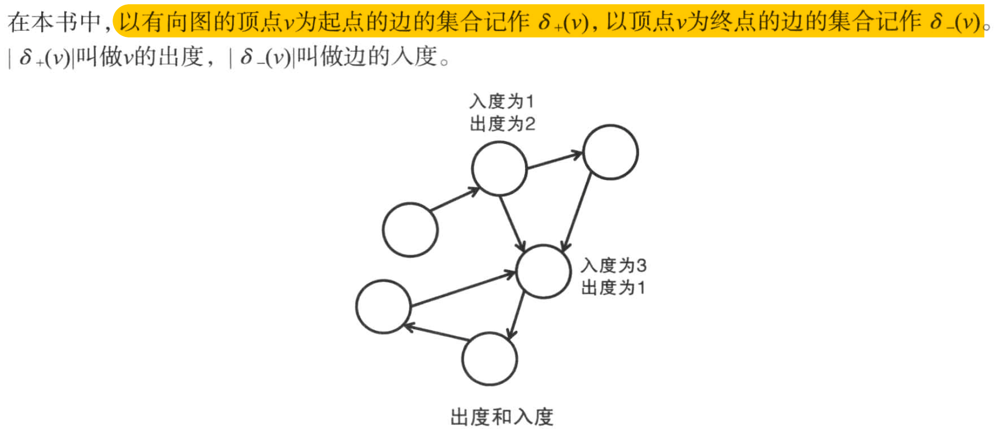

没有图的有向圈叫做 DAG。

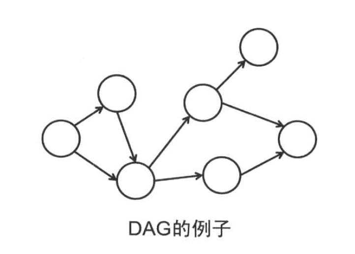

对于每个顶点我们给它一个编号，第 i 个顶点叫做 Vi。那么存在从顶点 Vi 到 顶点 Vj 的路径时就可以进行拓扑排序

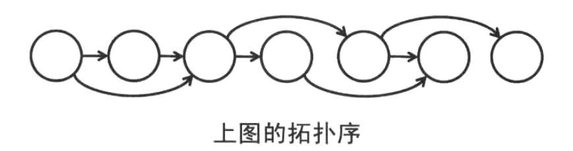

## 2.5.2 图的表示

1. 为了能在程序中对图进行处理，所以我们需要将顶点和边用具体的数据存储起来
2. 典型的数据结构有 `邻接矩阵` 和 `邻接表`
3. 记顶点和边的集合分别为 `V`，`E`, `|V|` 和 `|E|` 表示的顶点和边的个数。另外，在 V 中，顶点被编号为 `0 ~ |V|-1`

### 邻接矩阵

1. **邻接矩阵使用 |V| x |V| 的二维数组来表示，g[i][j] 表示的是顶点 i 和顶点 j 的关系**
2. 对于无向图，只需要表示 **两个点是否存在边**，那么将 g[i][j] 和 g[j][i] 都设置为 1 即可
3. 对于有向图，需要表示 **是否存在从顶点 i 出发指向定点 j 的边**， g[i][j] = 1，g[j][i] = 0，表示存在 i 指向 j 的边，但是不存在 j 指向 i 的边
4. 对于带权图， g[i][j] 的值通常是边的权值；但是为了区分权值 0，通常设置没有边为 INF；同时，对于无向图还是要保持 g[i][j] == g[j][i]

**使用邻接矩阵的好处是可以在常数时间内判断两点之间是否存在边，但是需要花费 O(|V|<sup>2</sup>) 的空间，在边很少的稀疏图里十分浪费**

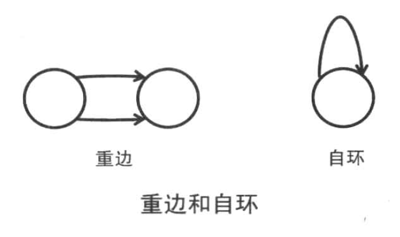

### 邻接表

>邻接表：从顶点 i 出发有到达 j、k、l 的边保存在链表中，需要 `O(|V| + |E|)` 空间

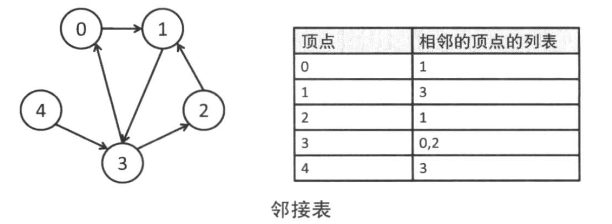

#### 邻接表的实现

```cpp
#include "vector"
#include "iostream"

/**
 * 对于边有属性的情况
 *
 * struct edge { int to, cost; };
 * std::vector<std::vector<edge > > G;
 *
 * 3 3				顶点数和边数
 * 0 1				0 到 1 的边
 * 0 2				0 到 2 的边
 * 1 2				1 到 2 的边
 */

std::vector<std::vector<int > > G;

void init()
{
	int vk, ek;

	std::cin >> vk >> ek;

	for (size_t i = 0; i < vk; ++i)
	{
		G.push_back(std::vector<int>());
	}

	int from, to;

	for (size_t i = 0; i < ek; ++i)
	{
		std::cin >> from >> to;
		G[from].push_back(to);
	}
}

int main(int argc, char **argv)
{
	init();

	for (size_t i = 0; i < G.size(); ++i)
	{
		std::cout << i << ": " ;
		for (size_t j = 0; j < G[i].size(); ++j)
		{
			std::cout << G[i][j] << ", ";
		}
		std::cout << std::endl;
	}
}

```

#### 邻接表表示有权图

```cpp
#include "iostream"
#include "vector"

struct vertex
{
	/**
	 * 顶点的其他属性
	 */
	 int to;
	 int cost;
};

std::vector<std::vector<vertex> > G;


void init()
{
	int vk, ek;

	std::cin >> vk >> ek;

	for (size_t i = 0; i < vk; ++i)
	{
		G.push_back(std::vector<vertex>());
	}

	int from, to, cost;

	for (size_t i = 0; i < ek; ++i)
	{
		std::cin >> from >> to >> cost;
		struct vertex v = {to, cost};
		G[from].push_back(v);
	}
}

int main(int argc, char **argv)
{
	init();

	for (size_t i = 0; i < G.size(); ++i)
	{
		std::cout << i << ": " ;
		for (size_t j = 0; j < G[i].size(); ++j)
		{
			if (j != 0)
			{
				std::cout << ", ";
			}
			std::cout << "[" << G[i][j].to
					  << "," << G[i][j].cost << "]";
		}
		std::cout << std::endl;
	}
}

```

## 2.5.3 图的搜索

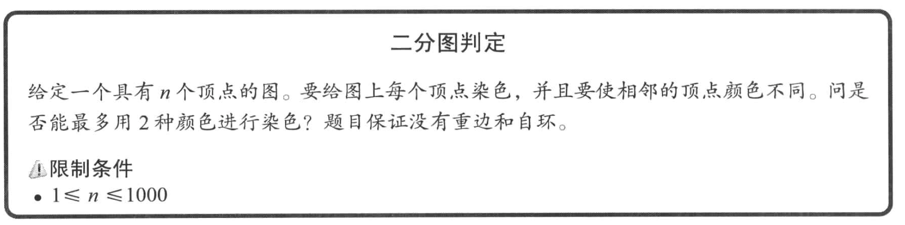

1. 把相邻的顶点染成不同的颜色称之为着色问题
2. 对图进行染色所需要的最小颜色称之为最小着色数
3. 最小着色数是2的图称之为二分图

```cpp
#include "iostream"
#include "vector"

std::vector<std::vector<int > > G;
std::vector<int > color;

int vn, en;

void init()
{
	std::cin >> vn >> en;
	for (size_t i = 0; i < vn; ++i)
	{
		std::vector<int > v;
		G.push_back(v);
	}

	int from, to;
	for (size_t i = 0; i < en; ++i)
	{
		std::cin >> from >> to;
		G[from].push_back(to);
	}

	for (size_t i = 0; i < vn; ++i)
	{
		color.push_back(0);
	}
}

bool dfs(int v, int c)
{
	color[v] = c;
	for (int i : G[v])
	{
		/* 如果相邻的染色和该顶点一样，那么返回 false */
		if (color[i] == c)
			return false;

		/* 如果相邻的顶点还未被染色，那么染色成 -c */
		if (color[i] == 0 && !dfs(i, -c))
			return false;
	}
	return true;
}

void solve()
{
	for (size_t i = 0; i < vn; ++i)
	{
		if (color[i] == 0)
		{
			if (!dfs(i, 1))
			{
				std::cout << "No" << std::endl;
				return;
			}
		}
	}

	std::cout << "Yes" << std::endl;
}

int main(int argc, char **argv)
{
	init();
	solve();
}
```

## 2.5.4 最短路径问题

### 单源最短路径问题1 (Bellman-Ford 算法)

单源最短路径是固定一个起点，求它到其他所有点的最短路径的问题。

记从起点 `s` 到顶点 `i` 的最短路径为 `d[i]`，则：

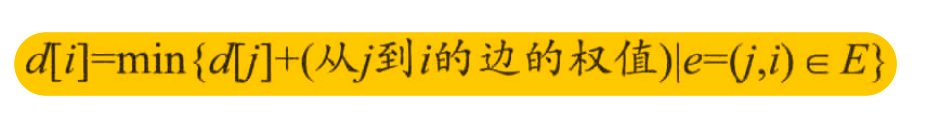

- 如果给定的图是一个 DAG，那么就可以按拓扑序给顶点编号，并利用这条递推关系式计算出 d。
- 如果图中有圈，及当前到顶点的路径长度为 d[i],并设置初值 d[s] = 0，d[i] = INF，并根据这条递推公式来更新 d 的值就可以算出最新的 d。(只要图中不存在负圈的情况下)
- 负圈又称负环，就是说一个全部由负权的边组成的环( **这段话是从知道抄的，看起来应该是错的，因为只要这个圈的权值加起来是负的它就可以一直在转圈中减小总长** )，这样的话不存在最短路，因为每在环中转一圈路径总长就会边小。


```cpp
#include "iostream"

#define INF   0xFFFF
#define MAX_E 1024
#define MAX_V 1024

struct edge
{
	int from, to, cost;
};

/* 边 */
edge es[MAX_E];
/* 到顶点 i 的最短距离 */
int d[MAX_V];
int V, E;

void shortest_path(int s)
{
	for (size_t i = 0; i < V; ++i)
		d[i] = INF;
	d[s] = 0;

	while (true)
	{
		bool update = false;
		/* 在每次 for 循环中遍历一次边 */
		for (size_t i = 0; i < E; i++)
		{
			edge e = es[i];
			/* 如果 d[e.from] != INF，说明该到达该顶点的最短路径已经更新 */
			/* 那么我们可以尝试用从 e.from 走到 e.to 这条路径与当前 d[e.to] 的最短路径比较 */
			if (d[e.from] != INF && d[e.to] > d[e.from] + e.cost)
			{
				d[e.to] = d[e.from] + e.cost;
				update = true;
			}
		}
		if (!update)
			break;
	}
}

```

>这种算法叫做 `Bellman-Ford 算法`，以松弛操作为基础，即估计的最短路径之逐渐被更准确的值替代。
>`Bellman-Ford 算法` 与 迪科斯彻算法类似，都以松弛操作为基础，即估计的最短路径值渐渐地被更加准确的值替代，直至得到最优解。在两个算法中，计算时每个边之间的估计距离值都比真实值大，并且被新找到路径的最小长度替代。 然而，迪科斯彻算法以贪心法选取未被处理的具有最小权值的节点，然后对其的出边进行松弛操作；而贝尔曼-福特算法简单地对所有边进行松弛操作，共 |V|-1次，其中 |V|是图的点的数量。在重复地计算中，已计算得到正确的距离的边的数量不断增加，直到所有边都计算得到了正确的路径。这样的策略使得贝尔曼-福特算法比迪科斯彻算法适用于更多种类的输入。

#### 原理

每次松弛操作实际上是对相邻节点的访问，第 n次松弛操作保证了所有深度为n的路径最短。由于图的最短路径最长不会经过超过 |V|-1条边，所以可知贝尔曼-福特算法所得为最短路径。

我们有 |V| 个顶点，当每个顶点到另外一个顶点都是负权值的时候，我们经过 |V| - 1 条边。当我们超过了 |V| - 1 仍然在更新的时候，说明存在负圈。

```cpp
bool find_negative_loop()
{
	memset(d, 0, sizeof(d));
	for (int i = 0; i < V; ++i)
	{
		for (int j = 0; j < E; ++j)
		{
			edge e = es[j];
			if (d[e.to] > d[e.from] + e.cost) {
				d[e.to] = d[e.from] + e.cost;
				if (i == V - 1)
					return true;
			}
		}
	}

	return false;
}

```

#### 描述性证明

首先指出，对于一条最短路径，既不会包含负权回路，也不会包含正权回路。因此最多包含 |V| - 1 条边。

其次，从源点s可达的所有顶点如果 存在最短路径，则这些最短路径构成一个以s为根的最短路径树。Bellman-Ford算法的迭代松弛操作，实际上就是按每个点实际的最短路径[虽然我们还不知道，但它一定存在]的层次，逐层生成这棵最短路径树的过程。

**注意，每一次遍历，都可以从前一次遍历的基础上，找到此次遍历的部分点的单源最短路径。** 如：这是第i次遍历，那么，通过数学归纳法，若前面单源最短路径层次为1~（i-1）的点全部已经得到，而单源最短路径层次为i的点，必定可由单源最短路径层次为i-1的点集得到，从而在下一次遍历中充当前一次的点集，如此往复迭代，[v]-1次后，若无负权回路，则我们已经达到了所需的目的--得到每个点的单源最短路径。[注意：这棵树的每一次更新，可以将其中的某一个子树接到另一个点下]

反之，可证，若存在负权回路，第[v]次遍历一定存在更新，因为负权回路的环中，必定存在一个“断点”，可用数学手段证明。

最后，我们在第[v]次更新中若没有新的松弛，则输出结果，若依然存在松弛，则输出‘CAN'T'表示无解。同时，我们还可以通过“断点”找到负权回路。

### 单源最短路径2 (Dijkstra 算法)

在 Bellman-Ford 算法中，即使 `d[i]` 没有变化，每一次循环也要检查一遍从 i 出发的所有边。例如在代码 `d[e.to] > d[e.from] + e.cost` 中，如果 `d[e.from]` 没有变化，其实是可以不检查这条边的路径的。(因为 d[e.to] 只会变小，所以只要 d[e.to] > d[e.from] + e.cost 不满足条件，并且在 d[e.from] 没有改变的情况下，这个条件用于不会被满足)

因此，可以对算法进行如下修改：

1. 找到最短距离已经确定的顶点，从它出发更新相邻顶点的最短距离。
2. 此后不再需要关心 `1` 中 **最短距离已经确定的点**
3. 在最开始时，只有起始点的最短距离是确定的。而在尚未使用过的顶点中，距离 `d[i]` 最小的顶点就是最短距离已经确定的顶点。 **这是因为不存在负边，所以 `d[i]` 不会在接下来的更新中间减小。**

例如，假设我们存在点 v[0], v[1], v[2], v[3]...

- e[1, 2] = -6
- e[0, 1] = 5
- e[0, 2] = 2
- e[2, 3] = 1

那么更新应该如下图所示

| 状态   | d[0] | d[1] | d[2] | d[3] |
|--------|------|------|------|------|
| 初始化 | 0    | INF  | INF  | INF  |
| loop 1 | 0    | 5    | 2    | 3    |
| loop 2 | 0    | 5    | -1   | 0    |

#### Dijkstra 算法的实现

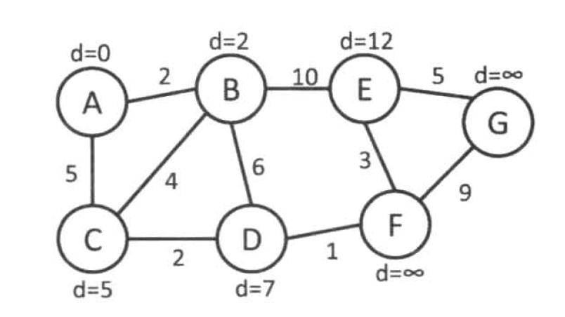


#### Dijkstra 算法的描述

>Dijkstra 算法基于一个重要的结论： **由于不存在负边，所以在我们当前的 d[MAX_V] 的最小值就是到达该点的最短路径。因为从任何其他的点到达该点都必须通过一个负边**

1. 声明一个数组 d[MAX_V] 表示从起点到达顶点 i 的最短路径
2. 声明一个集合 T[MAX_V] 表示所有 **已经找到了最短路径的顶点的集合**
3. 原点 s 的路径权重被赋为 0 （dis[s] = 0）。若对于顶点 s 存在能直接到达的边（s,m），则把dis[m]设为w（s, m）,同时把所有其他（s不能直接到达的）顶点的路径长度设为无穷大。初始时，集合T只有顶点s
4. **然后，从 d 中取出一个不在集合 T 的最小值（T表示已经找到了最短路径的点），则该值就是起点 s 到该值对应的顶点的最短路径，并且把该点加入到集合 T**
5. 然后，我们需要看看新加入的顶点是否可以到达其他顶点并且看看通过该顶点到达其他点的路径长度是否比源点直接到达短，如果是，那么就替换这些顶点在dis中的值。

```cpp
#include "iostream"

#define INF   0xffff
#define MAX_V 1024
#define MAX_E 1024

/* cost[u][v] 表示边 e = (u, v) 的权值 */
int cost[MAX_V][MAX_V];
int d[MAX_V];
int used[MAX_V];

int V, E;

void init()
{
	std::cin >> V >> E;
	std::fill(d, d + V, INF);
	std::fill(used, used + V, false);
	d[0] = 0;
	for (int u = 0; u < MAX_V; ++u)
	{
		for (int v = 0; v < MAX_V; ++v)
		{
			cost[u][v] = -1;
		}
	}

	char u, v;
	int c;
	for (int i = 0; i < E; ++i)
	{
		/* BUG：之前初始化只初始化了 cost[u][v]，然而这是一个无向图 */
		std::cin >> u >> v >> c;
		cost[u - 'a'][v - 'a'] = c;
		cost[v - 'a'][u - 'a'] = c;
	}
}

void dijkstra()
{
	while (true)
	{
		int v = -1;
		/*
		 * 首先从尚未使用过的顶点中选择一个距离最小的顶点。
		 *
		 * 这里注意我们使用的技巧，我们使用了 !used[u] 保证我们只查看未计算过的点
		 * 使用 v == -1 || d[u] < d[v] 来保证两个事情：
		 * 	1. 是否能够找到一个未计算过并且距离最小的顶点
		 * 	2. 如果我们能找到一个未计算过并且距离最小的顶点，那么 v 就是这个顶点的值
		 */
		for (int u = 0; u < V; ++u)
		{
			if (!used[u] && (v == -1 || d[u] < d[v]))
				v = u;
		}

		if (v == -1)
		{
			break;
		}

		used[v] = true;

		/*
		 * 此时，我们完成了一个新的顶点，并且这个顶点的 d[u] 就是起点到顶点u的最短路径；
		 * 那么，我们用从顶点 u 到下一个顶点的距离来更新最短路径
		 */
		for (int u = 0; u < V; u++)
		{
			/* 注意，这里一定要做这个判断。当 cost[v][u] < 0 时表示没有对应的路径 */
			if (cost[v][u] >= 0)
			{
				d[u] = std::min(d[u], d[v] + cost[v][u]);
			}
		}
	}

	std::cout << d[V - 1] << std::endl;
}

int main(int argc, char **argv)
{
	init();
	dijkstra();
}
```

#### dijkstra 算法的输入

```
7 10
a b 2
a c 5
b c 4
c d 2
b d 6
b e 10
d f 1
e f 3
e g 5
f g 9
```

#### Dijkstra 算法的优化

1. 再查看我们上面的代码，我们的 while 循环每次更新一个顶点，然后在每次 while 循环中需要选择最小顶点和更新最短距离，所以它的复杂度是 `O(|V| * |V|)`
2. 如果我们使用邻接表的话，我们在每次更新最短距离的时候， cost[u] 的链表中只包含了它能到达的顶点，而不像 cost[u][v] 包含了所有能到达的顶点，所以这部分的复杂度是 `O(|E|)`。但是由于需要枚举所有的顶点来查找下一个使用的顶点，这部分的复杂度是 `O(|V|)`，和 while 循环结合之后复杂度仍然是 `O(|V| * |V|)`. **在 E 比较小的时候，每次 while 循环中大量的时间花费在 `O(|V|)` 的查找当前 `d[MAX_V]` 中最小的那个可用顶点上**
3. 需要优化的是数值的插入（更新）和取出最小值两个操作，因此使用堆就可以了。

```cpp
#include <vector>
#include <queue>
#include "iostream"

typedef std::pair<int, int> P;

const int INF = 0xffff;

class edge
{
public:
	edge(int to, int cost) : to(to), cost(cost)
	{}

	int to, cost;
};

int V, E;

/*
 * first 是顶点，second 是最短距离。
 *
 * 我们使用堆来存储需要计算的路径，这样将找到需要计算的顶点的时间复杂度从 V 降低到 log(V)
 */
std::priority_queue<P, std::vector<P>, std::greater<P> > q;

std::vector<std::vector<edge> > G;

std::vector<int> d;

void dijkstra()
{
	while (!q.empty())
	{
		/* 找到需要计算的最短路径 */
		P p = q.top();
		q.pop();
		int u = p.first;
		/* 尝试更新从当前节点出发能到达的所有节点的路径 */
		for (size_t v = 0; v < G[u].size(); ++v)
		{
			edge &e = G[u][v];
			if (d[e.to] > d[u] + e.cost)
			{
				d[e.to] = d[u] + e.cost;
				q.push(std::make_pair(e.to, d[e.to]));
			}
		}

	}

	for (size_t i = 0; i < d.size(); ++i)
	{
		if (i != 0)
		{
			std::cout << ",";
		}
		std::cout << d[i];
	}
	std::cout << std::endl;
}

void init()
{
	std::cin >> V >> E;
	G.resize(V);
	q.push(std::make_pair(0, 0));
	d.resize(V);
	std::fill(d.begin(), d.end(), INF);
	d[0] = 0;
	char from, to;
	int cost;
	for (int u = 0; u < E; ++u)
	{
		std::cin >> from >> to >> cost;
		from = from - 'a';
		to = to - 'a';
		G[from].push_back(edge(to, cost));
		G[to].push_back(edge(from, cost));
	}

	std::cout << "V = " << V << std::endl;
	std::cout << "E = " << E << std::endl;
	std::cout << "G.size() = " << G.size() << std::endl;
}

int main(int argc, char **argv)
{
	init();
	dijkstra();
}
```

### 任意两点之间的最短路径问题（Floyd-Warshall 算法）

1. 只使用顶点 0 ~ k-1 和 i，j 的情况下，记 i 到 j 的最短长度为 `d[k+1][i][j]`， `k == -1` 时只使用 i，j，那么最短长度为 `d[0][i][j] = cost[i][j]`
2. 在只使用 0~k 时，我们分路径正好经过顶点 k 一次和不经过 k 两种不同的情况：
	- 当不经过顶点 k，则 `d[k][i][j] = d[k-1][i][j]`
	- 当经过顶点 k 一次，则 `d[k][i][j] = d[k-1][i][k] + d[k-1][k][j]`
3. 那么我们推出了表达式 d[k][i][j] = std::min(d[k-1][i][j], d[k-1][i][k] + d[k-1][k][j])
4. 由于我们实际要求的是 d[i][j] 而不是 d[k][i][j]
	- d[i][j] = min(d[0][i][j], ..., d[V-1][i][j])
	- 根据上面的公式我们可以想象一下 d[k][i][j]，它其实是一个类似于魔方的结构，而 d[k][i][j](k = [0, V))，则它就是魔方中的一条线横穿了魔方的三个面。压缩到一个平面就是
	- 在 `for(int k = 0; k < V; ++k)` 中不断的更新 d[i][j] = std::min(d[i][j], d[i][k] + d[k][j]);
	- 注意，对于 d[i][j] 我们应该按照一定的规则初始化，d[i][i] = 0, d[i][j] = cost[i][j](包含i到j的路径)，d[i][j] = INF(不包含 i 到 j 的路径)
5. Floyd 算法可以处理负圈的情况，只需要判断是否存在 d[i][i] 小于 0 的顶点即可。

```cpp
#include "iostream"
#include "vector"

const int INF = 0xffff;

int V, E;

std::vector<std::vector<int> > d;

void init()
{
	std::cin >> V >> E;

	char from, to;
	int cost;

	for (int i = 0; i < E; ++i)
	{
		std::vector<int> v;
		for (int j = 0; j < E; ++j)
		{
			if (j == i)
				v.push_back(0);
			else
				v.push_back(INF);
		}
		d.push_back(v);
	}


	for (int i = 0; i < E; ++i)
	{
		std::cin >> from >> to >> cost;
		int f = from - 'a';
		int t = to - 'a';
		d[f][t] = cost;
		d[t][f] = cost;
	}
}

void floyd_warshall()
{
	for (int k = 0; k < V; ++k)
	{
		for (int u = 0; u < V; ++u)
		{
			for (int v = 0; v < V; ++v)
			{
				d[u][v] = std::min(d[u][v], d[u][k] + d[k][v]);
			}
		}
	}

	for (int i = 0; i < V; ++i)
	{
		for (int j = 0; j < V; ++j)
		{
			if (j != 0)
				std::cout << ",";

			std::cout << d[i][j];
		}
		std::cout << std::endl;
	}
}

int main(int argc, char **argv)
{
	init();
	floyd_warshall();
}
```

#### 路径还原
