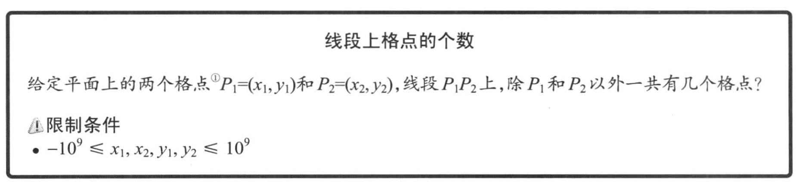
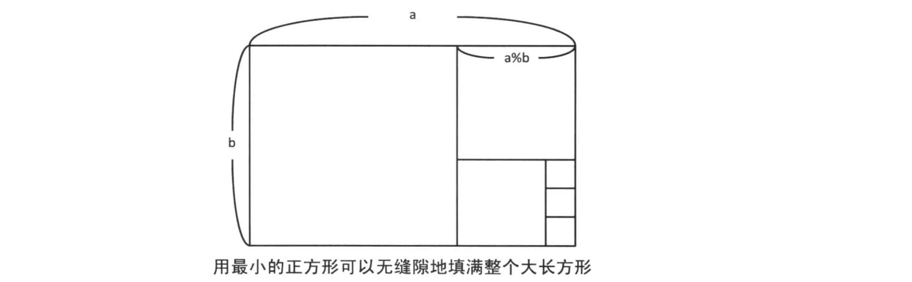
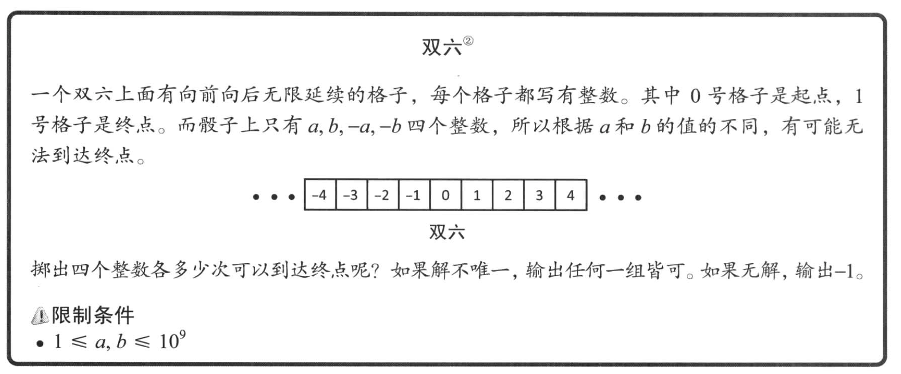
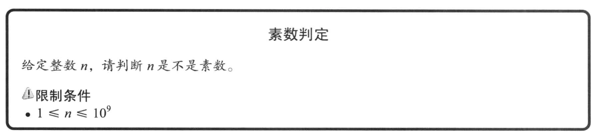
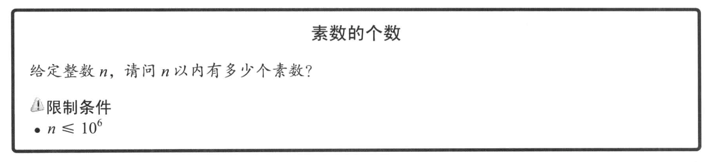
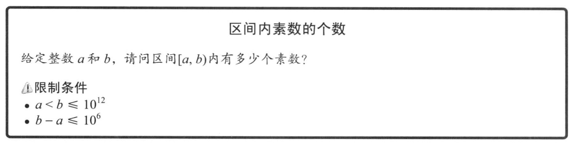
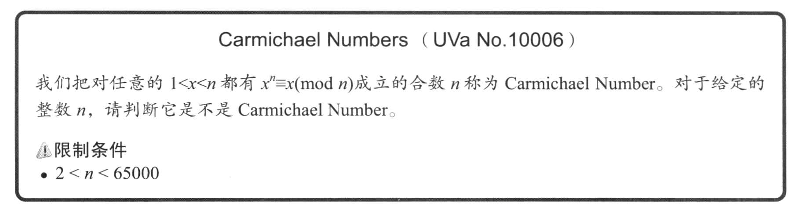

# 2.6 数学问题中的解题窍门

>虽然数学问题大多需要用特定的方法求解，但是也有几个基础算法扮演着重要角色。

## 2.6.1 辗转相除法

### 求最大公约数



>格点指的是坐标轴上横坐标和纵坐标都为整数的点

这道题的答案是 `|x1 - x2|` 和 `|y1 - y2|` 的最大公约数 - 1

设 `gcd(a, b)` 是计算自然数 a 和 b 的最大公约数的函数，a 除以 b 得到的商和余数分别为 p 和 q。
那么 `a = p * b + q`，假设 `gcd(b, q) = u`，则 `u * x1 = b`, `u * x2 = q`
推出 `a = p * u * x1 + u * x2`，则有 a / u == p * x1 + x2， b / u = x1。推出 **gcd(b, q) 既整除 a 又整除 b，所以 gcd(b, q) 被 gcd(a, b) 整除**

又有 `q = a - p * b`，假设 `gcd(a, b) = v`，则有 `a = v * x1`, `b = v * x2`。
进而有 `q = v * x1 + p * v * x2`，可以推出 `q / v = x1 + p * x2`, `b / v = x2`。
于是 `gcd(a, b) == v` 既整除 q，又整除 b，所以 **gcd(a, b) 被 gcd(b, q) 整除**

由上面两个结论可以推出 `gcd(a, b) = gcd(b, q)`



```cpp
#include "iostream"

int gcd(int a, int b)
{
	if (a < b)
	{
		std::swap(a, b);
	}
	if (b == 0)
	{
		return a;
	}

	return gcd(b, a % b);
}

int main(int argc, char **argv)
{
	int x1, y1, x2, y2;
	std::cin >> x1 >> y1 >> x2 >> y2;

	int a = (x1 > x2) ? (x1 - x2) : (x2 - x1);
	int b = (y1 > y2) ? (y1 - y2) : (y2 - y1);

	std::cout << (gcd(a, b) - 1) << std::endl;
}
```

### 扩展欧几里德算法



## 有关素数的基础算法

### 素性测试



```cpp
#include "iostream"
#include "vector"

bool is_prime(int num)
{
	if (num == 1)
	{
		return false;
	}

	for (int i = 2; i * i <= num; ++i)
	{
		if (num % i == 0)
		{
			return false;
		}
	}

	return true;
}

/*
 * 约数枚举
 */
std::vector<int> divisor(int n)
{
	std::vector<int > res;
	int i;
	for (i = 1; i * i < n; ++i)
	{
		if (n % i == 0)
		{
			res.push_back(i);
			// 如果循环条件包含 i * i == n，那么需要判断 i * i 是否等于 n
			res.push_back(n / i);
		}
	}

	if (i * i == n)
	{
		res.push_back(i);
	}

	return res;
}
```

### 埃氏筛法

>如果只对一个整数进行素性测试，那么之前的方法的时间复杂度已经足够。但如果需要对许多整数进行素性测试，还需要更高效的算法。



```cpp
#include "iostream"

bool is_prime(int num)
{
	if (num == 1)
	{
		return false;
	}

	for (int i = 2; i * i <= num; ++i)
	{
		if (num % i == 0)
		{
			return false;
		}
	}

	return true;
}

void sieve(int n)
{
	int res = 0;
	/*
	 * 这里可以通过 bit a[n+1] 来优化空间，因为我们可以用索引表示数字
	 */
	int a[n + 1];
	for (int i = 1; i <= n; ++i)
	{
		a[i] = i;
	}

	for (int i = 2; i <= n; ++i)
	{
		if (a[i] == -1)
			continue;
		if (is_prime(i))
			res++;
		for (int j = 1; i * j <= n; ++j)
		{
			a[i * j] = -1;
		}
	}

	std::cout << res << std::endl;
}

int main(int argc, char **argv)
{
	int x;
	std::cin >> x;
	sieve(x);
}
```

### 区间筛选



## 2.6.3 模运算

### 基本的模运算符

1. 记 a 和 b 除以 m 的余数相等为 `a=b(mod m)`
2. 记 a 除以 m 的余数为 `a mod m`，并且 `0 <= (a mod m) <= (m - 1)`
3. 如果 `a=b(mod m)` 并且 `c=d(mod m)`，那么：
	- a+b=c+d(mod m)
	- a-b=c-d(mod m)
	- a*b=c*d(mod m)

## 2.6.4 快速幂运算

```cpp
typedef long long ll;

ll pow(ll x, ll n)
{
	ll res = 1;
	while (n > 0)
	{
		if (n & 1)
			res *= x;
		x *= x;
		n >>= 1;
	}
	return res;
}

```

`pow(x, n)` 可以表示为 `pow(x, pow(2, k1))` `*` `pow(x, pow(2, k2))` `*`...

进入第 i 次循环 `x = pow(x, pow(2, i))`，如果当前 n 的最低位为 1，说明要乘上这个数字，随后我们修改循环 `x = pow(x, pow(2, i + 1))`

### CarmichaelNumber

前面已经知道了快速计算平方的方法，我们现在需要证明一个问题： `(x * y) % n` = `(x % n) * (y % n)`

假设 `x = an + b`, `y = un + v`，那么 `(x * y) % n ` = bv，`(x % n) * (y % n)` = bv



```cpp
#include "iostream"

typedef long long ll;

ll mod_pow(ll x, ll n, ll mod)
{
	ll res = 1;
	while (n > 0)
	{
		if (n & 1)
			res = res * x % mod;

		x = x * x % mod;
		n >>= 1;
	}
	return res;
}

int main(int argc, char **argv)
{
	int num;
	std::cin >> num;
	bool t = true;
	for (int i = 2; i < num; ++i)
	{
		if (mod_pow(i, num, num) != (i % num))
		{
			std::cout << i << std::endl;
			t = false;
			break;
		}
	}
	std::cout << (t ? "Yes" : "No") << std::endl;
}

```
