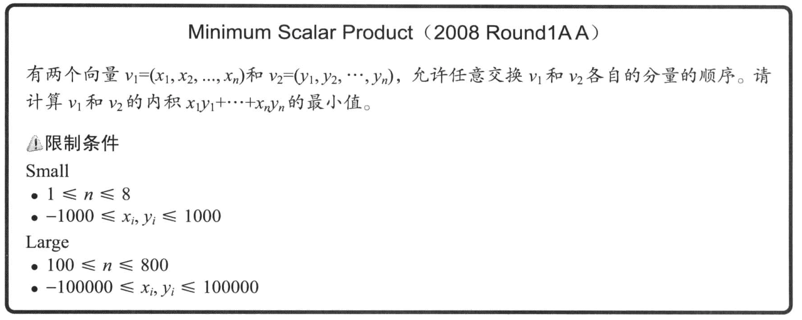
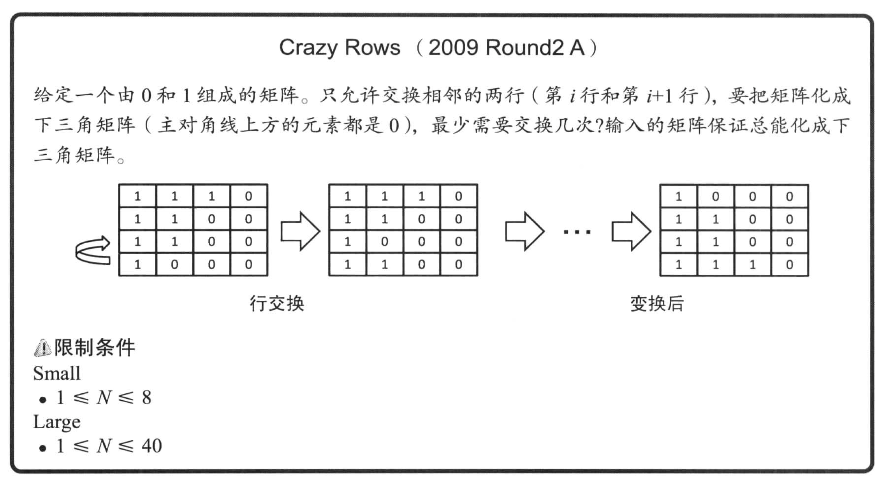

# 挑战程序设计竞赛

## 2.7 一起来挑战 GCJ 的题目

### Minimum Scalar Product



1. v1 和 v2 都可以随意的交换顺序，所以如果我们将 v1 按照升序排列，只变动 v2 也是可以的；
2. `隐约` 会觉得，将 v2 降序排列会得到正确的结果，我们可以先用测试用例验证我们的想法，满足的话再想办法给出证明；

假设存在 v1 = [x1, x2], v2 = [y1, y2] 分别按升序和降序排列

```
(x1 * y1 + x2 * y2) - (x1 * y2 + x2 * y1)
= (y1 - y2) * x1 + (y2 - y1) * x2 
= (x1 - x2) * (y1 - y2)
< 0
```

当 n == 2 时满足条件，下面我们可以开始归纳

假设 v2 不是按照降序排列，那么存在 `i < j` 使得 `yj < yi`，根据前面的证明我们可以知道，交换 yj 和 yi 可以得到更小的内积

```cpp
#include "iostream"

const int MaxN = 1024;

int num;

int v1[MaxN];
int v2[MaxN];

void init()
{
	std::cin >> num;
	for (int i = 0; i < num; ++i)
	{
		std::cin >> v1[i];
	}

	for (int i = 0; i < num; ++i)
	{
		std::cin >> v2[i];
	}
}

void solve()
{
	std::sort(v1, v1 + num);
	std::sort(v2, v2 + num);
	long long res = 0;
	for (int i = 0; i < num; ++i)
	{
		res += static_cast<long long>(v1[i])
			   * static_cast<long long>(v2[num - i - 1]);
	}

	std::cout << res << std::endl;
}

int main(int argc, char **argv)
{
	init();
	solve();
}
```

### Crazy Rows



思路是，对于第一行，我们从上到下查找第一个满足条件的行，并将这一行移动到改行。然后对于剩下的行递归的去计算。

有几个问题值得我们注意：

1. 如果我们找到了一个符合条件的行，并且这一行需要的 0 超过了我们需要的 0 会不会导致我们后续找不到符合条件的行呢？

不会，因为我们的题目中提到了， **输入矩阵保证总能转换成下三角矩阵**，所以对于任意一行，满足条件的行 >= 1。如果匹配到一个超过需求的行，说明这一行可能是之前剩下的或者说符合条件的行本来就有多的0，在计算下一行的时候，需求的0减少了，也保证存在对应的行。

2. 我们把最靠近的满足条件的那一行提升到当前行，为什么这种方式是最快的？
