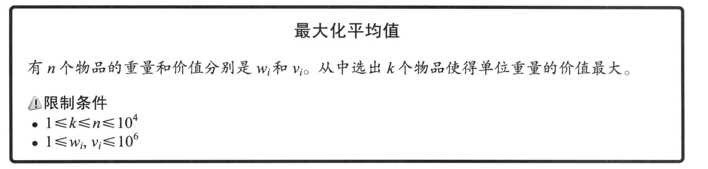

# 3.1 不光是查找值！“二分搜索”

## 3.1.1 从有序数组中查找某个值


```cpp
//
// Created by 0x822a5b87 on 2020/7/10.
//

#include "iostream"

int n, a[100], k;

void init()
{
	std::cin >> n;
	for (size_t i = 0; i < n; ++i)
	{
		std::cin >> a[i];
	}
	std::cin >> k;
}

void solve()
{
	if (n <= 0)
		return;

	int ret = n;
	int b   = 0, e = n - 1;
	while (e - b > 1)
	{
		int mid = (e + b) / 2;
		std::cout << 0 << " " << e << std::endl;
		if (a[mid] >= k)
		{
			e   = mid;
			ret = mid;
		}
		else
		{
			b = mid;
		}
	}

	std::cout << ret << std::endl;
}

int main(int argc, char **argv)
{
	init();
	solve();
}
```

## 3.1.2 假定一个解并判断是否可行


```cpp
#include <cmath>
#include "iostream"

// 解题思路
// 假设切割之后每条绳子的长度为 x，那么每条绳子的可以被切割的数量是 n[i] = floor(L[i] / x)
// 那么所有绳子被切割的总长度就是 n[0] + ... n[size - 1]，只要这个数字大于 K 说明满足条件
// 那么现在在 [0, max_len() + 1] 的区间一定就是绳子可以被切割的最大长度
// 我们只需要在这个区间来验证每一个数字是否可以满足条件，直到找到最大的那个满足条件的数字

int n, k;
double len[100];

void init()
{
	std::cin >> n;
	std::cin >> k;
	for (int i = 0; i < n; ++i)
	{
		std::cin >> len[i];
	}
}

bool C(double x)
{
	int num = 0;
	for (int i = 0; i < n; ++i)
	{
		num += static_cast<int>(len[i]) / x;
	}
	return num >= k;
}

double max_len()
{
	double max = 0;
	for (size_t i = 0; i < n; ++i)
	{
		if (len[i] > max)
		{
			max = len[i];
		}
	}
	return max;
}

void solve()
{
	// 上界是 MaxLen
	double lb = 0, ub = max_len() + 1;
	// 循环100次，由于二分法的时间复杂度是 O(lg N)，所以循环 100 次的精度已经很高了
	for (int i = 0; i < 100; ++i)
	{
		double mid = (lb + ub) / 2;
		if (C(mid))
		{
			lb = mid;
		}
		else
		{
			ub = mid;
		}
	}
	printf("%.2f\n", floor(ub * 100) / 100);
}

int main(int argc, char **argv)
{
	init();
	solve();
}
```

## 3.1.3 最大化最小值


根据题目的描述，我们需要求的值是，我们将 `m` 头牛放到 `n` 个小屋里，输出相邻的两头牛之间的最小距离

>**类似的最大化最小值或者最小化最大值的问题，通常用二分搜索法就可以很好的解决**

根据我们在前面一题里的思路，我们假设最后的两头牛之间的最小距离为 x，**这个最小距离一定在 [0, max_len] 这个区间里**。
那么我们可以使用二分法在所有距离里查找那个最大的满足条件的距离。

```cpp
#include "iostream"

int n, m;
int x[100];

void init()
{
	std::cin >> n >> m;
	for (int i = 0; i < n; ++i)
	{
		std::cin >> x[i];
	}
	// 注意，我们需要对数组排序，因为输入是无序的。
	std::sort(&x[0], &x[n-1]);
}

bool yes(int dis)
{
	int prev = -1000, remaining = m;
	for (int i = 0; i < n && remaining > 0; ++i)
	{
		if (x[i] - prev >= dis)
		{
			// 满足条件就放置一头牛
			--remaining;
			prev = x[i];
		}
	}

	return remaining == 0;
}

void solve()
{
	int lb = 0, ub = x[n - 1];
	while (ub - lb > 1)
	{
		int mid = (lb + ub) / 2;
		if (yes(mid))
		{
			lb = mid;
		}
		else
		{
			ub = mid;
		}
	}
	std::cout << lb << std::endl;
}

int main(int argc, char **argv)
{
	init();
	solve();
}
```

## 3.1.4 最大化平均值



>输出单位重量

我最开始的思路是，将所有的值按照单位价值进行排序，从大到小贪心的进行选取。但是这样的输入对于样例输入的结果是 5/7 = 0.714。所以这个方法是不可取的。

假设有三个物体分别是 item[0], item[1], item[2]，他们的单位价值分别是 v[0] > v[1] > v[2]。

那么选择 item[0] 和 item[1] 的最后单位价值区间应该是 (v[0], v[1]), 而选择 item[0] 和 item[2] 的单位价值区间应该是 (v[0], v[2])。

item[1] 的重量越大，那么选择 item[0] 和 item[1] 的单位价值就会越趋近于 v[1]。这个是不满足贪心算法的。

---

那么我们可以修改一下思路，我们的单位价值应该是 (0, max_per_weight)，我们可以使用二分法在这个里面去查找，每次都去判断是否能找到 k 个物品满足条件，直到找到答案。

假设我们需要判断的单位重量为 x，那么就要 `sum(v0, ..., vk) / sum(w0, ..., wk) > x`，变化一下得到 `sum(v0, ..., vk) - x * sum(w0, ..., wk) > 0`

>这里有一个非常重要的点，我们在 `solve` 方法中循环 100 次，这个时候我们的 `lb` 和 `ub` 都是 `double`，也就是我们期望找到的那个最大单位价值。
>我们这里每一次计算都会使得我们计算的精度更高。

```cpp
#include "iostream"

int n, k;
double w_v[100][2];
double per_w[100];

void init()
{
	std::cin >> n >> k;
	for (int i = 0; i < n; ++i)
	{
		std::cin >> w_v[i][0] >> w_v[i][1];
	}
}

bool judge(double x)
{
	for (int i = 0; i < n; ++i)
	{
		per_w[i] = w_v[i][1] - x * w_v[i][0];
	}
	std::sort(per_w, per_w + n);

	double sum = 0;
	for (int i = 0; i < k; ++i)
	{
		sum += per_w[n - i - 1];
	}

	return sum > 0;
}

void solve()
{
	// 计算100次
	double lb = 0, ub = 10e6;
	for (int i = 0; i < 100; ++i)
	{
		double mid = (lb + ub) / 2;
		if (judge(mid))
		{
			lb = mid;
		}
		else
		{
			ub = mid;
		}
	}

	printf("%.2f\n", lb);
}

int main(int argc, char **argv)
{
	init();
	solve();

	return 0;
}
```
