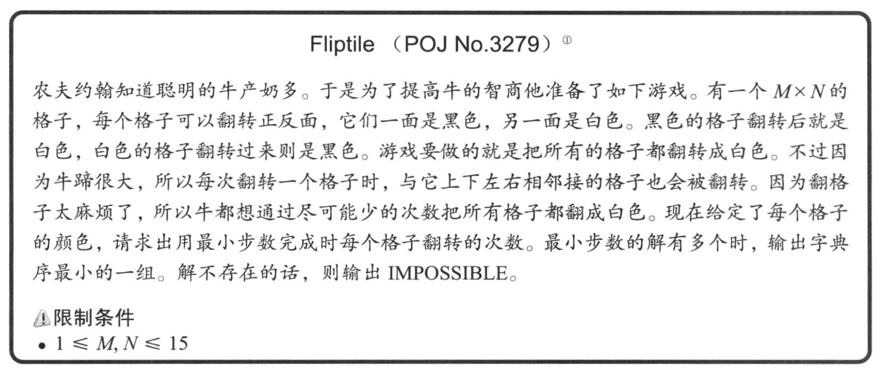
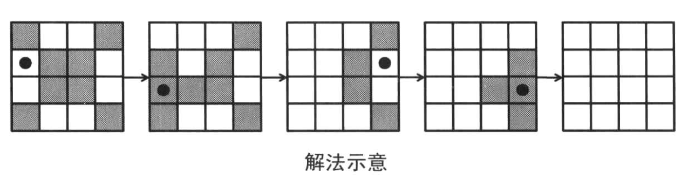
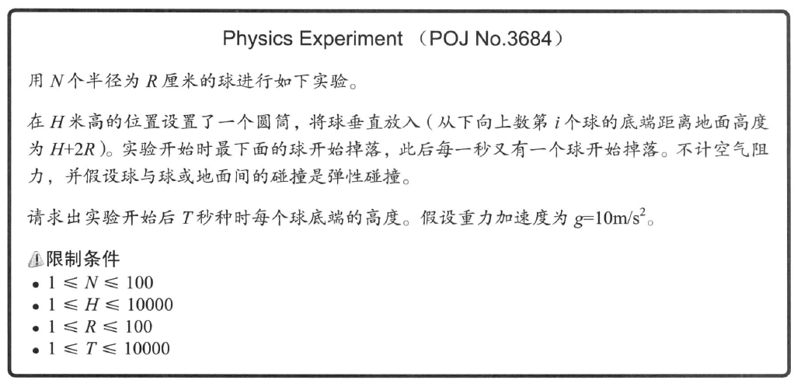
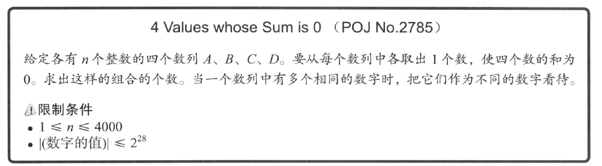
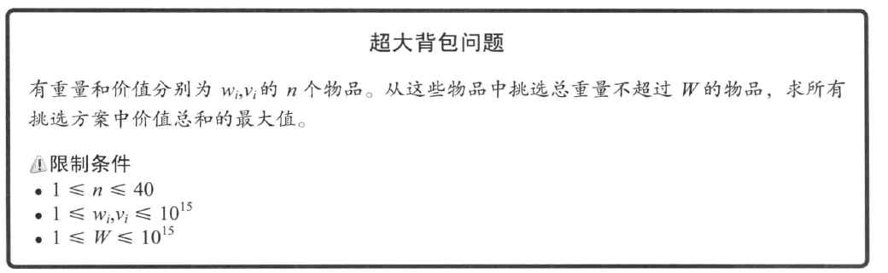
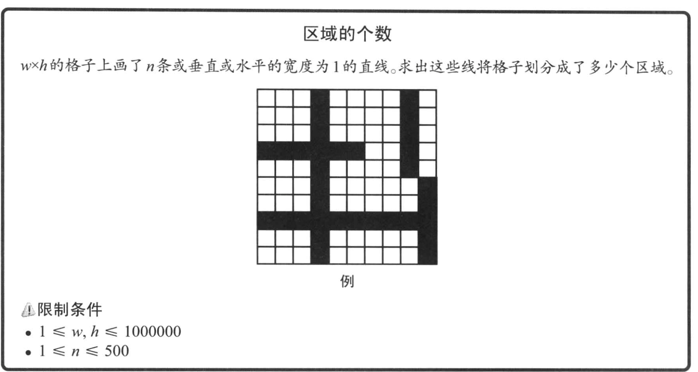
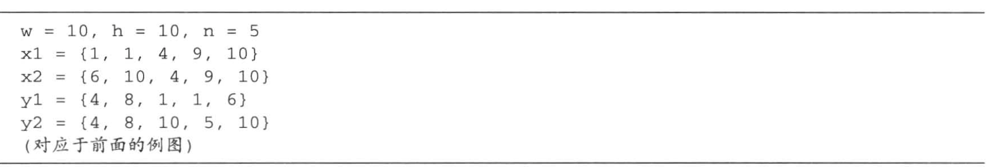
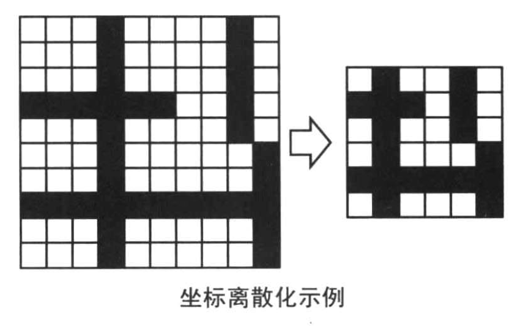

# 3.2 常用技巧精选（一）

## 3.2.1 尺取法

>尺取法通常是指对数组保存一对下标（起点和终点），然后根据实际情况交替推进两个端点直到得出答案的方法，这种方法很像尺取虫爬行的方式故得名。


### 3.2.1.1 使用二分查找法

由于所有的元素都大于0，所以对于一个序列 `sum(a[i], ..., a[t]) >= s`，那么任意的 `t < t'` 都有  `s` `<=` `sum(a[i], ..., a[t])` `<` `sum(a[i], ..., a[t'])`

此外，假设 sum(i) = `a[0] + ... + a[i]`，那么区间 `[s, t-1)` 的序列和就等于 `sum(t) - sum(s)`

如果我们以 O(n) 的时间算好 sum 的话，当我们确定了一个起点 s 的时候，那么我们就可以可以在区间 `[s, n)` 上进行二分查找找到 lower_bound。

或者换个思路，我们可以计算出以 s 为起点，n 为终点的所有的序列和，我们需要找的就是那个满足条件的最小值。这个值到 s 的距离就是最短连续子序列的长度。

```cpp
#include "iostream"

const int MAX_LEN = 100;

int n, s;
int a[MAX_LEN], sum[MAX_LEN + 1];

void init()
{
	std::cin >> n >> s;

	for (int i = 0; i < n; ++i)
	{
		std::cin >> a[i];
	}
}

void solve()
{
	std::fill(sum, sum + n, 0);

	// sum[i] 是区间 [0, i) 的序列之和
	// sum[ub] - sub[lb] 是区间 (lb, ub] 的序列之和
	for (int i = 0; i < n; ++i)
	{
		sum[i + 1] += sum[i] + a[i];
	}

	// 如果不存在解
	if (sum[n] < s)
	{
		std::cout << "0" << std::endl;
		return;
	}

	int res = n;
	for (int start = 0; sum[start] + s <= sum[n]; ++start)
	{
		// t 是找到的数组下界的索引
		// 因为我们要求的是序列 [start, x) 这个区间的值，所以下界的值应该是 sum[start] + s
		int t = std::lower_bound(sum + start, sum + n, sum[start] + s) - sum;
		res = std::min(res, t - start);
	}

	std::cout << res << std::endl;
}

int main(int argc, char **argv)
{
	init();
	solve();

	return 0;
}
```

### 3.2.1.2 一种更高效的解法

假设以 a[s] 开头的总和大于s的子序列是 `[s, t)` ，那么必然的 `[s+1, t-1)` `<` `[s, t-1)` `<` s

那么以 a[s+1] 开头的子序列 `[s+1, t2)`，必然有 `t <= t2`

这个算法的核心是，首先找到一个以 a[s] 开头的子序列，然后慢慢的缩小它，直到找到一个区间 `[s', t]` 正好大于 s。

根据我们前面的结论：`[s'+1, t]` 的序列和是肯定小于 `[s', t]` 和 s 的（因为它正好是前面的最小序列）。

那么下一次我们继续查找的时候就必须从 `a[s'+1]` 开始查找，而我们之前已经计算了 `[s'+1, t]` 的序列和，所以可以直接使用这个值来计算以减小时间复杂度。


```cpp
#include "iostream"

const int MAX_LEN = 100;

int n, s;
int a[MAX_LEN];

void init()
{
	std::cin >> n >> s;

	for (int i = 0; i < n; ++i)
	{
		std::cin >> a[i];
		std::cout << a[i] << " ";
	}
	std::cout << std::endl;
}

void solve()
{
	int ret = n + 1;
	for (int start = 0, cur = 0, sum = 0; cur < n; ++cur)
	{
		// 计算 [start, cur] 的序列和
		sum += a[cur];
		if (sum >= s)
		{
			// 当 [start, cur] 的序列和大于等于s时，我们需要减去那些不必要的部分
			while (sum >= s)
			{
				sum -= a[start++];
			}
			// 这个时候 [start - 1, cur] 是满足条件的序列，所以它的长度是 cur - start + 2
			ret = std::min(ret, cur - start + 2);

			// 根据我们前面的结论，我们已经计算出来了
			// 注意，这个时候：sum = sum([start + 1, end])
			// 在下一次循环的时候我们就需要计算 sum = sum([start, end + 1]) 了
		}
	}
	std::cout << ret << std::endl;
}

int main(int argc, char **argv)
{
	init();
	solve();
	return 0;
}
```

### 3.2.1.3 Jessica's reading problem


我们假设区间 `[s, t]` 正好包含所有的知识点并且正好是最短的页数，那么我们下一次就要开始从 `s+1` 往后找了，随后找到了一个 `all[s]` 的知识点，此时的索引为 `t'`

那么 `[s+1, t']` 的区间内又包含了所有的知识点，我们又需要从 `s+1` 开始去缩小我们的区间直到找到最小区间。

>这里的代码其实可以进一步精简，我们使用一个值 knowledge_count 来记录区间包含的知识点的数量，当 map 的值减少到0时，我们减少 knowledge_count。这样可以避免去操作 map

```cpp
#include "iostream"
#include "set"
#include "map"

static const int MAX_LEN = 10e6;

int           n;
int           a[MAX_LEN];
// 知识点
std::set<int> all;
// 记录知识点出现的次数
std::map<int, int> count;

void init()
{
	std::cin >> n;
	for (int i = 0; i < n; ++i)
	{
		std::cin >> a[i];
		all.insert(a[i]);
		std::cout << a[i] << " ";
	}
	std::cout << std::endl;
}

void solve()
{
	int ret = n;
	for (int start = 0, cur = 0; cur < n; ++cur)
	{
		if (count.count(a[cur]) == 0)
		{
			count.insert(std::make_pair(a[cur], 0));
		}
		++count.at(a[cur]);
		if (all.size() == count.size())
		{
			// [start, cur] 的区间内已经包含了所有的知识点，我们要开始缩小范围
			while (all.size() == count.size())
			{
				int &v = count.at(a[start]);
				if (--v == 0)
				{
					count.erase(a[start]);
				}
				++start;
			}
			// 这个时候的区间 [start - 1, end] 包含了所有的知识点，并且正好是最小范围
			ret = std::min(ret, cur - start + 2);
		}
	}

	std::cout << ret << std::endl;
}

int main(int argc, char **argv)
{
	init();
	solve();
	return 0;
}
```

### 3.2.1.4 尺取法总结

尺取法一般用于枚举区间，求符合限制的区间，“返回值”是区间，整个序列区间要有一定规律，一般也是单调。

尺取法的核心是，保存区间 `[s, t]` 的计算结果，当这个区间是满足条件的 **最短子序列** 时，下一次我们就删除掉 `s` 的结果得到 `[s+1, t]` 这个区间的计算结果。这样可以避免 `[s+1, t]` 这个区间的数据的重复计算来缩小复杂度。

## 3.2.2 反转（开关问题）


---


我们可以先考虑对于特定的 k 如果求出让所有的牛朝向正确方向的。

观察可以得到两个结论：

1. 交换区间的反转顺序对结果没有影响；
2. 对同一个区间的反转是无效果的。

所以问题就转换成了，求所有需要反转的区间。那么，我们可以从做到右遍历数组，找到第一头朝向错误的牛。这头牛是一定需要做反转的，那么如果我们对这头牛进行一次反转操作，并且之后就再也不需要考虑这个区间了。

我们再来考虑一下时间复杂度，对于特定的 k，最差情况下需要反转 `n - k + 1` 次，每次需要反转 `k` 个元素，并且对于每个 k 我们都必须求解一次。于是总的复杂度是 `O(n3)`

### 3.2.2.1 不考虑时间复杂度的伪代码

```cpp
// 对每个特定的 k 求值
for (int k = 2; k < n; ++k)
{
	// 从左到右对所有的区间进行反转
	for (int i = 0; i < n; ++i)
	{
		if (no_need)
		{
			continue;
		}
		for (int j = 0; j < k; ++k)
		{
			// 翻转 k 头牛
			a[i + j] |= a[i + j];
		}
	}
}
```

我们可以看到，在伪代码中，我们对某一个位置的牛 a[s] 的反转是执行了多次的。那么自然的我们就可以去优化它。

我们使用数组 f[i] 来表示对 `[i, i + k - 1]` 的区域进行了翻转，那么对于 a[i]，如果它的翻转次数是奇数它的值就是翻转后的值，如果是偶数它的值就是当前值。


count(i + 1)
a[i + 1] 的翻转次数 = f[i] + f[i - 1] + ... + f[i - k + 2]

count(i + 2)
a[i + 2] 的翻转次数 = f[i + 1] + f[i] + f[i - 1] + ... + f[i - k + 3]

那么，我们只需要每次都记录下这个值，在下次计算时就可以得到：

`count(i) = count(i - 1) + f[i - 1] - f[i - k]`

这个是常数时间，至此伪代码可以修改为

```cpp
// [i - k, i] 这个区间的翻转次数之和
int count = 0;
int res = 0;
// 对每个特定的 k 求值
for (int k = 2; k < n; ++k)
	// 从左到右对所有的区间进行反转
	for (int i = 0; i + k <= n; ++i)
	{
		if (need_revert(count, a[i]))
		{
			++res;
			f[i] = 1;
		}
		sum += f[i];
		if (i - k + 1 >= 0)
		{
			sum - f[i - k + 1];
		}
	}
}
```

### 3.2.2.2 Face The Right Way (优化)

```cpp
#include "iostream"

const int max_len = 5000;

int n;
int dir[max_len];
int f[max_len];

void init()
{
	std::cin >> n;
	char     tmp;
	for (int i = 0; i < n; ++i)
	{
		std::cin >> tmp;
		dir[i] = tmp == 'F' ? 0 : 1;
		std::cout << dir[i] << " ";
	}
	std::cout << std::endl;
}

int cal(int k)
{
	std::fill(f, f + n, 0);

	int res = 0;
	// f 的和
	int sum = 0;
	// 这里必须是 <=
	for (int i = 0; i + k <= n; ++i)
	{
		if (((sum + dir[i]) % 2) != 0)
		{
			res += 1;
			f[i] = 1;
		}
		sum += f[i];
		if (i - k + 1 >= 0)
		{
			sum += f[i - k + 1];
		}
	}

	for (int i = n - k + 1; i < n; ++i)
	{
		if (((sum + dir[i]) % 2) != 0)
		{
			return -1;
		}
		if (i - k + 1 >= 0)
		{
			sum += f[i - k + 1];
		}
	}

	return res;
}

void solve()
{
	int K = 1, M = n;
	for (int k = 2; k <= n; ++k)
	{
		int m = cal(k);
		if (m > 0 && m < M)
		{
			K = k;
			M = m;
			std::cout << K << " " << M << std::endl;
		}
	}

	std::cout << "k = " << K << ", m = " << M << std::endl;
}

int main(int argc, char **argv)
{
	init();
	solve();

	return 0;
}
```

### 3.2.2.3 Fliptile





和前面那道题不一样，这里翻转一个格子有多种方法。例如要翻转左上角的格子，翻转 `(1, 1)`, `(2, 1)`, `(1, 2)` 都可以。

但是有两个关键点和之前是一样的：

1. 对同一个格子的多次翻转是无效的；
2. 翻转的前后顺序不会改变最终的结果。

**所以，和前面一样我们可以想办法去枚举所有的符合条件的集合。**

**我们可以观察到一个结论，当第一行的翻转方式确定的时候，那么第二行的翻转方式也是确定了的，以示例为例子**

最开始是

```
1 0 0 1
0 1 1 0
0 1 1 0
1 0 0 1
```

假设第一行全部都不翻转，那么我们就知道 `(2, 1)` 和 `(2, 4)` 是一定要翻转的！因为这个时候只有它能翻转到上面的格子。而 `(2, 2)` 和 `(2, 3)` 是一定不能翻转的。

最后得到了新的图

```
0 0 0 0
1 0 0 1
1 1 1 1
1 0 0 1
```

接着又可以开始用第三行的翻转方式也确定了。

那么以此类推我们可以慢慢的找到最后一行，如果最后一行不是全白，则说明我们确定的这第一行的翻转方式无解。

>第一行的翻转有 2<sup>n</sup> 种选择，所以时间复杂度是 O(m * n * 2<sup>n</sup>)

### 3.2.2.2 fliptile 代码实现

1. vector的 `[]` 重载不会修改 vector 的容量，所以在访问 `[]` 的时候一定要手动的去 `resize()`，或者调用 `insert` 之类的方法
2. 对于第一行参数的赋值，我们可以将第一行的 bool 数组看做一个二进制数组，这样我们就可以使用 `1 << n` 这个条件来循环得到 `2<sup>n</sup>` 的循环，循环得到的数字的每一位就对应于 bool 数组的值。

```cpp
#include "iostream"
#include "vector"

const int max_len = 15;

const int WHITE = 0;
const int BLACK = 1;

const int IS_FLIP = 1;

unsigned m, n;

std::vector<std::vector<int>> ret;
std::vector<std::vector<int>> BOARD;

void init()
{
	std::cin >> m >> n;
	// vector 的初始容量为空，必须通过 resize 或者 reserve 调整容量
	BOARD.resize(m);
	ret.resize(m);
	for (int i = 0; i < m; ++i)
	{
		BOARD[i].resize(n);
		ret[i].resize(n);
		for (int j = 0; j < n; ++j)
		{
			std::cin >> BOARD[i][j];
			std::cout << BOARD[i][j] << " ";
		}
		std::cout << std::endl;
	}
	std::cout << std::endl;
}

void flip_value(std::vector<std::vector<int>> &board, int i, int j)
{
	if (i >= 0 && i < m && j >= 0 && j < n)
	{
		board[i][j] = (board[i][j] == BLACK ? WHITE : BLACK);
	}
}

void do_flip(std::vector<std::vector<int>> &board, int i, int j)
{
	flip_value(board, i, j);
	flip_value(board, i - 1, j);
	flip_value(board, i + 1, j);
	flip_value(board, i, j - 1);
	flip_value(board, i, j + 1);
}

void judge(std::vector<std::vector<int> > board)
{
	for (int i = 0; i < n; ++i)
	{
		if (ret[0][i])
		{
			do_flip(board, 0, i);
		}
	}

	// 当到这一行时，第一行的翻转情况已经确定了
	for (int i = 1; i < m - 1; ++i)
	{
		for (int j = 0; j < n; ++j)
		{
			int  color = board[i - 1][j];
			if (color == BLACK)
			{
				do_flip(board, i, j);
				ret[i][j] = true;
			}
			else
			{
				ret[i][j] = false;
			}
		}
	}

	// 检查最后一行是否为全白，不是的话说明对于固定的第一行，无解
	for (int i = 0; i < n; ++i)
	{
		if (board[m - 1][i] == BLACK)
		{
			return;
		}
	}

	std::cout << "========================" << std::endl;
	for (int i = 0; i < m; ++i)
	{
		for (int j = 0; j < n; ++j)
		{
			std::cout << ret[i][j] << " ";
		}

		std::cout << std::endl;
	}
	std::cout << "========================" << std::endl;
}

void solve(std::vector<std::vector<int>> &board)
{
	// 注意这里的循环，我们可以把第一行当做是一个二进制的数字，每个数字表示当前这一位是0或者是1
	for (unsigned i = 0; i < (1u << n); ++i)
	{
		for (unsigned j = 0; j < n; ++j)
		{
			ret[0][n - j - 1] = ((i >> j) & 1u);
		}
		judge(board);
	}
}

int main(int argc, char **argv)
{
	init();

	std::vector<std::vector<int>> board(BOARD);

	solve(board);

	return 0;
}
```

### 专栏：集合的整数表示

在程序中，当元素数比较少时，可以用 `二进制码` 来表示 `集合及其子集`，例如对于集合 `{0, 1, ..., n-1}` 这个总共为 n 个元素的集合。他的所有子集的数量是 2<sup>n</sup>

于是我们可以这样表示这个集合的不同子集

| 子集                            | code            |
|---------------------------------|-----------------|
| 空集                            | 0               |
| 只有第 i 个元素的集合           | 1 << i          |
| 含有全部 n 个元素的集合         | (1 << n) - 1    |
| 判断第 i 个元素是否属于某个集合 | (S >> i) & 1    |
| 向集合中加入第 i 个元素         | S 或 (1 << i)   |
| 删除集合的第 i 个元素           | S & (~(1 << i)) |
| 集合 S 和 T 的并集              | S 或 T          |
| 集合 S 和 T 的交集              | S & T           |

#### 枚举集合的全部子集

```cpp
for (int i = 0; i < (1 << n); ++i)
{
	// 子集处理
}
```

这样，子集会按照 `0`, `1`, `10`, 这样的方式全部的枚举出来。

#### 枚举某个集合的子集

对于某个集合，它本身就是前面提到的集合 `S` 的子集。例如给定 `0110 1101` 这个集合，要枚举它的所有子集：

`sub - 1` 可以消除数字中最低位的 1，并且将最低位 1 下的 0 都置位为 1。随后 `(sub - 1) & s` 可以直接跳过部分数字，这部分数字是我们的原始数字中的 0 被 `-1` 修改为 1 的数字。它们不是我们集合中的元素。

```cpp
#include "iostream"

int main(int argc, char **argv)
{
	unsigned s = 109;
	// 0110 1101
	unsigned sub = s;
	std::cout << s << std::endl;
	do
	{
		sub = (sub - 1) & s;
		std::cout << std::bitset<8>(sub) << " " << sub << std::endl;
	} while (sub != s);
}
```

## 3.2.3 弹性碰撞



## 3.2.4 折半枚举

### 3.2.4.1 4 values whose sum is 0



从四个数列中取数字的时间复杂度是 O(n<sup>4</sup>)。我们可以将它们对半分成 A 和 B， C 和 D 两个组。

当我们从 A 和 B 中取出两个数字得到 a + b 时，为了使得总和等于 0 则 C 和 D 就必须要满足 `c + d = -a - b`，如果我们先将 C 和 D 的和全部枚举出来并排序好，这样就可以运用二分搜索了。这个算法的复杂度是 `O(n<sup>2</sup>logn)`

>有时候问题的规模比较大，无法枚举所有元素的组合，但能够枚举一半元素的组合。此时，将问题拆成两半之后分别枚举，再合并它们的结果非常有效。

```cpp
#include <vector>
#include "iostream"

int              n;
std::vector<int> v1, v2, v3, v4;

void insert_v(std::vector<int> &v)
{
	int      value;
	for (int j = 0; j < n; ++j)
	{
		std::cin >> value;
		v.push_back(value);
	}
}

void init()
{
	std::cin >> n;
	insert_v(v1);
	insert_v(v2);
	insert_v(v3);
	insert_v(v4);
}

void solve()
{
	std::vector<int> cd;
	std::for_each(std::begin(v3), std::end(v3), [&cd](const int c)
	{
		std::for_each(std::begin(v4), std::end(v4), [&cd, &c](const int d)
		{
			cd.push_back(c + d);
		});
	});
	std::sort(std::begin(cd), std::end(cd));

	int count = 0;
	std::for_each(std::begin(v1), std::end(v1), [&cd, &count](const int a)
	{
		std::for_each(std::begin(v2), std::end(v2), [&cd, &a, &count](const int b)
		{
			count += std::upper_bound(std::begin(cd), std::end(cd), -(a + b))
					 - std::lower_bound(std::begin(cd), std::end(cd), -(a + b));
		});
	});

	std::cout << count << std::endl;
}

int main(int argc, char **argv)
{
	init();
	solve();
}
```

### 3.2.4.2 超大背包



回忆一下背包算法，背包算法是定义一个二维数组，二维数组的值是重量 `W`，`dp[i][j]` 表示的是在前面 `i` 个物品中挑选总价值不超过 `j` 的物品

所以 `dp[i][j] = std::max(dp[i-1][j], dp[i][j-w[i]])`

这样的时间复杂度和空间复杂度都为 `O(n * W)`

**此时我们应该利用 n 比较小的特点来寻找其他方法**

---

考虑到枚举所有的选取方式有 2<sup>n</sup> 种，所以直接进行枚举是不行的，可以使用折半的方式来进行枚举。

将整个数组对半切分得到两个数组，对于两个数组都有 2<sup>n/2</sup> 种挑选方式，我们将这些挑选方式分别记录为 `(w1, v1)` 和 `(w2, v2)`。

那么现在我们要解决的问题就转变成了在这两个不同的记录中找到 `c1` 和 `c2` 在满足条件的情况下最大。

在确定 c1 的情况下找到 c2 中满足 `w1 + w2 <= W` 并且 `v1 + v2` 最大的那个选项，这个就是当 c1 确定时的最优解。

只要我们遍历 c1，并找到不同的 c1 对应的最优解就是全局最优解。

那么问题就转换成了：**如何在 c1 确定的情况下，高效的搜索 c2 得到局部最优解；**

首先，我们可以过滤同时满足如下两个条件的数据：`w[i] < w[j]` && `v[i] > v[j]` 的解 `j`，去除掉这些解之后剩下的数据都满足：对于任意的 `w[i] < w[j]` 一定有 `v[i] < v[j]`，那么我们直接可以使用二分查找法找到最大的满足条件的选择。

时间复杂度是 ：枚举数组的复杂度为  O(2<sup>n/2</sup>)，在剩余的数组中进行二分查找的时间复杂度为 O(log2<sup>n/2</sup>) = O(n)，所以最终时间复杂度为 O(n2<sup>n/2</sup>)

### 3.2.4.3 代码实现

```cpp
#include <vector>
#include "iostream"

int n, W;
std::vector<int> w, v;

void init()
{
	int tmp;
	std::cin >> n;
	std::cout << n << std::endl;
	for (int i = 0; i < n; ++i)
	{
		std::cin >> tmp;
		w.push_back(tmp);
		std::cout << tmp << " ";
	}
	std::cout << std::endl;

	for (int i = 0; i < n; ++i)
	{
		std::cin >> tmp;
		v.push_back(tmp);
		std::cout << tmp << " ";
	}
	std::cout << std::endl;

	std::cin >> W;
	std::cout << W << std::endl;
}

/**
 * 枚举 lb 到 ub 区间所有可能的组合
 * @param ret 结果
 * @param lb  下界
 * @param ub  上界
 */
void do_enum(std::vector<std::pair<int, int>> &ret, size_t lb, size_t ub)
{
	for (size_t i = 0; i < (1u << (ub - lb)); ++i)
	{
		int w0 = 0, v0 = 0;
		size_t count = 0, e = i;
		while (e != 0)
		{
			if ((e & 1u) != 0)
			{
				w0 += w[lb + count];
				v0 += v[lb + count];
			}
			++count;
			e >>= 1u;
		}
		ret.emplace_back(std::make_pair(w0, v0));
	}
}

bool comp(const std::pair<int, int> l, const std::pair<int, int> r)
{
	return l.first < r.first;
}

std::vector<std::pair<int, int>> del_wrong(const std::vector<std::pair<int, int>> &pairs)
{
	std::vector<std::pair<int, int>> ret;
	size_t i = 0;
	// 注意，这里循环以直接到 pairs.size() - 1
	// 因为最后一个元素是全选，也就是说除非有重量为 0 的 item，否则它的重量一定是唯一的。
	for (; i < pairs.size() - 1; ++i)
	{
		int w0 = pairs[i].first, v0 = pairs[i].second;
		while (w0 == pairs[i + 1].first)
		{
			if (pairs[i + 1].second > v0)
			{
				v0 = pairs[i + 1].second;
			}
			i++;
		}
		ret.emplace_back(w0, v0);
	}

	ret.push_back(pairs[i]);
	return ret;
}

void solve()
{
	std::vector<std::pair<int, int>> left, right;
	do_enum(left, 0, n / 2);
	do_enum(right, n / 2, n);
	std::sort(right.begin(), right.end(), comp);
	std::vector<std::pair<int, int>> after_del = del_wrong(right);
	int max_weight = 0;
	std::for_each(std::begin(after_del), std::end(after_del), [](const std::pair<int, int> p){
		std::cout << p.first << " " << p.second << std::endl;
	});
	std::cout << std::endl;
	std::for_each(std::begin(left), std::end(left), [&](const std::pair<int, int> p){
		if (p.first > W)
		{
			return;
		}
		else if (p.first == W)
		{

			max_weight = std::max(p.second, max_weight);
		}
		else
		{
			const std::pair<int, int> &t = std::make_pair(W - p.first, 0xffff);
			const auto it = std::upper_bound(std::begin(after_del), std::end(after_del), t, comp) - 1;
			max_weight = std::max(max_weight, (*it).second + p.second);
		}
	});
	
	std::cout << max_weight << std::endl;
}

int main(int argc, char **argv)
{
	init();
	solve();
}
```

## 3.2.5 坐标离散化



### 3.2.5.1 样例输入



x 表示列，y 表示行

`x1` 和 `y1` 确认了直线的起点， `x2` 和 `y2` 确认了直线的终点。

也就是说，对于直线 i，将 `(x1[i], y1[i])` 和 `(x2[i], y2[i])` 连起来就是我们的直线

### 3.2.5.2 解题思路

**将前后没有变化的 `行` 和 `列` 删除之后对我们的计算没有影响。**


