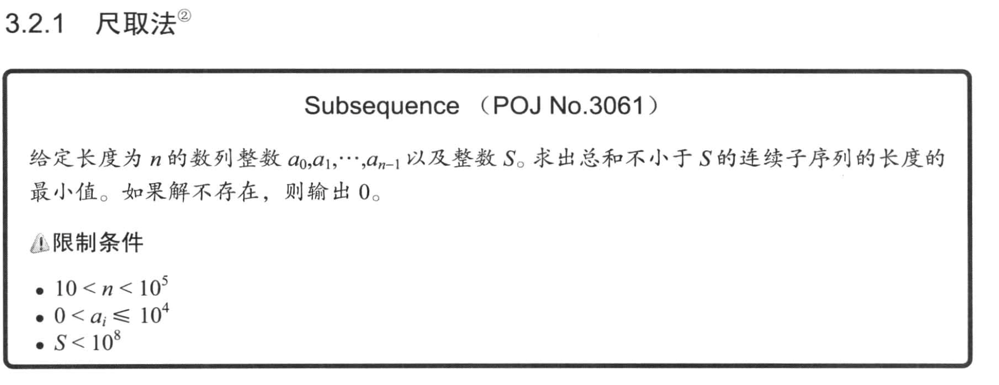
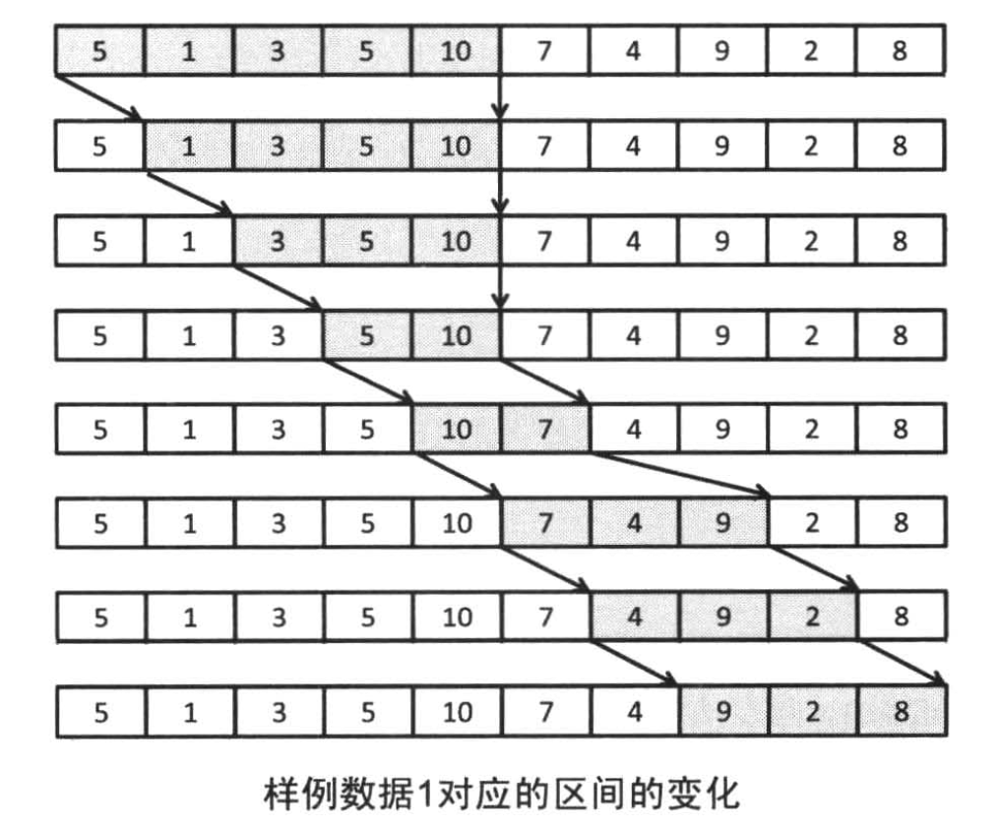
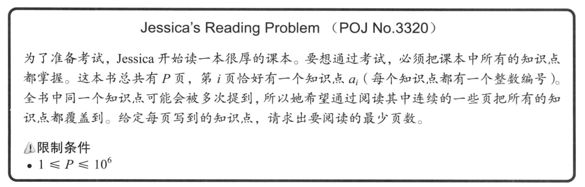
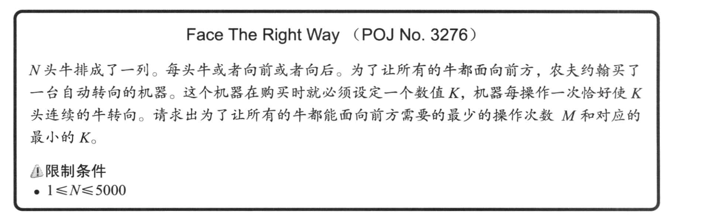
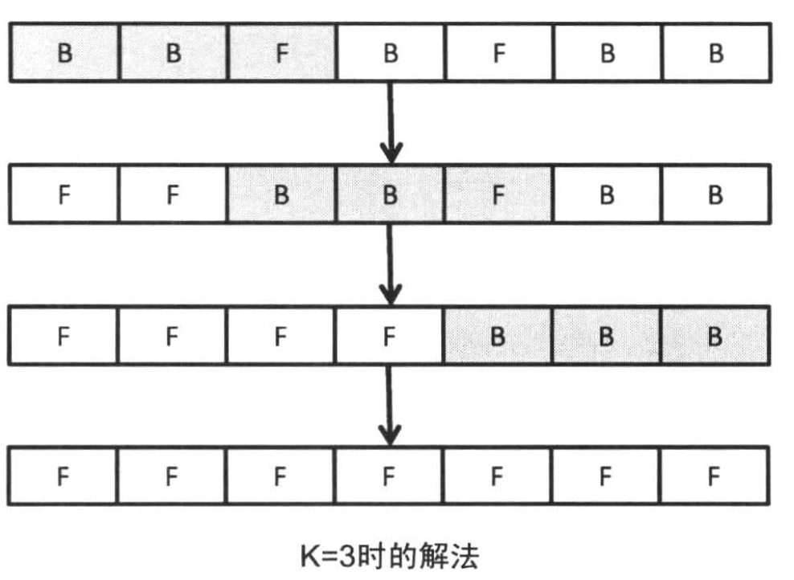

# 3.2 常用技巧精选（一）

## 3.2.1 尺取法

>尺取法通常是指对数组保存一对下标（起点和终点），然后根据实际情况交替推进两个端点直到得出答案的方法，这种方法很像尺取虫爬行的方式故得名。



### 3.2.1.1 使用二分查找法

由于所有的元素都大于0，所以对于一个序列 `sum(a[i], ..., a[t]) >= s`，那么任意的 `t < t'` 都有  `s` `<=` `sum(a[i], ..., a[t])` `<` `sum(a[i], ..., a[t'])`

此外，假设 sum(i) = `a[0] + ... + a[i]`，那么区间 `[s, t-1)` 的序列和就等于 `sum(t) - sum(s)`

如果我们以 O(n) 的时间算好 sum 的话，当我们确定了一个起点 s 的时候，那么我们就可以可以在区间 `[s, n)` 上进行二分查找找到 lower_bound。

或者换个思路，我们可以计算出以 s 为起点，n 为终点的所有的序列和，我们需要找的就是那个满足条件的最小值。这个值到 s 的距离就是最短连续子序列的长度。

```cpp
#include "iostream"

const int MAX_LEN = 100;

int n, s;
int a[MAX_LEN], sum[MAX_LEN + 1];

void init()
{
	std::cin >> n >> s;

	for (int i = 0; i < n; ++i)
	{
		std::cin >> a[i];
	}
}

void solve()
{
	std::fill(sum, sum + n, 0);

	// sum[i] 是区间 [0, i) 的序列之和
	// sum[ub] - sub[lb] 是区间 (lb, ub] 的序列之和
	for (int i = 0; i < n; ++i)
	{
		sum[i + 1] += sum[i] + a[i];
	}

	// 如果不存在解
	if (sum[n] < s)
	{
		std::cout << "0" << std::endl;
		return;
	}

	int res = n;
	for (int start = 0; sum[start] + s <= sum[n]; ++start)
	{
		// t 是找到的数组下界的索引
		// 因为我们要求的是序列 [start, x) 这个区间的值，所以下界的值应该是 sum[start] + s
		int t = std::lower_bound(sum + start, sum + n, sum[start] + s) - sum;
		res = std::min(res, t - start);
	}

	std::cout << res << std::endl;
}

int main(int argc, char **argv)
{
	init();
	solve();

	return 0;
}
```

### 3.2.1.2 一种更高效的解法

假设以 a[s] 开头的总和大于s的子序列是 `[s, t)` ，那么必然的 `[s+1, t-1)` `<` `[s, t-1)` `<` s

那么以 a[s+1] 开头的子序列 `[s+1, t2)`，必然有 `t <= t2`

这个算法的核心是，首先找到一个以 a[s] 开头的子序列，然后慢慢的缩小它，直到找到一个区间 `[s', t]` 正好大于 s。

根据我们前面的结论：`[s'+1, t]` 的序列和是肯定小于 `[s', t]` 和 s 的（因为它正好是前面的最小序列）。

那么下一次我们继续查找的时候就必须从 `a[s'+1]` 开始查找，而我们之前已经计算了 `[s'+1, t]` 的序列和，所以可以直接使用这个值来计算以减小时间复杂度。



```cpp
#include "iostream"

const int MAX_LEN = 100;

int n, s;
int a[MAX_LEN];

void init()
{
	std::cin >> n >> s;

	for (int i = 0; i < n; ++i)
	{
		std::cin >> a[i];
		std::cout << a[i] << " ";
	}
	std::cout << std::endl;
}

void solve()
{
	int ret = n + 1;
	for (int start = 0, cur = 0, sum = 0; cur < n; ++cur)
	{
		// 计算 [start, cur] 的序列和
		sum += a[cur];
		if (sum >= s)
		{
			// 当 [start, cur] 的序列和大于等于s时，我们需要减去那些不必要的部分
			while (sum >= s)
			{
				sum -= a[start++];
			}
			// 这个时候 [start - 1, cur] 是满足条件的序列，所以它的长度是 cur - start + 2
			ret = std::min(ret, cur - start + 2);

			// 根据我们前面的结论，我们已经计算出来了
			// 注意，这个时候：sum = sum([start + 1, end])
			// 在下一次循环的时候我们就需要计算 sum = sum([start, end + 1]) 了
		}
	}
	std::cout << ret << std::endl;
}

int main(int argc, char **argv)
{
	init();
	solve();
	return 0;
}
```

### 3.2.1.3 Jessica's reading problem



我们假设区间 `[s, t]` 正好包含所有的知识点并且正好是最短的页数，那么我们下一次就要开始从 `s+1` 往后找了，随后找到了一个 `all[s]` 的知识点，此时的索引为 `t'`

那么 `[s+1, t']` 的区间内又包含了所有的知识点，我们又需要从 `s+1` 开始去缩小我们的区间直到找到最小区间。

>这里的代码其实可以进一步精简，我们使用一个值 knowledge_count 来记录区间包含的知识点的数量，当 map 的值减少到0时，我们减少 knowledge_count。这样可以避免去操作 map

```cpp
#include "iostream"
#include "set"
#include "map"

static const int MAX_LEN = 10e6;

int           n;
int           a[MAX_LEN];
// 知识点
std::set<int> all;
// 记录知识点出现的次数
std::map<int, int> count;

void init()
{
	std::cin >> n;
	for (int i = 0; i < n; ++i)
	{
		std::cin >> a[i];
		all.insert(a[i]);
		std::cout << a[i] << " ";
	}
	std::cout << std::endl;
}

void solve()
{
	int ret = n;
	for (int start = 0, cur = 0; cur < n; ++cur)
	{
		if (count.count(a[cur]) == 0)
		{
			count.insert(std::make_pair(a[cur], 0));
		}
		++count.at(a[cur]);
		if (all.size() == count.size())
		{
			// [start, cur] 的区间内已经包含了所有的知识点，我们要开始缩小范围
			while (all.size() == count.size())
			{
				int &v = count.at(a[start]);
				if (--v == 0)
				{
					count.erase(a[start]);
				}
				++start;
			}
			// 这个时候的区间 [start - 1, end] 包含了所有的知识点，并且正好是最小范围
			ret = std::min(ret, cur - start + 2);
		}
	}

	std::cout << ret << std::endl;
}

int main(int argc, char **argv)
{
	init();
	solve();
	return 0;
}
```

### 3.2.1.4 尺取法总结

尺取法一般用于枚举区间，求符合限制的区间，“返回值”是区间，整个序列区间要有一定规律，一般也是单调。

尺取法的核心是，保存区间 `[s, t]` 的计算结果，当这个区间是满足条件的 **最短子序列** 时，下一次我们就删除掉 `s` 的结果得到 `[s+1, t]` 这个区间的计算结果。这样可以避免 `[s+1, t]` 这个区间的数据的重复计算来缩小复杂度。

## 3.2.2 反转（开关问题）



---



我们可以先考虑对于特定的 k 如果求出让所有的牛朝向正确方向的。

观察可以得到两个结论：

1. 交换区间的反转顺序对结果没有影响；
2. 对同一个区间的反转是无效果的。

所以问题就转换成了，求所有需要反转的区间。那么，我们可以从做到右遍历数组，找到第一头朝向错误的牛。这头牛是一定需要做反转的，那么如果我们对这头牛进行一次反转操作，并且之后就再也不需要考虑这个区间了。

我们再来考虑一下时间复杂度，对于特定的 k，最差情况下需要反转 `n - k + 1` 次，每次需要反转 `k` 个元素，并且对于每个 k 我们都必须求解一次。于是总的复杂度是 `O(n3)`

### 3.2.2.1 不考虑时间复杂度的伪代码

```cpp
// 对每个特定的 k 求值
for (int k = 2; k < n; ++k)
{
	// 从左到右对所有的区间进行反转
	for (int i = 0; i < n; ++i)
	{
		if (no_need)
		{
			continue;
		}
		for (int j = 0; j < k; ++k)
		{
			// 翻转 k 头牛
			a[i + j] |= a[i + j];
		}
	}
}
```

我们可以看到，在伪代码中，我们对某一个位置的牛 a[s] 的反转是执行了多次的。那么自然的我们就可以去优化它。

我们使用数组 f[i] 来表示对 `[i, i + k - 1]` 的区域进行了翻转，那么对于 a[i]，如果它的翻转次数是奇数它的值就是翻转后的值，如果是偶数它的值就是当前值。


count(i + 1)
a[i + 1] 的翻转次数 = f[i] + f[i - 1] + ... + f[i - k + 2]

count(i + 2)
a[i + 2] 的翻转次数 = f[i + 1] + f[i] + f[i - 1] + ... + f[i - k + 3]

那么，我们只需要每次都记录下这个值，在下次计算时就可以得到：

`count(i) = count(i - 1) + f[i - 1] - f[i - k]`

这个是常数时间，至此伪代码可以修改为

```cpp
// [i - k, i] 这个区间的翻转次数之和
int count = 0;
int res = 0;
// 对每个特定的 k 求值
for (int k = 2; k < n; ++k)
	// 从左到右对所有的区间进行反转
	for (int i = 0; i + k <= n; ++i)
	{
		if (need_revert(count, a[i]))
		{
			++res;
			f[i] = 1;
		}
		sum += f[i];
		if (i - k + 1 >= 0)
		{
			sum - f[i - k + 1];
		}
	}
}
```
