# 3.3 活用各种数据结构

## 3.3.1 线段树

线段树是擅长处理区间的，形如下图的数据结构。

线段树是一颗 **完美二叉树**，所有的叶子深度都相同，并且每个节点要么是叶子要么有二个儿子的树，树上的每个节点都维护一个区间。

根维护的是整个区间，每个节点维护的是父亲区间二等分之后的其中一个子区间。

和 **完全二叉树** 不同，完全二叉树指的是在树中除了最后一层之外，所有的层都是满的，并且在最后一层或者是满的，或者是从右边开始缺少若干连续的节点。

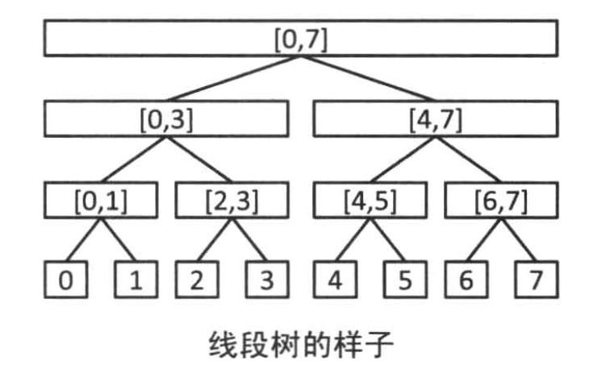

### 基于线段树的 RMQ(Range Minimum Query)

下面要建立的 二叉树  在给定数列 a[0], a[2], ..., a[n-1] 的情况下，可以在 O(log n) 的时间内完成如下两种操作：

1. 给定 s 和 t，求 a[s], a[s+1], ..., a[t] 的最小值
2. 给定 i 和 x，把 a[i] 的值修改为 x

如下图，线段树的每个节点维护 **对应区间的最小值**。在建树的时候，只需要按照从下到上的顺序分别取左右儿子的值中的较小者即可。

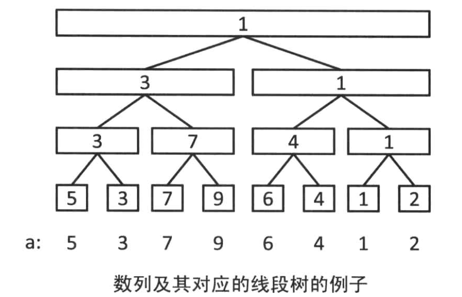

### 基于线段树的 RMQ 的查询

要求 [a[0], a[6]] 的最小值，我们只需要查询 [a[0], a[3]], [a[4], a[5]], a[6] 这三个区间的最小值即可。

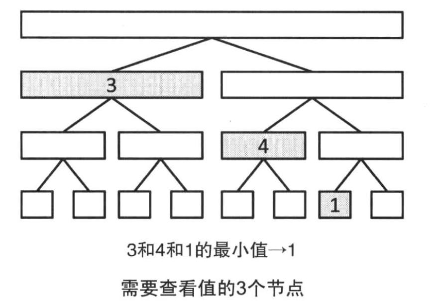

需要求某个区间的最小值，如下递归处理即可

1. 如果查询的区间和当前的节点对应的区间无交集，那么返回一个不影响答案的值
2. 如果所查询的区间完全包含了当前节点对应的区间，那么返回当前节点的值
3. 以上两种情况都不满足的话，就对两个儿子递归处理，返回两个结果中的较小值

### 基于线段树的 RMQ 的值的更新

在更新 a[i] 的值的时候，需要对包含 i 的所有区间的节点的值进行重新计算。先更新对应的节点，随后更新它的父节点，直到更新到根节点。

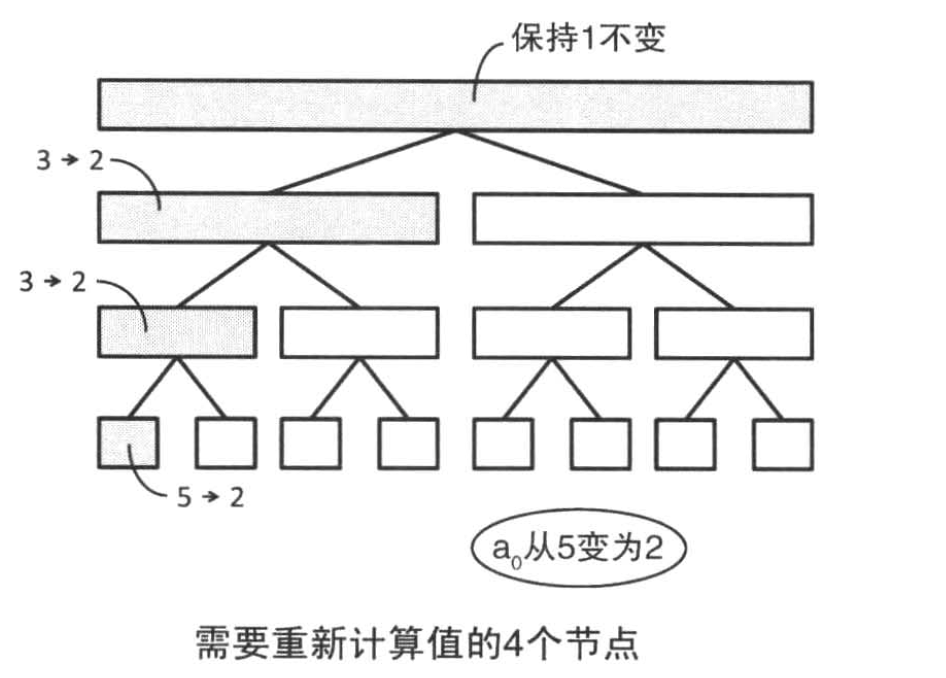

### 基于线段树的 RMQ 的复杂度

不论哪种操作，对于 `每个深度` 都最多访问常数个节点：访问左子节点不访问右子节点（访问右子节点的子节点），访问右子节点并且不访问左子节点（访问左子节点的子节点），两个节点都不访问（分别访问两个节点的子节点）。

**线段树不会添加或者删除节点**，所以即使是最朴素的实现都能在 `O(log n)` 的时间内进行各种操作。

此外，n 个元素的线段树初始化的时间复杂度是和空间复杂度都是 `O(n)`。因为在构造线段树的时候，我们的时间复杂度是 n + n / 2 + n / 4 + ... = 2n

### 基于线段树的 RMQ 的实现

假设我们有一个 n 个元素的 线段树 RMQ，那么我们的数组的实际长度是 2 * n - 1。因为我们还需要额外的内存来存放区间的最小值。

对于我们的实现，我们使用 `[n - 1, 2 * n - 2]` 这个区间来存储原数组，使用 `[0, n - 2]` 这个区间来存储线段树上每个区间的最小值。

```cpp
#include <vector>
#include "iostream"

const int MAX_N = 1 << 17;

std::vector<int> data;
int              n;

void init(int num)
{
	n = 1;
	while (n < num)
	{
		n *= 2;
	}

	data.resize(2 * n - 1);
	std::fill(std::begin(data), std::end(data), INT_MAX);
}

/**
 * 将第 k 个值 (0 - indexed) 更新为 a
 * @param k 要更新的值的索引
 * @param a 更新后的数值
 */
void update(int k, int a)
{
	k += n - 1;
	data[k] = a;
	while (k > 0)
	{
		k = (k - 1) / 2;
		data[k] = std::min(data[k * 2 + 1], data[k * 2 + 2]);
	}
}

/**
 * 求 [a, b) 的最小值
 * @param k 节点编号
 * @param l r 表示此节点的区间是 [l, r)
 * @return
 */
int query(int a, int b, int k, int l, int r)
{
	// 一定要注意，这里必须有 =，因为 [a, b) 和 [l, r) 都是左开右闭的区间
	// (l, (l + r) / 2) 和 ((l + r) / 2, r) 这两个区间可能会死循环
	// 例如，对于 l == 5, r == 6 可能一直死循环
	if (r <= a || b <= l)
	{
		return INT_MAX;
	}
	if (a <= l && r <= b)
	{
		return data[k];
	}
	return std::min(query(a, b, k * 2 + 1, l, (l + r) / 2),
					query(a, b, k * 2 + 2, (l + r) / 2, r));
}

//int main(int argc, char **argv)
//{
//	init(8);
//
//	update(0, 5);
//	update(1, 3);
//	update(2, 7);
//	update(3, 9);
//	update(4, 6);
//	update(5, 4);
//	update(6, 1);
//	update(7, 2);
//
//	assert(query(0, 8, 0, 0, 8) == 1);
//	assert(query(1, 3, 0, 0, 8) == 3);
//	assert(query(2, 6, 0, 0, 8) == 4);
//	assert(query(0, 0, 0, 0, 8) == INT_MAX);
//	assert(query(7, 7, 0, 0, 8) == INT_MAX);
//	assert(query(5, 7, 0, 0, 8) == 1);
//}
```

## 需要运用线段树的问题

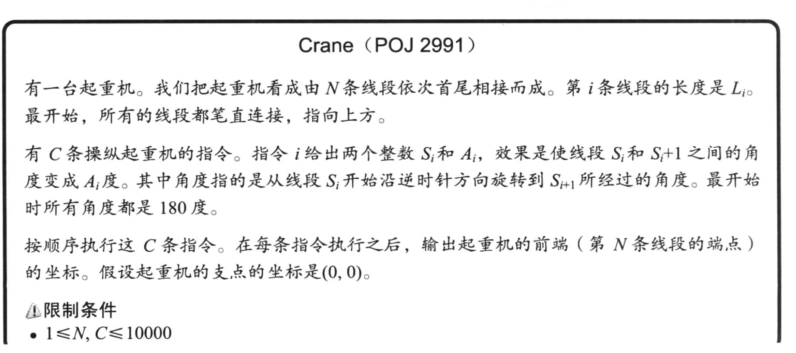
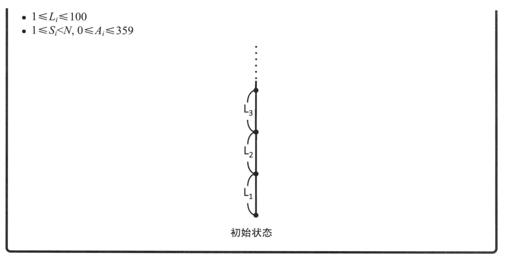

[POJ 2991 Crane](https://www.cnblogs.com/staginner/archive/2012/04/07/2436436.html)

如果我们将其中某一个线段旋转β角，那么这个线段上方的所有线段都会旋转β角，这就很类似线段树中的对区间加上一个常数的问题了，于是不妨向着线段树的思路去想。

接下来一个问题就是β角是相对于谁的，换句话说我们所谓的每个线段都会旋转β角，那么是绕谁旋转的？实际上，如果我们局限于把线段当线段看的话，那么这个旋转就会看成是绕某个定点的，这个点就是我们旋转的线段和它下面那个不动的线段的交点，再这样想下去我们就没法处理了，因为每个旋转操作所绕的定点不是唯一的，我们没办法把所有的旋转操作都统一到一起，那么我们就没办法把旋转操作叠加，这样就没法使用线段树了。

**但如果换个思路的话，实际上β角还等于这个线段旋转后所在的直线和未旋转前所在的直线的夹角，而直线的夹角是可以用向量的夹角表示的，如果我们把线段看成一个向量的话那么β角就是这个向量旋转的角度。**

如果这么看的话，所有的旋转操作就可以统一到一起了，也可以叠加了，因为这样不会局限于绕哪个定点，只需要把向量自身旋转一下就OK。其实说到这里，我们会发现其实上一段的分析从一开始就误入歧途了，我们着眼于了“β角是相对于谁的”，因为相对的东西是不可能统一到一起的，参考系不一样结果就不一样，所以我们要想把每个线段的旋转操作统一到一起，就要去看这些旋转操作改变了哪些绝对的量，而向量就是一个绝对的量，它并不参考与其他的东西，只由这个线段自身的状态决定。

## [线段树 从入门到进阶](https://www.cnblogs.com/jason2003/p/9676729.html)

### 概念引入

线段树是一种二叉树，也就是对于一个线段，我们会用一个二叉树来表示。比如说一个长度为4的线段，我们可以表示成这样：

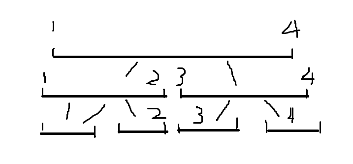

这是什么意思呢？**如果你要表示线段的和**，那么最上面的根节点的权值表示的是这个线段1~4的和。根的两个儿子分别表示这个线段中1~2的和，与3~4的和。以此类推。

然后我们还可以的到一个性质：**节点i的权值=她的左儿子权值+她的右儿子权值**。因为1~4的和就是等于1~2的和+2~3的和。

根据这个思路，我们就可以建树了，我们设一个结构体tree，tree[i].l和tree[i].r分别表示这个点代表的线段的左右下标，tree[i].sum表示这个节点表示的线段和。

我们知道，一颗二叉树，她的左儿子和右儿子编号分别是她*2和她*2+1

再根据刚才的性质，得到式子：tree[i].sum=tree[i*2].sum+tree[i*2+1].sum;就可以建一颗线段树了！代码如下：

```cpp
#include "iostream"

struct tree
{
	int l, r, sum;
};

const int MAX_LEN = 100;

int  n;
int  input[MAX_LEN];
tree data[MAX_LEN];

void init()
{
	std::cin >> n;
	for (int i = 0; i < n; ++i)
	{
		data[i] = tree();
		std::cin >> input[i];
	}
}

/**
 * 递归构建线段树
 * @param i 线段树的节点 i
 * @param l 这个点代表的线段的左下标
 * @param r 这个点代表的线段的右下标
 */
void build(int i, int l, int r)
{
	data[i].l = l;
	data[i].r = r;
	// 如果是叶子节点
	if (l == r)
	{
		data[i].sum = input[l];
		return;
	}
	int mid   = (l + r) >> 1;
	// 分别构造左子树和右子树
	build(i * 2 + 1, l, mid);
	build(i * 2 + 2, mid + 1, r);
	// 刚才我们发现的性质return ;
	data[i].sum = data[i * 2 + 1].sum + data[i * 2 + 2].sum;
}

void print_data()
{
	for (int i = 0; i < 2 * n - 1; ++i)
	{
		std::cout << data[i].l << " " << data[i].r << " " << data[i].sum << std::endl;
	}
}

int main(int argc, char **argv)
{
	init();
	build(0, 0, 3);
	print_data();
}
```

### 第二部 简单（无pushdown）的线段树

#### 区间查询

>其实这一章开始才是真正的线段树，我们要用线段树干什么？答案是维护一个线段（或者区间），比如你想求出一个1~100区间中，4~67这些元素的和，你会怎么做？朴素的做法是for(i=4;i `<=` 67;i++)  sum+=a[i]，这样固然好，但是算得太慢了。

我们使用上面实现的线段树，由于保存了每个区间的 sum，所以求和就变成了 4~67 包含了线段树的哪些区间。

我们总结一下，线段树的查询方法：

1、如果这个区间被完全包括在目标区间里面，直接返回这个区间的值

2、如果这个区间的左儿子和目标区间有交集，那么搜索左儿子

3、如果这个区间的右儿子和目标区间有交集，那么搜索右儿子

```cpp
int search(int i, int l, int r)
{
	// 如果不在区间内那么直接返回0
	if (r < data[i].l || data[i].r < l)
	{
		return 0;
	}
	// 如果区间完全包含了线段树的某一段，那么直接返回结果而不用查询详细值
	if (l <= data[i].l && data[i].r <= r)
	{
		return data[i].sum;
	}

	return search(i * 2 + 1, l, r) + search(i * 2 + 2, l, r);
}
```

#### 单点修改

```cpp
int add(int &o, int &v)
{
	int diff = v - o;
	o = v;
	return diff;
}

int update(int i, int dis, int v)
{
	if (data[i].l == data[i].r)
	{
		return add(data[i].sum, v);
	}

	tree chl = data[i * 2 + 1], chr = data[i * 2 + 2];
	if (chl.l <= dis && dis <= chl.r)
	{
		int diff = update(i * 2 + 1, dis, v);
		data[i].sum += diff;
		return diff;
	}
	else if (chr.l <= dis && dis <= chr.r)
	{
		int diff = update(i * 2 + 2, dis, v);
		data[i].sum += diff;
		return diff;
	}
	else
	{
		std::cout << "error" << std::endl;
		return 0;
	}
}

```

#### 区间修改和单点查询

区间修改和单点查询，我们的思路就变为：如果把这个区间加上k，相当于把这个区间涂上一个k的标记，然后单点查询的时候，就从上跑道下，把沿路的标记加起来就好。

**这样的简单线段树，除了求和，还可以求区间最小最大值，还可以区间染色。**

```cpp
//
// Created by 0x822a5b87 on 2020/7/19.
// 线段树
// 区域修改，单点查询

#include "iostream"

struct tree
{
	int l, r, sum;
};

const int MAX_LEN = 100;

int  n;
int  input[MAX_LEN];
tree data[MAX_LEN];

void init()
{
	std::cin >> n;
	for (int i = 0; i < 2 * n - 1; ++i)
	{
		data[i] = tree();
		std::cin >> input[i];
	}
}

void build(int i, int l, int r)
{
	data[i].l   = l;
	data[i].r   = r;
	if (l == r)
	{
		data[i].sum = input[l];
		return;
	}
	data[i].sum = 0;

	int mid = (l + r) / 2;
	build(i * 2 + 1, l, mid);
	build(i * 2 + 2, mid + 1, r);
}

void add(int i, int l, int r, int v)
{
	// 这里的理解是错误的，因为我们可能会只增加一个点的数据
	// 不需要修改原始节点的数据
	// if (data[i].l == data[i].r)
	// {
	// 	return;
	// }

	if (l <= data[i].l && data[i].r <= r)
	{
		data[i].sum += v;
		return;
	}

	if (l <= data[i * 2 + 1].r)
	{
		add(i * 2 + 1, l, r, v);
	}
	if (data[i * 2 + 2].l <= r)
	{
		add(i * 2 + 2, l, r, v);
	}
}

int search(int i, int l, int r, int dis)
{
	if (l == r)
	{
		return data[i].sum;
	}
	if (l <= dis && dis <= r)
	{
		int mid = (l + r) / 2;
		if (dis <= mid)
		{
			const tree &node = data[i * 2 + 1];
			return data[i].sum + search(i * 2 + 1, node.l, node.r, dis);
		}
		else
		{
			const tree &node = data[i * 2 + 2];
			return data[i].sum + search(i * 2 + 2, node.l, node.r, dis);
		}
	}
	return 0;
}

void print_data()
{
	std::cout << "========================" << std::endl;
	for (int i = 0; i < 2 * n - 1; ++i)
	{
		std::cout << data[i].l << " " << data[i].r << " " << data[i].sum << std::endl;
	}
	std::cout << "========================" << std::endl;
}

int main(int argc, char **argv)
{
	init();
	build(0, 0, 4);
	assert(search(0, 0, 4, 0) == 1);
	assert(search(0, 0, 4, 1) == 2);
	assert(search(0, 0, 4, 2) == 3);
	assert(search(0, 0, 4, 3) == 4);
	assert(search(0, 0, 4, 4) == 5);
	add(0, 0, 0, 10);
	assert(search(0, 0, 4, 0) == 11);
	add(0, 0, 1, 10);
	assert(search(0, 0, 4, 0) == 21);
	assert(search(0, 0, 4, 1) == 12);
	add(0, 0, 4, 10);
	assert(search(0, 0, 4, 0) == 31);
	assert(search(0, 0, 4, 1) == 22);
	assert(search(0, 0, 4, 2) == 13);
	assert(search(0, 0, 4, 3) == 14);
	assert(search(0, 0, 4, 4) == 15);
}
```

>但是，我们还没有真正的使用到线段树的真正实力。 **对于区间求和，`树状数组` 少了一个很大的常数，二区间最值，使用ST（Sparse Table）中文名稀疏表也会更好。**我们接下来学习一下它的进阶功能。

### 第三部 进阶线段树

**前面提到的区间查询和区间查找目前来看是不能同时满足。**

因为如果对于1~4这个区间，你把1~3区间+1，相当于把节点1~2和3标记，但是如果你查询2~4时，你会发现你加的时没有标记的2节点和没有标记的3~4节点加上去，结果当然是错的。

那么我们应该怎么办？这时候 `pushdown` 的作用就显现出来了。

你会想到，我们只需要在查询的时候，如果我们要查的2节点在1~2区间的里面，那我们就可以把1~2区间标记的那个+1给推下去这样就能顺利地加上了。

区间修改的时候，按照如下原则：

1. 如果当前区间被目标区间完全覆盖，则 `sum = sum + (data[i].r - data[i].l + 1) * v`
2. 如果当前区间没有被完全覆盖，则先 pushdown `lazytag`
3. 如果这个区间的左儿子和目标区间有交集，那么搜索左儿子
4. 如果这个区间的右儿子和目标区间有交集，那么搜索右儿子

 然后查询的时候，将这个懒标记下传就好了，下面图解一下：

如图，区间1~4分别是1、2、3、4，我们要把1~3区间+1。因为1~2区间被完全覆盖，所以将其+2，并将紫色的lazytage+1，3区间同理

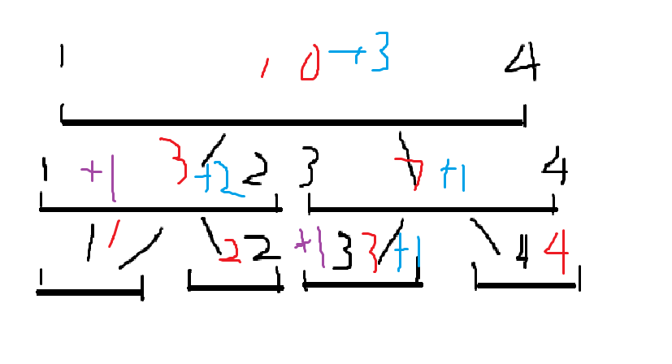

注意我们处理完这些以后，还是要按照tree[i].sum=tree[i*2].sum+tree[i*2+1].sum的原则返回，代码如下：

```cpp
//
// Created by 0x822a5b87 on 2020/7/19.
// 线段树：包含 push_down

#include "iostream"

// sum 区间 [l, r] 的和
// lazy_tag 区间 [l, r] 每个元素累加的值
struct tree
{
	int l, r, sum, lazy_tag;
};

const int MAX_LEN = 100;

int  n;
int  input[MAX_LEN];
tree data[MAX_LEN];

void init()
{
	std::cin >> n;
	for (int i = 0; i < 2 * n - 1; ++i)
	{
		data[i] = tree();
		std::cin >> input[i];
	}
}

void build(int i, int l, int r)
{
	data[i].l        = l;
	data[i].r        = r;
	data[i].lazy_tag = 0;
	if (l == r)
	{
		data[i].sum = input[l];
		return;
	}

	int mid = (l + r) / 2;
	build(i * 2 + 1, l, mid);
	build(i * 2 + 2, mid + 1, r);
	data[i].sum = data[i * 2 + 1].sum + data[i * 2 + 2].sum;
}

void push_down(int i)
{
	// 增加这个判断主要是为了性能
	if (data[i].lazy_tag != 0)
	{
		// 左右儿子加上
		data[i * 2 + 1].lazy_tag += data[i].lazy_tag;
		data[i * 2 + 2].lazy_tag += data[i].lazy_tag;

		int mid = (data[i].r + data[i].l) / 2;
		data[i * 2 + 1].sum += data[i].lazy_tag * (mid - data[i * 2 + 1].l + 1);
		data[i * 2 + 2].sum += data[i].lazy_tag * (data[i * 2 + 2].r - mid);

		data[i].lazy_tag = 0;
	}
}

void add(int i, int l, int r, int v)
{
	if (l <= data[i].l && data[i].r <= r)
	{
		data[i].sum += v * (data[i].r - data[i].l + 1);
		data[i].lazy_tag += v;
		return;
	}
	push_down(i);
	// 更新左儿子和右儿子
	if (l <= data[i * 2 + 1].r)
	{
		add(i * 2 + 1, l, r, v);
	}
	if (data[i * 2 + 2].l <= r)
	{
		add(i * 2 + 2, l, r, v);
	}
	data[i].sum = data[i * 2 + 1].sum + data[i * 2 + 2].sum;
}

int search(int i, int l, int r)
{
	// 如果不在区间内直接返回
	if (data[i].r < l || data[i].l > r)
	{
		return 0;
	}
	// 包含整个区间则直接返回整个区间的和
	if (l <= data[i].l && data[i].r <= r)
	{
		return data[i].sum;
	}
	// 计算左子节点和右子节点的和
	push_down(i);
	int s = 0;
	if (data[i * 2 + 1].r >= l)
	{
		s += search(i * 2, l, r);
	}
	if (data[i * 2 + 2].l <= r)
	{
		s += search(i * 2 + 1, l, r);
	}
	return s;
}

void print_data()
{
	std::cout << "========================" << std::endl;
	for (int i = 0; i < 2 * n - 1; ++i)
	{
		std::cout << data[i].l << " " << data[i].r << " "
				  << data[i].sum << " " << data[i].lazy_tag << std::endl;
	}
	std::cout << "========================" << std::endl;
}

int main(int argc, char **argv)
{
	init();
	build(0, 0, 4);
	assert(search(0, 0, 4) == 15);
	add(0, 0, 4, 1);
	assert(search(0, 0, 4) == 20);
	add(0, 0, 0, 10);
	assert(search(0, 0, 4) == 30);
	add(0, 4, 4, 10);
	assert(search(0, 0, 4) == 40);
	add(0, 2, 3, 10);
	assert(search(0, 0, 4) == 60);
}
```

#### 错误总结

1. 最开始我的想法是，lazy_tag 完全只表示一个加法的值。每次在 search 的时候用 `sum + lazy_tag * len(data[i])` 来计算一个区间和。但是这存在一个问题， **由于 push_down 的关系，我们当前区间的子区间有可能有部分值也包含了一个 lazy_tag** ，用我们的方法在 search 的时候有可能会没有加到这个值

#### 个人总结

1. 在包含 `push_down` 的线段树中，包含了两个重要的元素：`sum` 和 `lazy_tag`，分别表示当前区间和以及区间上每个元素应该增加的元素。当我们的查询范围包含了整个区间的时候，我们的区间和直接可以等于 `sum`。当查询范围没有包含整个区间的时候，我们要执行 `push_down` 来将 `lazy_tag` 增加到它的左子节点和右子节点上。随后我们需要来计算左子节点和右子节点的和来得到区间和的结果。
2. `push_down` 是将当前区间的 `lazy_tag` 加到子节点的操作，它需要执行五个操作：
	2.1 更新左子节点的 sum
	2.2 更新右子节点的 sum
	2.3 更新左子节点的 lazy_tag
	2.4 更新右子节点的 lazy_tag
	2.5 将自身的 lazy_tag 置 0
3. 在 search 的时候调用 `push_down` 不会增加复杂度，因为 `push_down` 的操作是常数，而需要执行 `push_down` 的次数最大也是线段树的高度，这个复杂度和普通的 search 是一样的，只不过增加一个常数 2。
4. 为什么在 `search` 的时候需要 push_down，因为我们在求解最后结果的时候，如果不将前面的 `lazy_tag` 加上的话，下面的数据将少掉 `lazy_tag` 的那部分和。

## 基于稀疏表（Sparse Table）的 RMQ

对于数列 a[0],a[1],...,a[n] 构建的 ST 如下所示

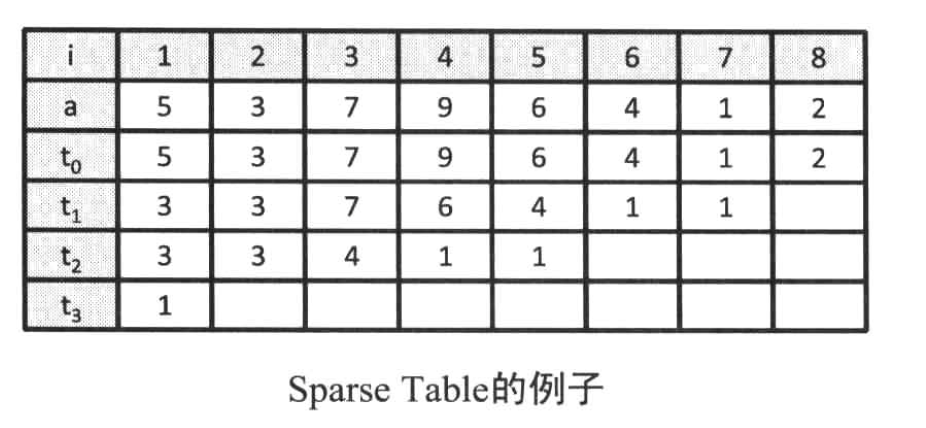

**其中 t[i][j] 表示的是区间 [a[j, a[j+2<sup>i</sup>]]] 的最小值**

>对于给定的区间 [x, y]，它一定可以划分为两个小的区间 [x, u] 和 [v, y]，其中 `v <= u`，那么 min([x, y]) == min(min([x, u]), min([v, y]))

如果我们找到一个值 i，使得 `2<sup>i</sup> <= (y - x) < 2<sup>i+1</sup>`，我们就得到了两个值：

1. u = `2<sup>i</sup> + x` ： 我们使用 ST 中的 `t[i][x]` 就得到了 `[a[x], a[u]]` 这个区间的最小值，并且 `u <= y`
2. v = `y - 2<sup>i</sup>` ： 我们使用 ST 中的 `t[i][v]` 就得到了 `[a[v], a[y]]` 这个区间的最小值，并且 `v < u` && `v > x`

### 证明

u - y
= pow(2, i) + x - y
= pow(2, i) - (y - x)
`<=` 0

v - u
= y - x - pow(2, i + 1)
`<` 0

v - x
= y - x - pow(2, i)
`>=` 0

## 3.3.2 树状数组（Binary Indexed Tree）

树状数组可以完成下面的操作：

给定一个初始值为 a[1], ..., a[n] 的数列

- 给定 `i`，计算 a[1] + a[2] + ... + a[i]
- 给定 i 和 x，执行 a[i] += x

### 基于线段树的实现

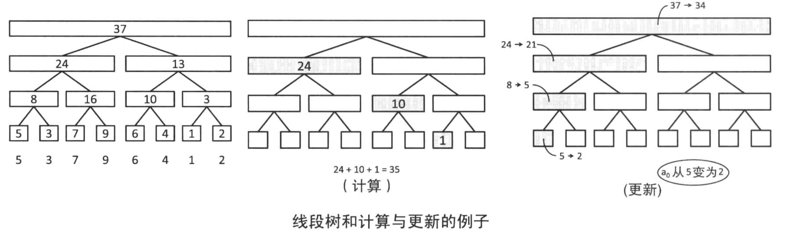

- 给定 `i`，计算区间 `[a[1], a[i]]` 的和，这个很简单，直接使用线段树的区间查询即可
- 给定 i 和 x，执行， a[i] += x，这个更简单，使用线段树的单点更新即可。

求区间 `[a[s], a[t]]` 的和我们还有另外一种求法：计算区间 `[a[1], a[s - 1]]` 的和 u，区间 `[a[1], a[t]]` 的和 v，那么 `v - u` 就得到了区间的和。

**在这种限制之下，线段树上的每个节点的右儿子都不需要了。因为如果区间 [a[1], a[s]] 需要用到右子节点，那么这个区间也一定包含了它的左子节点。那么我们直接使用它父亲的值即可**

基于上面的想法实现的就是 BIT，它的实现更为简单

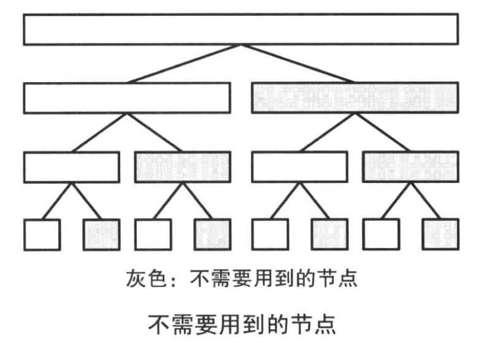

### BIT 的结构

BIT 使用数组维护下图所示的部分和

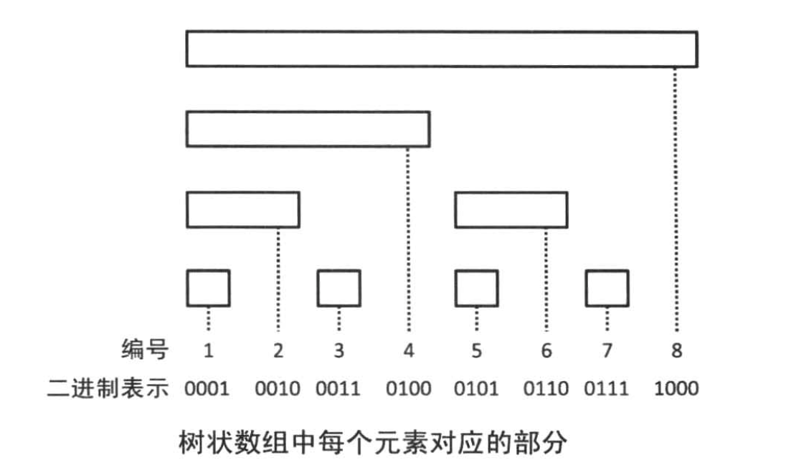

>**可以看到在上图中，我们就是把线段树中不需要的节点去掉之后，再把剩下的节点添加到数组中。**

举个简单的例子，在线段树中，我们的 [1, 2] 这个区间分别是 a[1] 和 a[2] 的值。而在树状数组中，由于 a[2] 是右子节点，所以我们把它合并成了一个节点，并且这个节点是后续节点的左子节点。

让我们对比一下每个节点对应的区间的长度和节点编号的二进制表示：

- 1，3，5，7 这些末位为 1 的代表的是长度是 1；
- 2，6 这些末位为 1 个 0 的代表的长度是 1；
- 4 这些末位为 2 个 0 的代表的长度是 2；
- 8 的末位为 3 个 0，代表的长度是 3.

### BIT 数组每一个元素表示什么？

>可以这么理解一下：我们的目的是要删除那些右子节点。记得我们之前提到的线段树中的右子节点的坐标是怎么计算的吗？节点 i 对应的右子节点应该是 `2 * i + 2`，这就代表着末位为0
><br/>
>如果一个位置的索引的末位为 0，代表它是一个右子节点。`i >> 1u` 之后如果末位仍然为 0，表示它的父节点仍然是一个右子节点。

假设我们的原始数组是 `a`，树状数组是 `c`：

那么对于树状数组中的每一个元素 `c[i]`

1. 如果 `a[i]` 在线段树中是一个左子节点，那么 `c[i] = a[i]`
2. 如果 `a[i]` 在线段树中是一个右子节点，那么 `c[i]` 等于 a[i] 加上它的左子节点，这得到了一个新的节点，如果这个节点在线段树中仍然为右子节点，那么我们要继续对它进行计算。

以 c[8] 为例子：

1. c[8] = a[8] + a[7]，计算完之后得到的节点对应线段树的 `[7, 8]` 区间，这仍然是一个右子节点
2. c[8] = c[8] + c[6]，计算完之后得到的节点对应线段树的 `[5, 8]` 区间，这仍然是一个右子节点
3. c[8] = c[8] + c[4]，计算完之后得到的节点对应线段树的 `[1, 8]` 区间，现在到了根节点。

换句话说，对于 `C[i]`，假设它的低位有 n 个连续的 0，那么它包含的区间是 `[a[i - 2<sup>n</sup>+1], a[i]]`

### 使用 BIT 求区间和 sum

假设数组数组用数组 `C` 来表示，那么有：

- C[1] = a[1]
- C[2] = a[2] + a[1]
- C[3] = a[3]
- C[4] = a[4] + a[3] + a[2] + a[1]
- C[5] = a[5]
- C[6] = a[6] + a[5]
- C[7] = a[7]
- C[8] = a[8] + a[7] + a[6] + a[5] + a[4] + a[3] + a[2] + a[1]

我们称C[i]的值为下标为i的数所管辖的数的和，C[8]存放的就是被编号8所管辖的那些数的和（有8个），而下标为i的数所管辖的元素的个数则为2^k个（k为i的二进制的末尾0的个数）举两个例子查询下标m8和m5所管辖的数的和

- 8 = 1000，末尾3个0，故k == 3，所管辖的个数为2^3 == 8，C8是8个数的和
- 5 = 0101，末尾没有0，故k == 0，所管辖的个数为2^0 == 1，C5是一个数的和（它本身A5）

**假设我们的树状数组已经构造完毕，以 sum(7) 和  sum(6) 为例计算一下它的和**

对于查询的m，将它转换成二进制后，不断对末尾的1的位置进行-1的操作，直到全部为0停止。

7的二进制为0111（C7得到），那么先对0111的末尾1的位置-1，得到0110 == 6（C6得到），再对0110末尾1位置-1，得到0100 == 4（C4得到），最后对0100末尾1位置-1后得到0000（结束信号），计算停止，至此C7，C6，C4全部得到，求和后就是m == 7时它的前缀和

m == 6时也是一样，先转成2进制等于0110，经过两次变换后为0100（C4）和0000（结束信号），那么求和后同样也得到了预计的结果

>为什么我们可以这样求值呢？我们可以这么看，要求 sum(m)，则我们要求的是 a[1] + a[2] + ... a[m]
><br />
>根据我们前面的总结，sum(m) 等于它所有的左子树的和加上它的右子树（它的右子树可能有也可能没有，如果有的话就是 a[m]）
><br />
>而它的所有左子树就是它的二进制中所有为 1 的数字。

那么现在我们要求它所有的为1的最低位，**i 的二进制的最后一个 1 可以通过 `i & -i` 得到**，我们可以这么记忆：i + (-i) == 0，那么 -i 就等于 i 的补码 + 1。那么就是说 i 和 -i 除了 i 的最低位的 1 相同之外，其他的都相反。

```cpp
#include "iostream"
#include <bitset>

int main()
{
	int num = 0xffff;
	std::cout << std::bitset<32>(num) << std::endl;
	std::cout << std::bitset<32>(-num) << std::endl;
	// 00000000000000001111111111111111
	// 11111111111111110000000000000001
	return 0;
}
```

### BIT 的更新

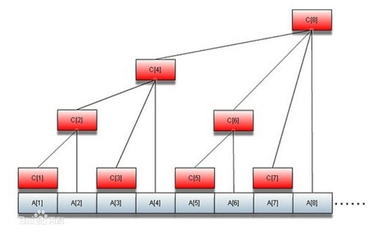

>对于输入编号为x的值，要求为它的值附加一个 v

假设 `x == 2`, `v == 5`。很显然，当我们更新 a[2] 的时候，所有包含 a[2] 的区间都需要更新，这些节点分别是 c[2], c[4], c[8]

**对于要更新 x 位置的值，我们把 x 转换成二进制，不断对二进制最后一个1的位置+1，直到达到数组下标的最大值n结束**

>再回到我们之前的理解：a[i] 更新的时候，包含它的区间都需要更新。
><br/>
>假设它低位有 n 个连续的 0，那么包含它的区间有：
><br/>
>1. x >= i && x 的低位最少包含 n 个连续的 0。

对于给出的例子x == 2，假设数组下标上限n == 8，x转换成二进制后等于0010（C2），对末尾1的位置进行+1，得到0100（C4），对末尾的1的位置进行+1，得到1000（C8），循环结束，对C2，C4，C8的前缀和都要加上value，当然不能忘记对A[2]的值+value，单点更新值过程结束

```cpp
void update(int x, int value){
    A[x] += value;    //不能忘了对A数组进行维护，尽善尽美嘛
    while(x <= n){
        C[x] += value;
        x += lowbit(x);
    }
}
```

### 构建 BIT

事实上，对于一个输入的数组A，我们一次读取的过程，就可以想成是一个不断更新值的过程（把A1~An从0更新成我们输入的A[i]），所以一边读入A[i]，一边将C[i]涉及到的祖先节点值更新，完成输入后树状数组C也就建立成功了

```cpp
int main(){
	while(scanf("%d", &n)!=EOF){	//用于测试n == 8 
		memset(a, 0, sizeof(a));
		memset(c, 0, sizeof(c));
		for(int i = 1; i <= n; i++){
			scanf("%d", &a[i]);		//a[i]的值根据具体题目自己安排测试可以1，2，3，4，5，6，7，8 
			update(i, a[i]);		//输入的过程就是更新的过程 
		}
		int ans = getSum(n-1);		//用于测试输出n-1的前缀和 输出28 
		printf("%d\n", ans);
	}	
	return 0;
} 
```

### 完整代码

```cpp
// 树状数组

#include <vector>
#include "iostream"

int n;
std::vector<int> a, c;

size_t low_bit(size_t x)
{
	return x & (-x);
}

int get_sum(size_t x)
{
	int s = 0;
	while (x > 0)
	{
		s += c[x];
		x -= low_bit(x);
	}
	return s;
}

void add(size_t x, int v)
{
	a[x] += v;
	while (x <= n)
	{
		c[x] += v;
		x += low_bit(x);
	}
}

void init()
{
	std::cin >> n;
	// 树状数组的下标是从 1 开始的
	a.resize(n + 1);
	c.resize(n + 1);
	for (int i = 1; i <= n; ++i)
	{
		a[i] = 0;
		c[i] = 0;
	}

	int num;
	for (int i = 1; i <= n; ++i)
	{
		std::cin >> num;
		add(i, num);
	}
}

int main(int argc, char **argv)
{
	init();

	assert(get_sum(1) == 1);
	assert(get_sum(2) == 3);
	assert(get_sum(3) == 6);
	assert(get_sum(4) == 10);
	assert(get_sum(5) == 15);
	assert(get_sum(6) == 21);
	assert(get_sum(7) == 28);
	assert(get_sum(8) == 36);
}
```

## 冒泡排序的交换次数

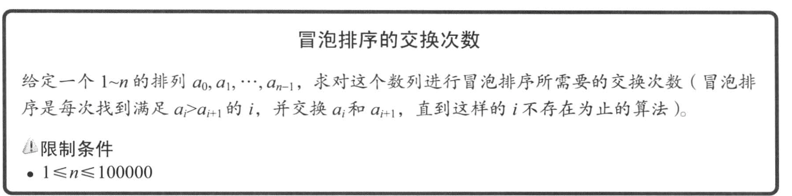

对于冒泡排序而言，交换的次数等同于所有逆序对的数量（满足 `i < j` && `a[i] > a[j]` 的对成为逆序对），对于每一个 j，如果能快速求出逆序对的个数问题就迎刃而解。

我们构建一个值的范围是 1~n 的 BIT，按照 j = 0, 1, 2, ..., n-1 的顺序进行如下操作：

我们的 BIT 的 C[i] 存放的是 `i = a[j]` 出现的次数。

- 执行 `v = get_sum(a[j])`，由于我们是顺序执行的，所以得到的数字就是区间 `[a[1], a[j]]` 这个区间内小于 a[j] 的数字的个数，也就是说逆序对的个数等于 `j - get_sum(a[j])`
- add(a[j], 1);

```cpp
/**
 * 冒泡排序的交换次数
 */
#include <vector>
#include "iostream"

int n;
std::vector<int> a, c;

ssize_t low_bit(size_t x)
{
	return x & (-x);
}

void add(size_t x, int v)
{
	// 注意，这里和上面的不一样，不能修改原数组.
	while (x <= n)
	{
		c[x] += v;
		x += low_bit(x);
	}
}

int get_sum(size_t x)
{
	int s = 0;
	while (x != 0)
	{
		s += c[x];
		x -= low_bit(x);
	}
	return s;
}

void init()
{
	std::cin >> n;
	a.resize(n + 1);
	c.resize(n + 1);
	for (int i = 0; i <= n; ++i)
	{
		a[i] = 0;
		c[i] = 0;
	}

	for (size_t i = 0; i <= n; ++i)
	{
		std::cin >> a[i];
	}
}

void solve()
{
	int ret = 0;
	for (int i = 0; i < n; ++i)
	{
		ret += i - get_sum(a[i]);
		add(a[i], 1);
	}
	std::cout << ret << std::endl;
}

int main(int argc, char **argv)
{
	init();
	solve();
}
```

### 冒泡排序交换次数离散化

>假设我们修改一下原始条件，假设给定的一个长度为 n 的 long 数组，这个时候我们肯定是没办法声明一个那么大的树状数组的。
><br/>
>但是我们可以对数组进行离散化处理。因为只有 n 个数字，所以我们可以用从 [0, n-1] 的数字来表示数组里的 n 个数，从而达到压缩空间的效果。

离散化的核心是： **为原数组中的每一个数字设置一个从属于 [0, n-1] 区间的编号，并且这个数字的编号也满足于他们大小比较关系。**

所以我们将结构体 `node` 的 `v` 初始化为原数组的值， `order` 初始化为这个数字在原数组中的索引。

我们对 `node` 进行排序之后得到了一个排序号的数组。那么这个时候的 a[i].order 对应的那个位置就应该是 i。

```cpp
// 离散化测试

#include <vector>
#include "iostream"

struct node
{
	int v, order;
};

int               n;
std::vector<node> a;
std::vector<int> d;

void init()
{
	std::cin >> n;
	a.resize(n);
	for (int i = 0; i < n; ++i)
	{
		std::cin >> a[i].v;
		a[i].order = i;
	}

	std::sort(std::begin(a), std::end(a), [](const node &l, const node &r)
	{
		return l.v < r.v;
	});

	// 离散化映射
	d.resize(n);
	for (int i = 0; i < n; ++i)
	{
		d[a[i].order] = i;
	}
}

int main(int argc, char **argv)
{
	init();
}
```

### 离散化实现

>这里要注意一个问题，我们在离散化数组的时候一定要从 1 开始初始化离散数组的映射。例如 {11,22,33,44} 这个四个数字一定要映射成为 {1,2,3,4} 而不能映射成为 {0,1,2,3}。
><br/>
>否则，从零开始的数组就会导致在 `+=`, `-=` low_bit 操作的时候导致死循环。

```cpp
// 求逆序对 + 离散化
#include <vector>
#include "iostream"

struct node
{
	int v;
	int order;
};

int               n;

std::vector<int> a, c0;
// 离散化之后的数组
std::vector<int> d2;
std::vector<node> d;

ssize_t low_bit(size_t x)
{
	return x & (-x);
}

void add(size_t x, int v)
{
	while (x <= n)
	{
		c0[x] += v;
		x += low_bit(x);
	}
}

int get_sum(size_t x)
{
	int s = 0;
	while (x != 0)
	{
		s += c0[x];
		x -= low_bit(x);
	}
	return s;
}

void init()
{
	std::cin >> n;
	a.resize(n);
	d.resize(n);
	d2.resize(n);
	c0.resize(n + 1);
	for (int i = 0; i < n; ++i)
	{
		a[i] = 0;
		d[i] = {0, 0};
	}

	for (size_t i = 0; i < n; ++i)
	{
		std::cin >> a[i];
		d[i].v = a[i];
		d[i].order = i;
	}

	// 离散化数组
	std::sort(std::begin(d), std::end(d), [](const node &l, const node &r)
	{
		return l.v < r.v;
	});

	for (int i = 0; i < n; ++i)
	{
		d2[d[i].order] = i + 1;
	}
}

void solve()
{
	int      ret = 0;
	for (int i   = 0; i < n; ++i)
	{
		ret += i - get_sum(d2[i]);
		std::cout << i << std::endl;
		add(d2[i], 1);
	}
	std::cout << ret << std::endl;
}

int main(int argc, char **argv)
{
	init();
	solve();
}
```

## A Simple Problem With Integers

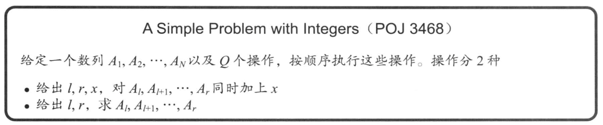

>这个就是之前提到的包含 `push_down` 的线段树，区间更新和区间查询。
