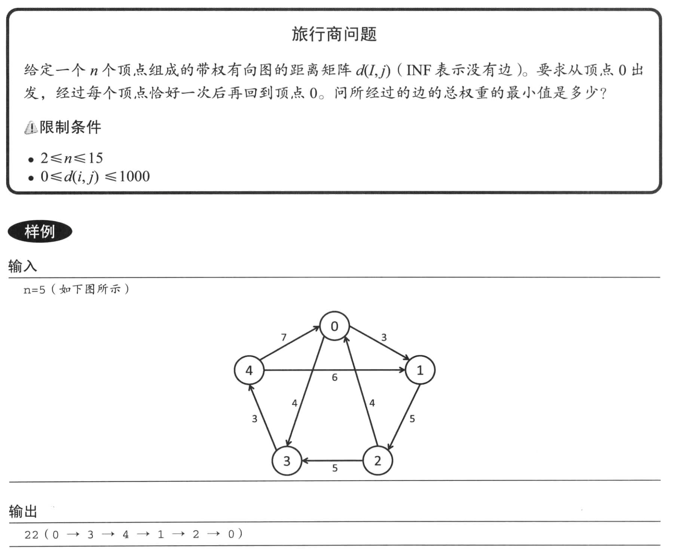
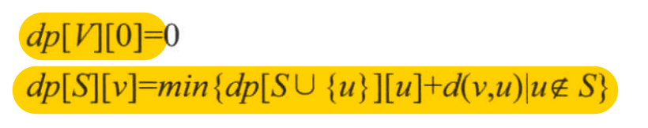
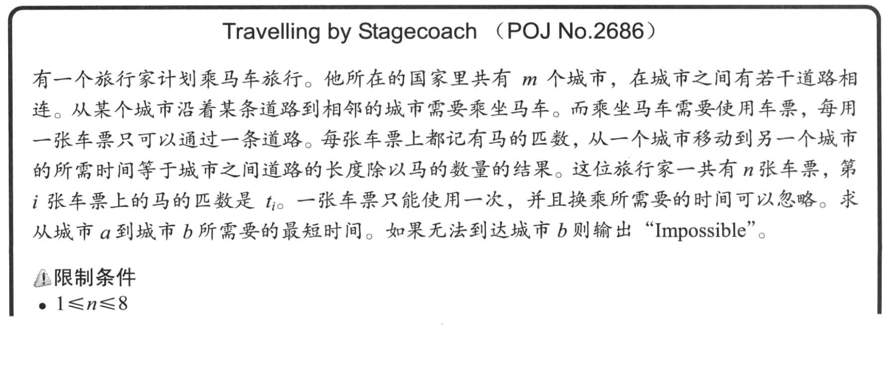

# 熟练掌握动态规划

## 3.4.1 状态压缩 DP

### 旅行商问题01



这个问题就是著名的旅行商问题（TSP， Traveling Salesman Problem）。TSP 问题是 NP 困难的，没有已知的多项式的高效算法可以解决这一问题。

所有的可能的路线共有 `(n - 1)!` 种，所以我们没办法枚举所有可能的情况。

我们可以尝试着递归的去解决这个问题：

- 假设现在已经访问过的顶点的集合为 S
- 当前所在的顶点为 v
- 用 `dp[S][v]` 表示从 v 出发访问剩余的所有顶点，最终回到顶点 0 的路径的权重和的最小值。

由于从顶点 v 出发的任意一个节点 `u 不属于 S`，因此有如下递推公式：



>在上面的递推公式中，V 表示与给出的集合相同的集合，也就是说所有的顶点都访问过了。

因为我们的节点只有 n 个（n 比较小），所以我们可以用一个数字来表示已经访问过的节点的集合。例如 `0xf` 表示访问过了四个节点。

>在最开始，我犯了一个很愚蠢的错误：在判断顶点的集合以及计算每一个节点时，应该是用 `c`，而不是 `n`。因为 n 是边的条数，而 c 才是顶点的个数。

```cpp
#include "iostream"

#define INF 10000000

const int MAX_N = 15;

int c, n;
int d[MAX_N][MAX_N];

// 假设 i 是所有已经到达的顶点的集合，j 是当前顶点
// value 是从顶点 j 到达所有未达到顶点之后回到起点0的最短路径
// dp[i][j] = 0									i == (1u << MAX_N) - 1;
// dp[i][j] = ?
// 对于上面的递推公式来说，我们从 j 开始可以达到的所有可达顶点（所有有路径并且尚未去过的顶点）
// 我们先假设走向任意可达顶点 v，随后加上 dp[u][v]，其中 u 是 i 新达到顶点 v 的并集
// dp[u][v] + dp[i][v] 就是经过 j 可以回到原点的最短路径
// 如果我们尝试所有的可达顶点，并求出最小值，这个最小值就是 dp[i][j] 可回到原点的最小值。
int dp[1u << MAX_N][MAX_N];

void init()
{
	std::cin >> c;
	std::cin >> n;
	for (int i = 0; i < n; ++i)
	{
		for (int j = 0; j < n; ++j)
		{
			d[i][j] = -1;
		}
	}

	int from, to, cost;

	for (int i = 0; i < n; ++i)
	{
		std::cin >> from >> to >> cost;
		d[from][to] = cost;
	}

	memset(dp, -1, sizeof(dp));
}

int rec(int S, int v)
{
	// 如果 dp[S][v] >= 0，说明这个结果已经计算过了
	if (dp[S][v] >= 0)
	{
		return dp[S][v];
	}

	// 所有的顶点都已经到达过了，并且已经回到了0号节点
	if (S == (1u << c) - 1 && v == 0)
	{
		return dp[S][v] = 0;
	}

	int      res = INF;
	// n 个节点，每个节点都计算一下经过它达到原点的最短路径
	for (int u   = 0; u < c; u++)
	{
		// 如果这个节点还没有到达过
		if (!((S >> u) & 1u) && d[v][u] >= 0)
		{
			res = std::min(rec(S | (1u << u), u) + d[v][u], res);
		}
	}
	return dp[S][v] = res;
}

void solve()
{
	std::cout << rec(0, 0) << std::endl;
}

int main(int argc, char **argv)
{
	init();
	solve();
}
```

算法的时间复杂度是 `O(2<sup>n</sup>n<sup>2</sup>)`

## Travelling by Stagecoach




