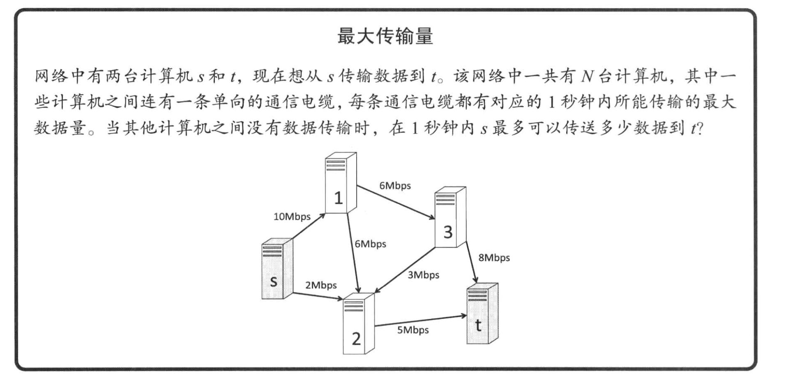
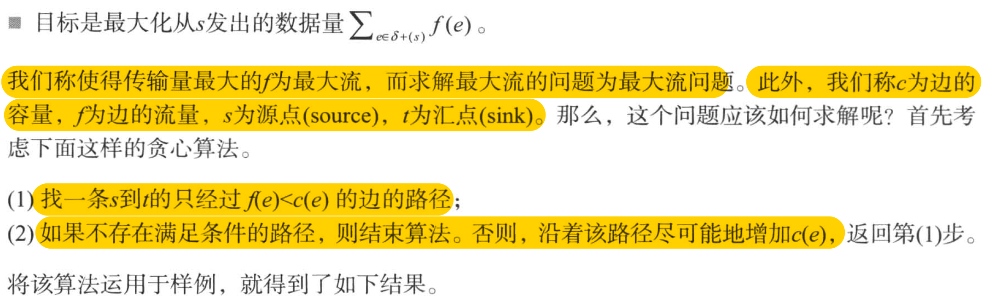
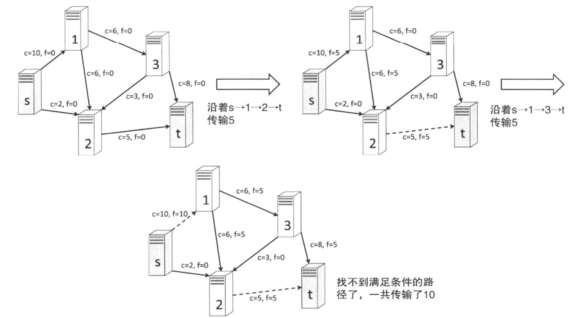
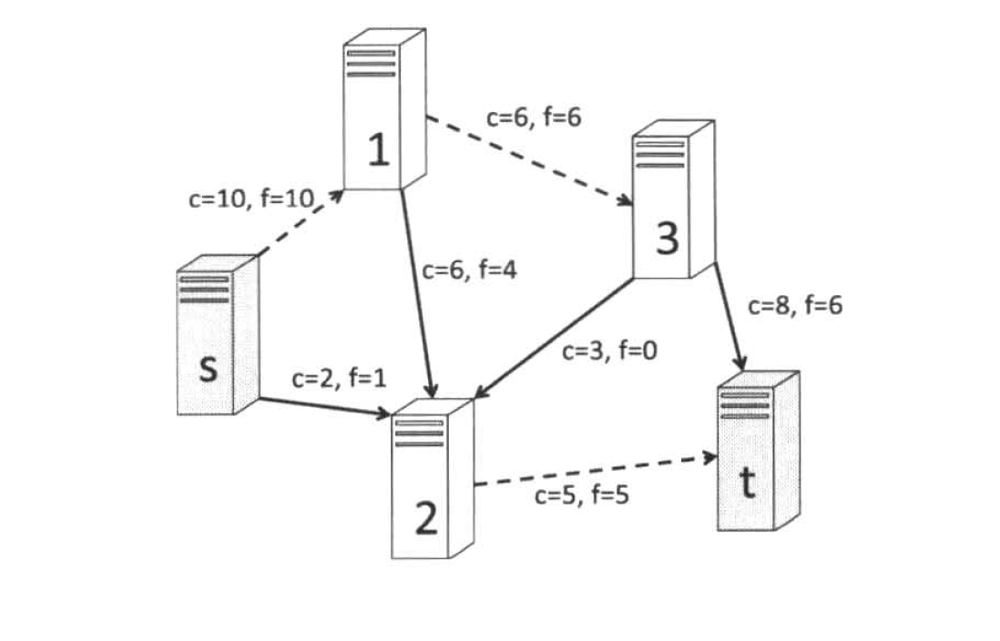
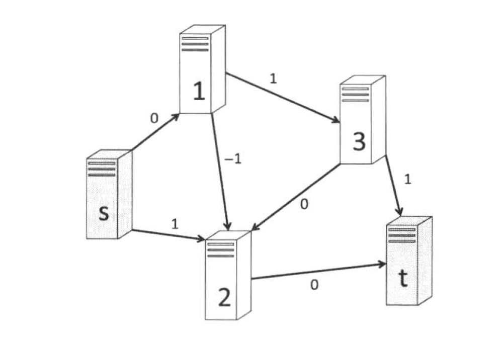
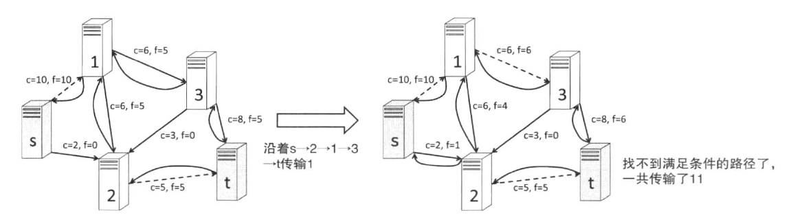
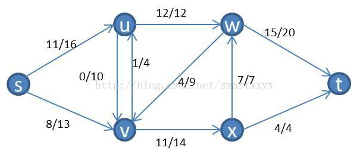
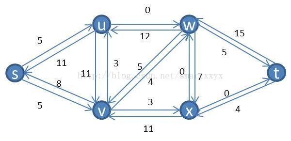
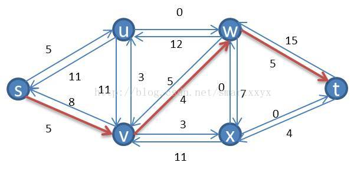

# 3.5 借助水流解决问题的网络流

本节将围绕最大流和最小费用最大流等问题，介绍图上的网络流

## 3.5.1 最大流








描述一下我们上面的贪心算法：

1. 首先我们在整个图上找到一条随机的从 s 到 t 的路径，那么现在这条路径上的最大流量就可以确定了（小于路径所有节点中的剩余最小容量和 s 的最大出流量）
2. 经过步骤1，我们更新那条路径上的所有节点的 `f(e)`，那么剩余的可用流量就等于 `c(e) - f(e)`
3. 随后我们跳回到步骤1，并寻找那些还没有走过的路径，直到找到正确的路径。

>但是上面的贪心算法是错误的，下面是一个反例



贪心算法得到的流量是10，而我们的反例中得到的流量是 11，我们可以对比一下两个不同的路径中流量的查（正确的结果 f(e) - 贪心算法的 f(e)）



我们通过将原先得到的流推回去（图中的-1部分）而得到了新的流。因此，可以试着在之前的贪心算法上加上这一操作，将算法进行如下改进。

1. 只利用满足 `f(e)` `<` `c(e)` 的 e 或者满足 `f(e)` `>` 0 的 e 对应的反向边 `rev(e)`，寻找一条s 到 t 的路径
2. 如果不存在满足条件的路径，则结束。否则，沿着该条路径尽可能的增加流，返回第一步



看上图，针对于我们之前的那个例子，当我们查找了 `s -> 1 -> 2 -> t` 和 `s -> 1 -> 3 -> t` 这两条路径之后，再没有其他的路径了。

但是现在修改了条件之后我们发现多出来了一条新的路径 `s -> 2 -> 1 -> 3 -> t` 的路径。因为在我们开始的条件中，`1 -> 2` 这条链路的 `c = 6, f = 5`。也就是 e 对应的反向边是可行路径。

这个算法叫做 `Full-Fulkerson` 算法。

**另外，我们称在上面的这个图中所考虑的 `f(e) < c(e)` 和 `f(e) > 0 对应的 e 的反向边 rev(e)` 所组成的图为残余网络，并称参与网络上的 s-t 路径为增广路径。**

>其实可以简单的这么理解，当我们找到 `f(e) > 0 对应的 e 的反向边 rev(e)` 并且可以到达末位的节点的时候，说明 `f(e)` 可以削减掉这条边的 `带宽占用（f）`。
><br />
>那么就相当于空出来了一些带宽。以我们的书中的例子为例。

增广路径为 `s -> 2 -> 1 -> 3 -> t`，其中 `2 -> 1` 是反向边。可以发现 `1 -> 2 ... -> t` 的这条路径上的流量可以被转移到 `1 -> 3 -> t` 这条路径上。那么相当于是空出来一部分流量。

### [最大流之Ford-Fulkerson算法](https://www.cnblogs.com/DarrenChan/p/9563511.html)

#### 正文

本文主要讲解最大流问题的Ford-Fulkerson解法。可以说这是一种方法，而不是算法，因为它包含具有不同运行时间的几种实现。该方法依赖于三种重要思想：**残留网络**，**增广路径** 和 **割**。

#### 残留网络

顾名思义，残留网络是指给定网络和一个流，其对应还可以容纳的流组成的网络。具体说来，就是假定一个网络G = (V, E)，其源点s，汇点t。

设f为G中的一个流，对应顶点u到顶点v的流。在不超过C（u，v）的条件下（C代表边容量），从u到v之间可以压入的额外网络流量，就是边（u，v）的残余容量（residual capacity），定义如下：

**r(u，v) = c(u，v) - f(u，v)**

我们知道，在网络流中还有这么一条规律。**从u到v已经有了3个单位流量，那么从反方向上看，也就是从v到u就有了3个单位的残留网络**，这时r（v，u）=3。可以这样理解，从u到v有3个单位流量，那么从v到u就有了将这3个单位流量的压回去的能力。



下面是这个流网络对应的残留网络



#### 增广路径

在了解了残留网络后，我们来介绍增广路径。已知一个流网络G和流f，增广路径p是其残留网络Gf中从s到t的一条简单路径。形象的理解为从s到t存在一条不违反边容量的路径，向这条路径压入流量，可以增加整个网络的流值。上面的残留网络中，存在这样一条增广路径：



其可以压入4个单位的流量，压入后，我们得到一个新的流网络，其流量比原来的流网络要多4。这时我们继续在新的流网络上用同样的方法寻找增广路径，直到找不到为止。这时我们就得到了一个最大的网络流。


#### 流网络的割


### 最大流的代码实现

1. 常用技巧：在进行深度优先的搜索中，我们可以使用一个 `used[MAX_V]` 数组来表示所有访问过的节点；
2. 常用技巧：在进行深度优先搜索的时候，我们可以将当前实际流量作为参数穿进去，因为整条链路的最大流量就是所有节点的 cap 的最小值，所以我们在求实际流量的时候需要用到当前的实际流量，我们可以在参数中保存这个状态。

```cpp
// 邻接表实现

#include <vector>
#include "iostream"

const int MAX_V = 1024;
const int INF = 100000;

struct edge
{
	// 终点，容量，反向边
	int to, cap, rev;
};

int               n;
// 图的邻接表
std::vector<edge> G[MAX_V];
// 深度优先搜索中的节点是否到达的表示
bool              used[MAX_V];

// 向图中增加一条从 s 到 t，容量为 cap 的边
// 注意，这里初始化 from 到 to 时，把 from -> to 和 to -> from 都认为是反向边
// 并且 from -> to 的初始容量为 cap, to -> from 的初始容量为 0
// 当我们的 dfs 从 from 走到 to 时，
// from -> to 的容量减去实际流量
// to -> from 的容量加上实际流量
// 通过这种优化手段我们可以很方便的去处理数据的所有链路
void add_edge(int from, int to, int cap)
{
	// G[from] 的反向边等于 G[to][G[to].size()]
	G[from].push_back(edge{to, cap, static_cast<int >(G[to].size())});
	G[to].push_back(edge{from, 0, static_cast<int >(G[to].size()) - 1});
}

int dfs(int v, int t, int f)
{
	// 如果已经到达终点
	if (v == t)
	{
		return f;
	}
	used[v] = true;
	// 搜索每一条边
	for (int i = 0; i < G[v].size(); ++i)
	{
		edge &e = G[v][i];
		if (!used[e.to] && e.cap > 0)
		{
			// 实际流量是深度优先搜索中最小的那一条边的容量
			int d = dfs(e.to, t, std::min(f, e.cap));
			if (d > 0)
			{
				e.cap -= d;
				G[e.to][e.rev].cap += d;
				return d;
			}
		}
	}
	return 0;
}

void init()
{
	std::cin >> n;
	int      from, to, cap;
	for (int i = 0; i < n; ++i)
	{
		std::cin >> from >> to >> cap;
		add_edge(from, to, cap);
	}
}

int max_flow(int s, int t)
{
	int flow = 0;
	for (;;)
	{
		memset(used, 0, sizeof(used));
		int f = dfs(s, t, INF);
		// 从 s 开始深度优先搜索已经找不到任何路径了
		if (f == 0)
		{
			return flow;
		}
		flow += f;
	}
}

int main(int argc, char **argv)
{
	init();
	std::cout << max_flow(0, 4) << std::endl;
}
```

### 最大流量的实现2（错误版）

>下面的是一个最大流量的错误实现，错误的地方在于：
><br />
>我使用了邻接矩阵来实现，那么当我们查询节点 G[0] 所包含的边的时候，G[0] 应该是 **只包含了两条边**： `0 -> 1` 和 `0 -> 2`，并且没有反向边
><br />
>而实际搜索的时候，我们在查找 G[0] 的边的时候搜索了 `1 -> 0` 这条反向边，**而这条边应该是归属于 G[1] 的**，也就是说我们错误的搜索的不属于自己的边。

```cpp
#include <vector>
#include "iostream"

// 邻接矩阵的实现

const int MAX_N = 1024;
const int INF   = 100000;

int n;
std::vector<bool> used;
// 正向边
std::vector<std::vector<int> > g;
// 反向边
std::vector<std::vector<int> > r;

// 0 1 2 4
// 0 1 3 4
//
int dfs(int s, int t, int f, std::vector<int> path)
{
//	std::cout << s << " " << t << " " << f << std::endl;
	if (s == t)
	{
		std::cout << "f = " << f << std::endl;
		for (int i = 0; i < path.size(); ++i)
		{
			std::cout << path[i] << " ";
		}
		std::cout << std::endl;
		return f;
	}
	used[s] = true;
	// 这里就可以看出来为什么要使用邻接表而不是用邻接矩阵了
	// 因为需要遍历某个点的所有路径，所以使用邻接表会被邻接矩阵更快
	for (int i = 0; i <= t; ++i)
	{
		// 如果节点 i 没有经过
		if (!used[i])
		{
			// 如果找到了一条正向路径
			if (g[s][i] > 0)
			{
				// 继续深度搜索，并且修改实际流量
				path.push_back(i);
				int d = dfs(i, t, std::min(f, g[s][i]), path);
				if (d > 0)
				{
					g[s][i] -= d;
					r[i][s] += d;
					return d;
				} else {
					path.pop_back();
				}
			}
			else if (r[i][s] > 0 && i != t)
			{
				path.push_back(i);
				// 继续深度搜索，并且修改实际流量
				int d = dfs(i, t, std::min(f, r[i][s]), path);
				if (d > 0)
				{
					g[s][i] += d;
					r[i][s] -= d;
					return d;
				} else {
					path.pop_back();
				}
			}
		}
	}
	return 0;
}

int max_flow(int s, int t)
{
	int flow = 0;
	while (true)
	{
		std::fill(std::begin(used), std::end(used), false);
		std::vector<int> v;
		int ret = dfs(s, t, INF, v);
		if (ret == 0)
		{
			return flow;
		}
		flow += ret;
	}
}

void init_graph(std::vector<std::vector<int>> &graph)
{
	graph.resize(MAX_N);
	for (auto &sub_graph : graph)
	{
		sub_graph.resize(MAX_N);
		for (auto &c : sub_graph)
		{
			c = -1;
		}
	}
}

void init()
{
	used.resize(MAX_N);
	init_graph(g);
	init_graph(r);
	std::cin >> n;
	int      from, to, cap;
	for (int i = 0; i < n; ++i)
	{
		std::cin >> from >> to >> cap;
		g[from][to] = cap;
		// r 表示的是有一条从 to 到 from 的反向边
		r[to][from] = 0;
	}
}

int main(int argc, char **argv)
{
	init();
	std::cout << max_flow(0, 4) << std::endl;
}
```

### 最大流的实现2（修正版）

代码的修改实现非常简单，之前搜索的是 `r[i][s]`，这条反向边代表的是 `i -> s` 的边，我们不应该搜索。我们应该搜索的是 `s -> i` 是否存在一条反向边。

以 `G[0]` 节点为例，`g[0][1]` 和 `g[0][2]` 是存在的正向边，而 `r[0][1]` 和 `r[0][2]` 是 **不存在的反向边**。我们刚才的实现就是错误的搜索了这条反向边。

```cpp
			// 找到了一条反向路径，
			else if (r[s][i] > 0)
			{
				path.push_back(i);
				// 继续深度搜索，并且修改实际流量
				int d = dfs(i, t, std::min(f, r[s][i]), path);
				if (d > 0)
				{
					g[s][i] += d;
					r[s][i] -= d;
					return d;
				} else {
					path.pop_back();
				}
			}
```

### 最大流实现总结

1. 最大流的实现使用邻接表会比邻接矩阵更好，**因为最大流实现算法需要遍历一个节点的所有边，并且不需要随机查询某条边的状态。**
